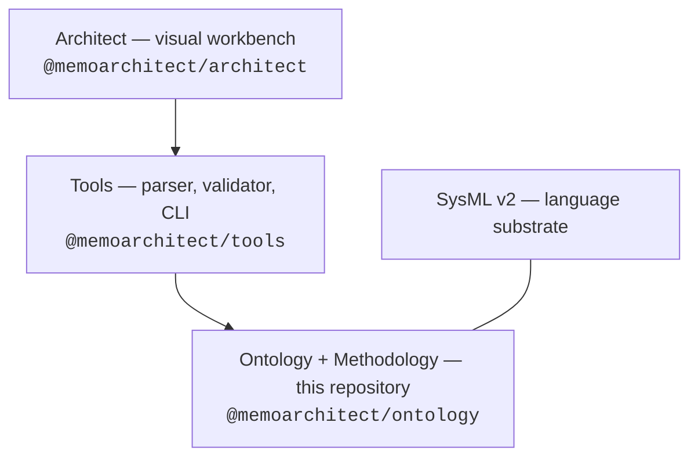

# Where This Repository Fits

MEMO is a stack of four layers. Each layer is optional above the one below it,
and each is owned by its own repository and npm package.

| Layer | What it defines | Where it lives |
|---|---|---|
| **Ontology** | Typed SysML v2 elements, Arcadia-inspired architecture layers, semantic links, and closure rules — what each element *means* | This repository |
| **Methodology** | Profiles, viewpoints, workflow stages, quality gates, and project bindings — how teams *apply* the ontology | This repository |
| **Tools** | Parser, semantic model, validation, and the `memo` CLI that checks the model and generates documents | [memo-tools](https://github.com/memoarchitect/memo-tools) |
| **Architect** | A visual workbench for diagrams, traceability, and DHF review over the same model | [memo-architect](https://github.com/memoarchitect/memo-architect) |

This repository is the **content layer**: pure SysML v2 and KerML source with
no executable code. Everything in it is portable to any conformant SysML v2
tool — the MEMO tools consume it, but do not own it.

Two principles keep the stack honest:

1. **The model is the single source of truth.** Tools and Architect read the
   same text-first source; neither adds meaning of its own.
2. **No content knowledge in the engine.** Package names, templates,
   archetypes, and scaffold layouts all come from this repository's
   [manifest](repository.md#the-manifest), never from hardcoded strings in
   TypeScript.

## Read next

- [The memo:: Namespace](namespace.md) — how the SysML packages build bottom-up
  from core semantics to a worked example.
- [Repository and Packaging](repository.md) — how the directories map to the
  published npm package and the four logical packages inside it.
