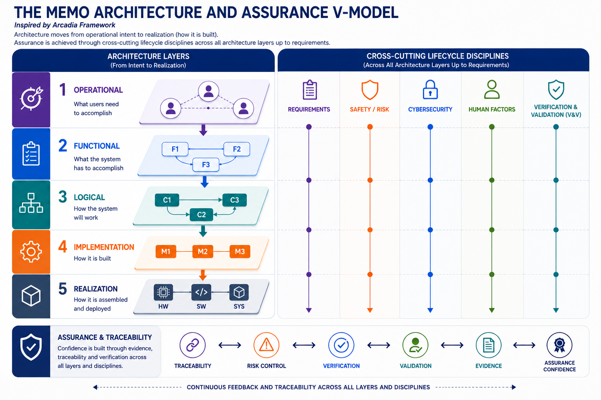

# MEMO architecture guide

Use this page to navigate the ontology by engineering question: which elements
belong in each perspective, how they connect, and which disciplines cut across
them. It is a practical index of the current ontology, not a required sequence
of project phases or a substitute for the package source.

{ .memo-zoomable aria-label="Open the architecture and assurance V-model" }

## Jump to a perspective

- [Operational: context, workflows, and scenarios](#operational)
- [Use-case kinds](#use-case-kinds)
- [Functional: capabilities, functions, and flows](#functional)
- [Logical: responsibilities, channels, and interfaces](#logical)
- [Implementation: software, hardware, and physical realization](#implementation)
- [Cross-cutting disciplines](#cross-cutting-disciplines)
- [Relationship backbone](#relationship-backbone)

## Operational

The operational perspective answers **why, for whom, and in what context**.

| Element | Use it to record | Key relationships |
| --- | --- | --- |
| `Actor`, `User`, `Stakeholder` | Who has a goal or responsibility | `Initiates`, `Performs`, `HasConcern` |
| `IntendedUse`, `ReasonablyForeseeableMisuse`, `UseContext`, `Need` (needKind: stakeholder) | Purpose, foreseeable misuse, setting, and desired outcome | `Motivates`, `DerivesFrom` |
| `UseCase` with `UseCaseKind` | A clinical, service, manufacturing, or development goal | `Motivates`, `Supports`, `Validates` |
| `OperationalWorkflow`, `WorkflowStep` | Reusable organization of work | `Supports`, `StepPrecedes` |
| `OperativeScenario` | A nominal, alternate, or exception path | `Selects`, `Realizes` |
| `OperationalActivity`, `UserTask` | Work performed along a path | `Performs`, `Enables`; optional extensions may add resource details |

**Core split:** `UseCase → OperationalWorkflow → OperativeScenario →
OperationalActivity → action flow → SystemFunction`. A scenario owns the
activity and action flow for its selected path; it is not a copy of the
workflow.

## Use-case kinds

`UseCase` stores the goal statement, trigger, preconditions, outcomes,
participants, context, supporting system, and source needs. `UseCaseKind`
records the domain of the goal:

| `useCaseKind` | Use it when the goal concerns… | Example |
| --- | --- | --- |
| `clinical` | patient care or clinical operation | Deliver patient-controlled analgesia |
| `service` | installation, maintenance, repair, calibration, or support | Calibrate a pressure sensor |
| `manufacturing` | producing, assembling, inspecting, packaging, or releasing a product | Inspect a sterile barrier seal |
| `development` | design, analysis, verification, change, or release work | Verify an alarm latency requirement |

Each goal remains a `UseCase`; the enumeration value records its domain.

## Functional

The functional perspective answers **what the system must do**, independently
of a software, electronics, or mechanical choice.

| Element | Use it to record | Key relationships |
| --- | --- | --- |
| `SystemFunction` | A technology-independent responsibility | `Enables`, `AllocatedTo`, `SatisfiedBy`, `VerifiedBy` |
| `FunctionalFlow`, `FunctionalFlowStep` | Reusable organization and order of functions | `InvolvesFunction`, `IncludesStep` |
| `FunctionalScenario` | The function path for one operational scenario | `selectedFlow`, `Realizes` |
| `FunctionalExchange` | Typed command, measurement, alarm, material, or energy transfer | connects function endpoints |
| `SystemAction` | Executable behavior realizing a function | `Performs` |

A function can be allocated to software, hardware, a mechanical part, or a
human procedure. Do not create a software component merely because a function
exists.

## Logical

The logical perspective answers **how the solution is organized while still
technology-independent**.

| Element | Use it to record | Key relationships |
| --- | --- | --- |
| `LogicalComponent` (componentRole: system, subsystem) | Responsibility structure | `Composes`, `AllocatedTo`, `Realizes` |
| `LogicalComponent` (componentRole: channel) | Primary, redundant, monitor, watchdog, interlock, or protection role via `channelRole` | `IndependentOf`, allocation and exchange links |
| `LogicalComponent` (componentRole: controlElement, dataStore, userInterface) | Control, storage, and operator responsibilities | allocation and interface links |
| `Interface`, `LogicalPort`, `LogicalInterface` | Named exchange boundaries | `Realizes`, typed exchanges |
| `IsolationBoundary`, `FaultContainmentRegion` | Required separation and containment | `IndependentOf`, safety/risk links |

Use `AllocatedTo` to say who is responsible for a function. Use an
`IndependentOf` relationship with its stated basis—not duplicated components—to
make a redundancy or independence claim.

## Implementation

The implementation perspective answers **how the design is realized**.

| Element group | Examples | Key relationships |
| --- | --- | --- |
| Software module structure | `SoftwareSystem`, `SoftwareComponent`, `SoftwareModule`, `SBOMEntry` | `Realizes`, `BuildsInto` |
| Runtime structure | `SoftwareComponent`, `Process`, `Thread`, `Service`, `RuntimePartition` | `HostedBy`, timing and interaction links |
| Deployment | `DeploymentUnit`, `ProcessingNode`, `RuntimeEnvironment` | `DeploysTo`, `HostedBy` |
| Hardware and physical realization | `HardwareAssembly`, `Sensor`, `Actuator`, `PhysicalAssembly` | `Realizes`, `Composes` |
| Concrete boundaries | `PhysicalPort`, `Interface` (interfaceKind: hardware, software) | `Realizes`, `ExchangesWith` |

An IBD shows parts, ports, and directed exchanges. A BDD shows definitions and
containment. Use behavior views for actions and state.

## Cross-cutting disciplines

These disciplines own their assurance elements and connect them to architecture
elements through typed relationships; they do not duplicate architecture
elements.

| Discipline | Core elements | Principal relationships |
| --- | --- | --- |
| Requirements | `Need` (needKind: stakeholder…), `Requirement` (requirementKind: system, software, hardware) | `DerivesFrom`, `SatisfiedBy`, `VerifiedBy` |
| Safety and risk | `SafetyRelatedCharacteristic`, `HazardCause`, `Hazard`, `SequenceOfEvents`, `HazardousSituation`, `Harm`, `Risk`, `RiskControlMeasure`, `ResidualRisk`, `Benefit`, FMEA/FTA elements | `Mitigates`, risk-chain links |
| Cybersecurity | `CybersecurityAsset`, `Threat`, `Vulnerability`, `CyberMitigation` | asset/threat/vulnerability/mitigation links |
| Human factors | `CriticalTask`, `UseError`, UI and usability elements | `CommitsUseError`, `Causes` |
| Verification and validation | `VerificationCase`, `ValidationCase`, `Evidence` | `VerifiedBy`, `Validates`, `ProducesEvidence` |

FMEA analyzes how a function or component can fail and identifies hazards. It
does not turn a hazard into a successor of the function. Unit tests verify
implemented units; system and validation cases verify claims and use context.

## Relationship backbone

| From | Relationship | To | Review question |
| --- | --- | --- | --- |
| `Need` (needKind: stakeholder) | `Motivates` | `UseCase` | Why does this goal matter? |
| `OperationalWorkflow` | `Supports` | `UseCase` | How is work organized? |
| `OperativeScenario` | `Selects` | `WorkflowStep` | Which path is considered? |
| `FunctionalScenario` | `Realizes` | `OperativeScenario` | What functional path realizes it? |
| `SystemFunction` | `Enables` | `OperationalActivity` | What enables the work? |
| `SystemFunction` | `AllocatedTo` | logical or implementation element | Who is responsible? |
| software / physical element | `Realizes` / `Realizes` | `LogicalComponent` | How is it realized? |
| requirement or control | `VerifiedBy` | `VerificationCase` | How is it checked? |
| `VerificationCase` | `ProducesEvidence` | `Evidence` | What result supports it? |

The backbone is a graph: one element can participate in several paths. See
[Elements](../modeling/elements.md) and [Relationships](../modeling/relationships.md)
for selection guidance and source/target examples.

## Repository boundary

MEMO is deliberately separated into three products. This repository contains
the portable content layer; it has no user interface and no command-line
implementation. A model can use it in any conformant SysML v2 environment.

| Layer | What it defines | Where it lives |
|---|---|---|
| **Ontology** | Typed SysML v2 elements, Arcadia-inspired architecture layers, semantic links, and closure rules — what each element *means* | This repository |
| **Methodology** | Profiles, viewpoints, workflow stages, quality gates, and project bindings — how teams *apply* the ontology | This repository |
| **Tools** | Parser, semantic model, validation, and the `memo` CLI that checks the model and generates documents | [memo-tools](https://github.com/memoarchitect/memo-tools) |
| **Architect** | A visual workbench for diagrams, traceability, and DHF review over the same model | [memo-architect](https://github.com/memoarchitect/memo-architect) |

This repository is the **content layer**: pure SysML v2 and KerML source. The
Tools and Architect products consume that content; neither owns or duplicates
its engineering meaning.

Two principles keep the stack honest:

1. **The model is the single source of truth.** Tools and Architect read the
   same text-first source; neither adds meaning of its own.
2. **No content knowledge in the engine.** Package names, templates,
   archetypes, and scaffold layouts all come from this repository's
   [manifest](repository.md#the-manifest), never from hardcoded strings in
   TypeScript.

## Source layout and history

- [The memo:: Namespace](namespace.md) — how the SysML packages build bottom-up
  from core semantics to a worked example.
- [Repository and Packaging](repository.md) — how the directories map to the
  public library surface and the four logical packages inside it.
- [Layer Map](../layers/index.md) — the layer vocabulary and typed
  relationships that connect a model vertically.
