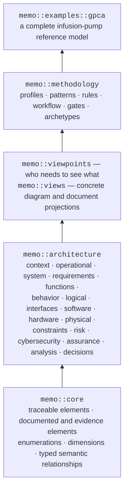

# The memo:: Namespace

`memo::` builds bottom-up. Read it from the base upward: core semantics first,
architecture layers next, viewpoints and views above that, methodology to apply
the model, and the GPCA pump as a concrete example.



| Package | Role |
|---|---|
| `memo::core` | Shared foundation: identity, traceability, documented/evidence elements, controlled values, and typed semantic relationships |
| `memo::architecture` | What the device *is*: Arcadia-inspired layers from clinical context through requirements, behavior, and structure to risk, cybersecurity, and assurance |
| `memo::viewpoints` | Stakeholder concerns: architecture, safety, cybersecurity, verification, and regulatory review |
| `memo::rules` | Native closure, coverage, cross-layer, lifecycle, and quantitative checks |
| `memo::compliance` | Regulated outputs: controlled artifacts, change, and risk-management-file concepts |
| `memo::methodology` | How teams apply the ontology: profiles, patterns, workflow steps, quality gates, and project bindings |
| `memo::examples::gpca` | A worked example used to validate and teach the modeling style |

## The public import surface

Product models import **one library** and use focused packages underneath it:

```sysml
private import memo_medical_device_library::*;
```

`memo_medical_device_library` (aliased `memo::medical_device_library`)
re-exports core, every architecture layer, and the standard viewpoints and
views. Prefer it over deep imports into source packages: deep imports couple a
project to internal organization and make upgrades harder.

## Design decisions worth knowing

**Typed links, not free-form arrows.** Every relation is a native SysML v2
`connection def` specializing `SemanticLink`: its name is the verb
(`MitigatesHazard`, `VerifiedBy`, `AllocatedTo`), its typed ends carry the
roles, a `linkStatus` carries state, and navigation is bidirectional. This is
what makes change impact computable instead of a manual search.

**Closure rules are checked, not promised.** Review questions such as *"does
every hazard have a risk control?"* or *"is every risk control verified?"* are
expressed as rules under `memo::rules` and evaluated by walking required
semantic links, flagging missing paths as errors or warnings.

**Risk and cybersecurity are peer layers.** They sit inside
`memo::architecture` next to the structural layers — not in a separate file
format — so controls anchor to the design features that implement them.

**Extensions live outside core.** Device-specific modes, interfaces, profiles,
and organization-specific kinds belong in project packages or the profile, not
in `memo::core`. The core vocabulary stays small and stable; see
[Contributing](../contributing.md).
