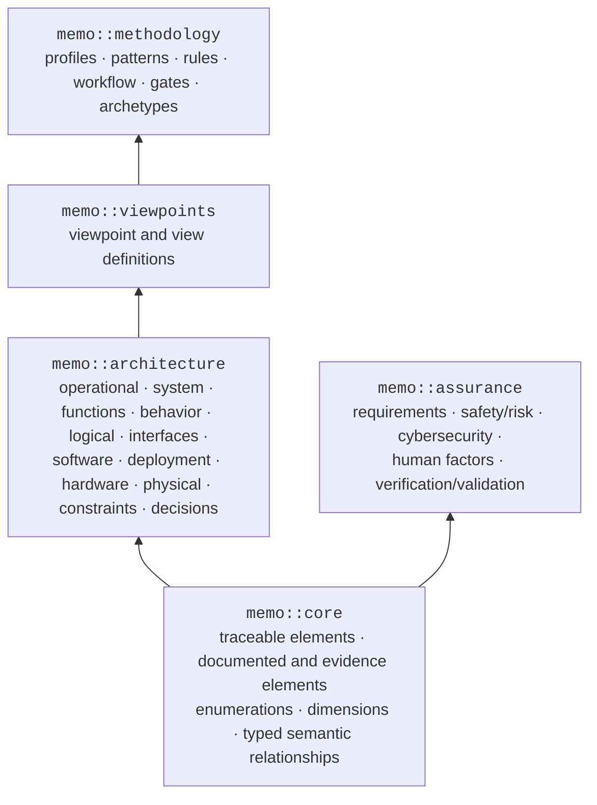

# The memo:: Namespace

`memo::` groups the base ontology. Extensions and examples are deliberately
outside it.


```mermaid
flowchart BT
    core["<code>memo::core</code><br/>traceable elements · documented and evidence elements<br/>enumerations · dimensions · typed semantic relationships"]
    arch["<code>memo::architecture</code><br/>operational · system · functions · behavior · logical · interfaces ·<br/>software · deployment · hardware · physical · constraints · decisions"]
    assurance["<code>memo::assurance</code><br/>requirements · safety/risk · cybersecurity ·<br/>human factors · verification/validation"]
    vp["<code>memo::viewpoints</code><br/>viewpoint and view definitions"]
    meth["<code>memo::methodology</code><br/>profiles · patterns · rules · workflow · gates · archetypes"]
    core --> arch --> vp --> meth
    core --> assurance
```

| Package | Role |
|---|---|
| `memo::core` | Shared foundation: identity, traceability, documented/evidence elements, controlled values, and typed semantic relationships |
| `memo::architecture` | Horizontal architecture layers: operational, system, functional, logical, interface, behavior, and implementation structure |
| `memo::assurance` | Vertical assurance disciplines: requirements, safety/risk, cybersecurity, human factors, and verification/validation |
| `memo::viewpoints` | Stakeholder concerns: architecture, safety, cybersecurity, verification, and regulatory review |
| `memo::rules` | Native closure, coverage, cross-layer, lifecycle, and quantitative checks |
| `memo::artifacts` | Controlled artifacts, ADRs, configuration-management records, and risk-management-file concepts |
| `memo::methodology` | How teams apply the ontology: profiles, patterns, workflow steps, quality gates, and project bindings |

## The public import surface

Product models import the base library:

```sysml
private import memo::*;
```

The root `memo` package re-exports the public definitions and owns the nested
namespace aliases. Prefer it over deep imports into declaration packages:
deep imports couple a project to internal organization.

If the selected methodology includes an extension, the project also imports
that extension facade. Extension packages do not become `memo::` children.

## Design decisions worth knowing

**Typed links, not free-form arrows.** Every relation is a native SysML v2
`connection def` specializing `MemoRelationship`: its name is the verb
(`Mitigates`, `VerifiedBy`, `AllocatedTo`), its typed ends carry the
roles, a `linkStatus` carries state, and navigation is bidirectional. This is
what makes change impact computable instead of a manual search.

**Closure rules are checked, not promised.** Review questions such as *"does
every hazard have a risk control?"* or *"is every risk control verified?"* are
expressed as rules under `memo::rules` and evaluated by walking required
semantic links, flagging missing paths as errors or warnings.

**Assurance is separate from architecture ownership.** Risk, cybersecurity,
requirements, and verification live under `memo::assurance`; typed
relationships anchor their controls and evidence to the relevant design
features without duplicating the architecture element.

**Extensions live outside core.** Device-specific modes, interfaces, profiles,
and organization-specific kinds belong in project packages or the profile, not
in `memo::core`. The core vocabulary stays small and stable; see
[Contributing](../contributing.md).
