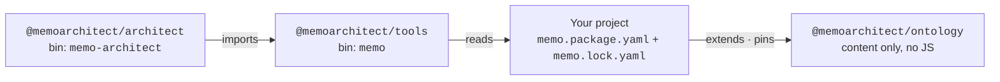

# Repository and Packaging

One npm package — `@memoarchitect/ontology` — carries all MEMO content. Four
*logical* packages survive inside it as subpaths declared in a root manifest,
so `extends:` references in user projects stay stable even if the directory
layout changes.

## Directory layout

```text
memo/
├── memo.manifest.yaml     # the packaging contract (see below)
├── src/                   # all SysML v2 / KerML source, one tree
│   ├── core/              # common types, enumerations, relationships, semantics
│   ├── architecture/      # one directory per architecture layer
│   ├── rules/             # closure, coverage, crosslayer, lifecycle, quantitative
│   ├── viewpoints/        # viewpoint and view definitions
│   ├── methodology/       # profiles, patterns, gates, workflow, archetypes
│   ├── compliance/        # regulated artifact and lifecycle concepts
│   ├── medical_device_library.sysml   # the public import surface
│   └── memo_namespaces.sysml          # memo:: alias map
├── ontology/              # logical @memoarchitect/ontology descriptor
├── profile/               # logical @memoarchitect/medical-modeling-profile
│   ├── archetypes.yaml    # archetype catalog used by `memo init`
│   └── templates/         # per-archetype starter templates
├── methodologies/
│   ├── default/           # logical @memoarchitect/methodology-default
│   └── gpca/              # logical @memoarchitect/methodology-gpca
├── template/              # complete starter project copied by `memo init`
└── examples/
    └── gpca-pump/         # the reference model — teaching material, not a scaffold
```

The manifest is the only contract published code relies on: tools resolve
logical package names through it, never through a directory convention.
Until 1.0 the content is experimental: names and structure may change
between releases without migration support, and lock files pin the exact
version a project was built against.

## The manifest

`memo.manifest.yaml` replaces every content value that would otherwise be
hardcoded in the tools:

```yaml
manifest: 1
packages:
  "@memoarchitect/ontology": ./ontology
  "@memoarchitect/medical-modeling-profile": ./profile
  "@memoarchitect/methodology-default": ./methodologies/default
  "@memoarchitect/methodology-gpca": ./methodologies/gpca
init:
  defaultExtends: "@memoarchitect/medical-modeling-profile"
  rootImport: "memo_medical_device_library"
  template: ./template
  archetypes: ./profile/archetypes.yaml
examples:
  gpca: ./examples/gpca-pump
```

When a project declares `extends: "@memoarchitect/medical-modeling-profile"`,
the tools resolve the installed ontology npm package, read this manifest, and
map the logical name to its subpath. `memo init` reads the same manifest to
copy `template/`, substitute the project name, and write `memo.lock.yaml`
pinning the resolved ontology identity and version.

## How the three packages relate



- The **project**, not the tools, depends on the ontology: `memo.package.yaml`
  declares what it extends, `memo.lock.yaml` pins the exact resolved version,
  and `memo validate` validates against the locked version.
- `@memoarchitect/tools` and `@memoarchitect/architect` release in **lockstep**
  (one shared version); `@memoarchitect/ontology` follows its own semver, where
  *major* means previously valid models can become invalid.
- npm is the registry. There is no bespoke content-distribution protocol.

## Guarantees kept by CI

- `template/` (after name substitution) and `examples/gpca-pump` must pass
  `memo validate`.
- The packed tarball contains content and the manifest only — no executable
  code (see `files:` in `package.json`).
- Generated documents are build outputs and are never scaffolded into `src/`.
