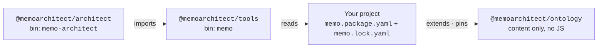

# Repository and Packaging

One npm package — `@memoarchitect/ontology` — carries all MEMO content. Four
*logical* packages survive inside it as subpaths declared in a root manifest,
so the package names user projects import stay stable even if the directory
layout changes.

## Directory layout

```text
memo/
├── memo.manifest.yaml     # the packaging contract (see below)
├── src/                   # all SysML v2 / KerML source, one tree
│   ├── core/              # common types, enumerations, relationships, semantics
│   ├── architecture/      # horizontal architecture-layer definitions
│   ├── assurance/         # vertical assurance-discipline definitions
│   ├── rules/             # closure, coverage, crosslayer, lifecycle, quantitative
│   ├── viewpoints/        # viewpoint and view definitions
│   ├── methodology/       # profiles, patterns, gates, workflow
│   ├── compliance/        # regulated artifact and lifecycle concepts
│   └── memo_namespaces.sysml          # public memo import and alias map
├── ontology/              # logical @memoarchitect/ontology descriptor
├── profile/               # logical @memoarchitect/medical-modeling-profile
├── methodologies/
│   ├── default/           # logical @memoarchitect/methodology-default
│   └── gpca/              # logical @memoarchitect/methodology-gpca
├── templates/             # complete starter projects selected by `memo init --template`
└── examples/
    ├── gpca-pump/         # the complete reference model — teaching material, not a scaffold
    └── */                 # focused, domain-specific examples
```

The manifest is the only contract published code relies on: tools resolve
logical package names through it, never through a directory convention.
Until 1.0 the content is experimental: names and structure may change
between releases without migration support, and lock files pin the exact
version a project was built against.

## The manifest

`memo.manifest.yaml` replaces every content value that would otherwise be
hardcoded in the tools:

```yaml
manifest: 1
packages:
  "@memoarchitect/ontology": ./ontology
  "@memoarchitect/medical-modeling-profile": ./profile
  "@memoarchitect/methodology-default": ./methodologies/default
  "@memoarchitect/methodology-gpca": ./methodologies/gpca
init:
  defaultExtends: "@memoarchitect/methodology-default"
  rootImport: "memo"
  defaultTemplate: default
templates:
  default: ./templates/default
  samd: ./templates/samd
examples:
  gpca: ./examples/gpca-pump
  standard-sysml-diagrams: ./examples/sysml-diagram-samples
```

When a project imports `@memoarchitect/methodology-default` and binds it in its
`ProjectMethodBinding`, the tools resolve the installed ontology npm package,
read this manifest, and map the logical name to its subpath. The manifest says
where the source sits; the import decides that it is loaded. `memo init --list` shows the manifest's
templates and examples. `memo init --template <id>` copies the selected
template, substitutes the project name, and writes `memo.lock.yaml`.

## How the three packages relate


```mermaid
flowchart LR
    P["Your project<br/><code>memo.package.yaml</code> + <code>memo.lock.yaml</code>"] -- "extends · pins" --> O["<code>@memoarchitect/ontology</code><br/>content only, no JS"]
    T["<code>@memoarchitect/tools</code><br/>bin: <code>memo</code>"] -- reads --> P
    A["<code>@memoarchitect/architect</code><br/>bin: <code>memo-architect</code>"] -- imports --> T
```

- The **project**, not the tools, depends on the ontology: `memo.package.yaml`
  declares what it extends, `memo.lock.yaml` pins the exact resolved version,
  and `memo validate` validates against the locked version.
- `@memoarchitect/tools` and `@memoarchitect/architect` release in **lockstep**
  (one shared version); `@memoarchitect/ontology` follows its own semver, where
  *major* means previously valid models can become invalid.
- npm is the registry. There is no bespoke content-distribution protocol.

## Guarantees kept by CI

- Every directory under `templates/` (after name substitution) and
  `examples/gpca-pump` must pass
  `memo validate`.
- The packed tarball contains content and the manifest only — no executable
  code (see `files:` in `package.json`).
- Generated documents are build outputs and are never scaffolded into `src/`.
