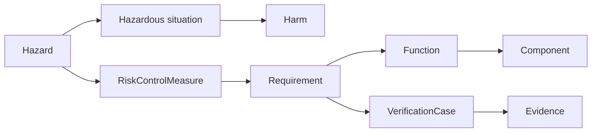

# GPCA — Correspondences

ISO/IEC/IEEE 42010 uses **correspondences** for relations *between* elements of
an architecture description — across views, across models — and
**correspondence rules** for the constraints those relations must satisfy.
This is where an architecture description stops being a folder of diagrams and
starts being one coherent claim.

In MEMO, correspondences are not a separate artifact. They are the typed
relationships in the catalog, and the rules are the validation rules the model
is checked against.

## Correspondence 1 — one element, many views

The same element appears in several views under different viewpoints, and it is
the *same element*, not a copy. The bolus-limit enforcement function is the
clearest case:

| It appears in | Under viewpoint | Answering |
|---|---|---|
| Function Allocation View | Functional | Which component owns it? |
| Logical Architecture View | Logical architecture | How does it connect? |
| Requirements Traceability View | Requirements | Which requirement does it satisfy? |
| Risk Mitigation Chain View | Risk | Which hazard does it control? |
| V&V Coverage View | Verification | Which test demonstrates it? |

This is why MEMO forbids copying elements into diagram-specific packages. A
copy breaks the correspondence, and with it the ability to ask "where else does
this appear?"

## Correspondence 2 — the assurance chain

The load-bearing correspondence for a medical device is the path from a hazard
to the evidence that it is controlled:

Each arrow is a typed relationship in the catalog and crosses a viewpoint
boundary: hazard and control live under the Risk viewpoint, the requirement
under Requirements, the function and component under Functional and Logical,
the verification case and evidence under Verification. The chain is what makes
the separate views one architecture description.

## Correspondence 3 — views to regulatory documents

`documentUsage` on a view records which deliverables consume it. Read the other
way, it says which views a document is assembled from:

| Document | Assembled from views under |
|---|---|
| Architecture Description | Context, Operational, Functional, Logical, Physical |
| SDD (IEC 62304) | Functional, Logical, Software, Operational |
| RMF (ISO 14971) | Risk, Cybersecurity, Logical |
| Hazard Analysis Report | Risk |
| Threat Model | Cybersecurity |
| Cybersecurity Risk Assessment | Cybersecurity |
| Usability Engineering File (IEC 62366) | Context, Operational |
| V&V | Verification, Operational |
| Requirements Traceability Matrix | Requirements |
| DHF | Requirements, Physical, Verification, Usability, and the DHF index |
| QMSR | Requirements, Logical, Software, Risk, Cybersecurity, Verification |

The practical consequence: a change to one element propagates to every document
that consumes a view containing it. That is the point of modelling rather than
writing the documents by hand.

## Correspondence rules

The rules the model is checked against — MEMO reports these as validation
violations rather than leaving them to review:

1. Every element sits in exactly one layer (single-axis ownership).
2. A view selects canonical elements; it never declares its own copies.
3. Every requirement traces up to a need and down to a verification case.
4. Every hazard has at least one risk control measure.
5. Every risk control measure is realized by a requirement or a function.

GPCA reports **0 violations** against the active rule set. That is a statement
about the rules that exist, not a proof of correctness — rule coverage is
itself part of what a reviewer should question.

## Where this leaves the conformance chain

Reading the four pages together:

- 9 concerns identified, of which 7 are framed by a diagram viewpoint.
- 10 viewpoints in use, each with a declared audience.
- 17 diagram views, each naming its viewpoint; 9 document views.
- Usability and Clinical concerns reach reviewers only through document views.

The last line is the honest gap. Everything else closes.
