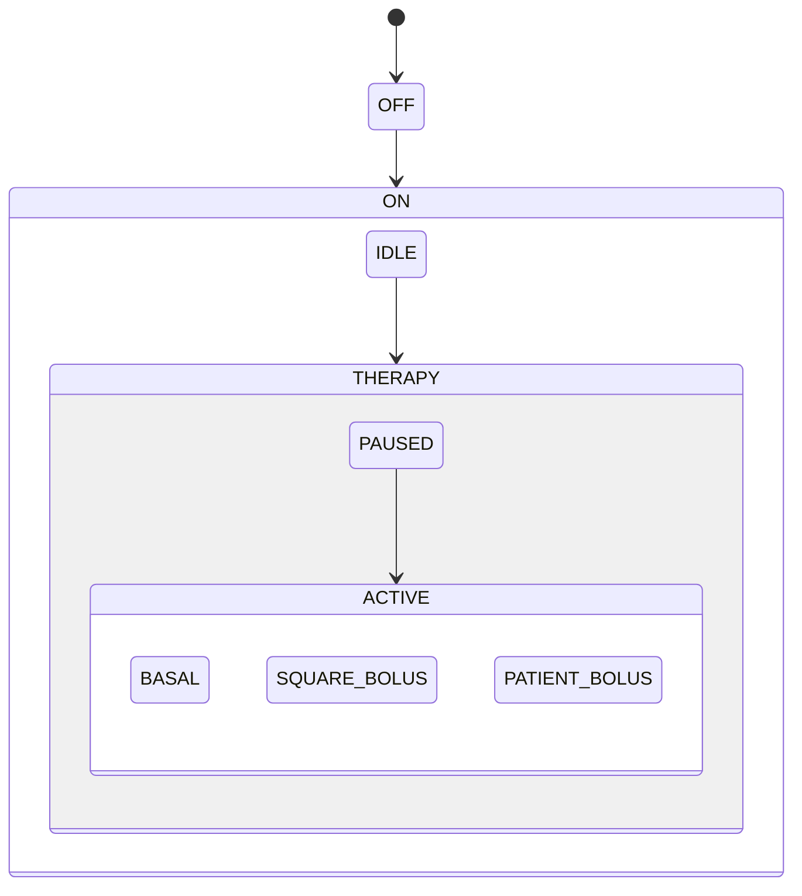

# GPCA Pump

The Generic Patient-Controlled Analgesia pump is the repository's complete
reference model, under
[`examples/gpca-pump`](https://github.com/memoarchitect/memo/tree/main/examples/gpca-pump).
It is the one model in MEMO that is documented as a full architecture
description in the sense of ISO/IEC/IEEE 42010.

!!! info "This is a case study, not a starter"
    Do not copy GPCA to begin a project. It is a model to *read*: pick a
    review question, open the viewpoint that frames it, and follow the links.
    For a starting point use the [tutorials](../../examples/index.md).

## What the device is

A PCA pump delivers an opioid analgesic on a prescribed basal rate while
letting the patient request additional boluses within programmed limits. Its
safety problem is dose: too little is untreated pain, too much is respiratory
depression. Almost every requirement, hazard, and mode in the model exists to
bound that one quantity.

## Where the design comes from

GPCA is not invented for MEMO. It is a safety-research platform developed
openly so that academia, industry, and the FDA could discuss infusion-pump
safety on a shared, non-proprietary design. The MEMO model was built from
those public artifacts, and elements carry a `sourceReference` citation back
to them — including the CriSys mode hierarchy reproduced in the mode-state
view.

## The architecture description

| 42010 concept | Where it is |
|---|---|
| Stakeholders and concerns | [Stakeholders & Concerns](stakeholders-concerns.md) |
| Architecture viewpoints | [Viewpoints](viewpoints.md) — 10 in use |
| Architecture views | [Views](views.md) — 26 in total |
| Correspondences | [Correspondences](correspondences.md) |

## How to read the model

Do not begin with the component list. Begin with a use case and follow one
scenario:

1. `ucDeliverPcaTherapy` states the clinical goal.
2. Three workflows support it — `wfPrepareAndStartTherapy`,
   `wfManageActiveTherapy`, `wfRespondToTherapyAlarm`.
3. Scenarios select paths through those workflows: `osLockoutBolus`
   (alternate), `osOcclusionAlarm` / `osAirInLine` / `osEmptyReservoir`
   (exception), `osPowerLoss` (recovery).
4. A selected scenario identifies the functional flow — `fcPatientBolus` —
   and the ordered functions on that path.
5. Functions connect to requirements, risks and controls, responsible
   architecture, verification cases, and evidence.

The catalog is large because it holds several such paths. Read it one review
question at a time.

## The mode hierarchy

The clearest single artifact in the model is the top-level mode machine
(`VIEW-BHV-001`), reproducing CriSys §4.1 Fig 4.1:

Four levels of nesting with guarded transitions and `Inhibited_*` macro guards
is why the state-transition renderer supports both
[nesting modes](https://memoarchitect.github.io/memo-architect/users/viewpoints-diagrams/):
the whole machine is unreadable at once, so a reviewer folds the branches they
are not asking about, or drills into one and reads it as its own diagram.

## Narrative walkthrough

The longer prose walkthrough — scenario-driven modelling, the citation trail,
and the assurance argument — remains at
[GPCA pump walkthrough](../../examples/gpca-walkthrough.md).
