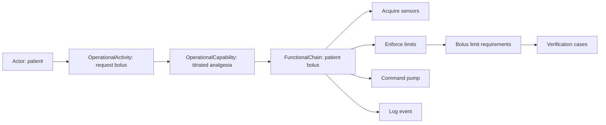

# GPCA Pump Walkthrough

The repository includes a Generic Patient-Controlled Analgesia (GPCA) pump
model under `examples/gpca-pump`. Use it as a worked example, not as a
production-ready device design.

## How to read the example

Read one vertical slice before browsing every file:

1. `model/catalog/gpca_context.sysml` — actors, intended use, use context, and
   foreseeable use errors.
2. `model/catalog/gpca_operational.sysml` — operational activities,
   capabilities, and scenarios.
3. `model/catalog/gpca_system.sysml` — system capabilities and functional
   chains.
4. `model/catalog/gpca_requirements.sysml` — needs, requirements, constants,
   and notification specifications.
5. `model/catalog/gpca_architecture.sysml` and related behavior/interface files
   — functions, components, states, and exchanges.
6. `model/catalog/gpca_risk.sysml` — hazards, risk estimates, and controls.
7. `model/catalog/gpca_verification.sysml` — verification cases and evidence.
8. `model/catalog/gpca_trace.sysml` — the typed relationships joining the
   catalog.

## Follow the patient-bolus scenario

When reading `gpca_trace.sysml`, search for an element name and inspect all
connections around it. This is often the fastest way to understand why an
element exists.

## Open the example

Open `examples/gpca-pump` as a SysML v2 project in your editor and inspect the
catalog files and their imports. The example is intentionally source-first:
there is no separate generated model to learn before reading the engineering
content.

If you need command-line validation or an interactive review surface, use the
corresponding guides in MEMO Tools or MEMO Architect. Those workflows consume
this example; they are not part of the ontology repository.

## What to copy into your project

Copy patterns, not identifiers or conclusions:

- package and import organization;
- stable IDs and readable names;
- separation of catalog elements from cross-layer traces;
- scenario-centered functional chains;
- explicit risk-control and verification links;
- views designed around review questions.

Do not copy the GPCA risk acceptability, requirements, or evidence as if they
applied to another device.
