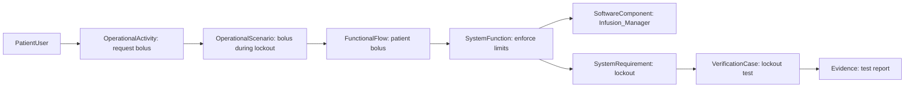

# GPCA Pump Walkthrough

The repository's one complete reference model is a Generic Patient-Controlled
Analgesia (GPCA) infusion pump, under
[`examples/gpca-pump`](https://github.com/memoarchitect/memo/tree/main/examples/gpca-pump).
Use it as a worked example, not as a production-ready device design: its value
is that every layer of the ontology is populated *and connected*, so you can
see what a complete engineering argument looks like in MEMO.

## Where GPCA comes from

The GPCA is not invented for MEMO. It is a safety-research platform developed
openly so that academia, industry, and the FDA could discuss infusion-pump
safety on a shared, non-proprietary design. The MEMO model was built from
those public artifacts, and each element carries a `sourceReference` citation
back to them:

| Cited artifact | Public source |
|---|---|
| GPCA System/Safety Requirements (2013) and GPCA Simulink/AADL models | University of Minnesota CriSys (Critical Systems) group — <http://crisys.cs.umn.edu/gpca.shtml> |
| Generic Infusion Pump (GIP) project and reference models, developed with FDA/CDRH | University of Pennsylvania PRECISE Center — <https://rtg.cis.upenn.edu/gip/> |
| GIP Hazard Analysis v1.0 (Arney et al., 2009) — the hazard taxonomy behind `gpca_risk` | Published via the GIP project page above (UPenn technical report) |
| Related open PCA-pump requirements and AADL work | Kansas State SAnToS Open PCA Pump project — <https://openpcapump.santoslab.org> |

This provenance is why the walkthrough can be honest: the requirements,
hazards, and behavioral structure trace to reviewable public documents, not to
a marketing scenario.

## Meet the model through one scenario

A patient presses the bolus button during the lockout interval. What should
happen, and how would you check the model answers correctly? Follow the
question through the layers:

1. **Operational.** `gpca_context.sysml` gives you the patient
   (`PatientUser`), the nurse, the ward context, and the foreseeable use
   errors. `gpca_operational.sysml` holds the `RequestPatientBolus` activity
   and the `BolusRequestDuringLockout` scenario — variant *alternate*,
   condition *foreseeable misuse*, because a patient pressing early is
   expected behavior, not an error path.
2. **Functional.** `gpca_behavior_subsystems.sysml` defines the functions;
   `gpca_system.sysml` organizes the `PatientBolusChain` functional flow whose
   steps carry typed references: sense request → check lockout and max dose →
   command flow → actuate → log.
3. **Implementation.** `gpca_architecture.sysml` holds the software components
   (`Infusion_Manager`, `Alarm`, …) and hardware assemblies;
   `gpca_interfaces.sysml` binds 46 component exchanges with typed endpoints.
4. **Assurance.** `gpca_risk.sysml` carries the over-infusion hazard chain,
   `gpca_verification.sysml` the lockout verification cases and evidence, and
   `gpca_trace.sysml` the typed links that make the whole path reviewable.

```mermaid
flowchart LR
    Patient[PatientUser] --> Request[OperationalActivity: request bolus]
    Request --> Scenario[OperationalScenario: bolus during lockout]
    Scenario --> Chain[FunctionalFlow: patient bolus]
    Chain --> Limit[SystemFunction: enforce limits]
    Limit --> IM[SoftwareComponent: Infusion_Manager]
    Limit --> Req[SystemRequirement: lockout]
    Req --> VC[VerificationCase: lockout test]
    VC --> Ev[Evidence: test report]
```

## How to read the example, layer by layer

Read one vertical slice before browsing every file:

1. `model/catalog/gpca_context.sysml` — users, intended use, use context, use errors.
2. `model/catalog/gpca_operational.sysml` — activities and operational scenarios.
3. `model/catalog/gpca_behavior_subsystems.sysml` — system functions and functional exchanges.
4. `model/catalog/gpca_system.sysml` — capabilities, functional flows, functional scenarios.
5. `model/catalog/gpca_requirements.sysml` — needs, requirements, constants, notifications.
6. `model/catalog/gpca_architecture.sysml` + `gpca_interfaces.sysml` — components, assemblies, typed exchanges.
7. `model/catalog/gpca_risk.sysml` and `gpca_cybersecurity.sysml` — the risk and threat chains.
8. `model/catalog/gpca_verification.sysml` — verification cases and evidence.
9. `model/catalog/gpca_trace.sysml` — the typed relationships joining the catalog.

When reading `gpca_trace.sysml`, search for an element name and inspect all
connections around it — often the fastest way to understand why an element
exists.

## What to copy into your project

Copy patterns, not identifiers or conclusions:

- package and import organization;
- stable IDs, readable names, and `sourceReference` citations to real inputs;
- separation of catalog elements from cross-layer traces;
- scenario-centered functional flows with typed step references;
- explicit risk-control, usability, and verification links;
- views designed around review questions.

Do not copy the GPCA risk acceptability, requirements, or evidence as if they
applied to another device — they belong to a research platform, and their job
here is to show the shape of a complete argument.
