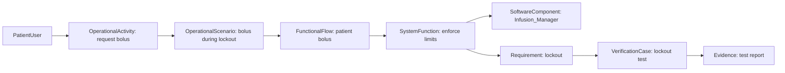

# GPCA Pump: Reference Scenario-Driven Model

This page explains the repository's complete reference model: a Generic
Patient-Controlled Analgesia (GPCA) infusion pump, under
[`examples/gpca-pump`](https://github.com/memoarchitect/memo/tree/main/examples/gpca-pump).
It is not a project starter or a list of files to copy. It is a coherent model
of one pump: the clinical goal, the work around the pump, the scenarios the
team must handle, the functions and architecture that support those scenarios,
and the evidence used to review the result.

## Read GPCA as a scenario-driven model

Do not begin with the component list. Begin with a use case and follow one
scenario. GPCA uses the same modelling logic recommended on the opening page:

1. A `ClinicalUseCase` states the clinical goal.
2. One or more operational workflows support that use case.
3. Each workflow has nominal, alternate, exception, or recovery scenarios.
4. A selected scenario identifies operational activities, functional flows,
   and functions needed on that path.
5. Functions connect to requirements, risks and controls, responsible
   architecture, verification cases, and evidence.

The GPCA catalog is large because it contains several such paths. You do not
need to read it as one long file. Pick a review question, start with its
viewpoint, and follow the selected catalog elements and typed links.

## What GPCA models through scenarios

The GPCA model has one use case, `ucDeliverPcaTherapy`: deliver prescribed,
patient-controlled analgesia without exceeding dose or safety limits. It is
supported by three workflows and several scenarios:

| Model element | GPCA content | Why it is present |
| --- | --- | --- |
| Use case | `ucDeliverPcaTherapy` | States the clinical goal once. |
| Workflow | `wfPrepareAndStartTherapy` | Covers programming and starting a prescription. |
| Workflow | `wfManageActiveTherapy` | Covers therapy while the patient can request boluses. |
| Workflow | `wfRespondToTherapyAlarm` | Covers degraded conditions and recovery to a safe state. |
| Alternate scenario | `osLockoutBolus` | A bolus request during lockout must be rejected and logged. |
| Exception scenarios | `osOcclusionAlarm`, `osAirInLine`, `osEmptyReservoir` | Each describes a different hazard-related operational path. |
| Recovery scenario | `osPowerLoss` | Shows continued or restored therapy after power loss. |
| Functional flow | `fcPatientBolus` | Turns the selected bolus path into ordered system responsibilities. |
| Functions | acquire sensors → enforce limits → manage infusion → command pump → log | Identify exactly what the device must do on that path. |

This is the central example of scenario-driven modelling: it does not begin
with the pump architecture. It begins with therapy work, selects the paths
that need analysis, then connects those paths to functions and the assurance
argument.

## Where GPCA comes from

The GPCA is not invented for MEMO. It is a safety-research platform developed
openly so that academia, industry, and the FDA could discuss infusion-pump
safety on a shared, non-proprietary design. The MEMO model was built from
those public artifacts, and each element carries a `sourceReference` citation
back to them:

| Cited artifact | Public source |
|---|---|
| GPCA System/Safety Requirements (2013) and GPCA reference models | University of Minnesota CriSys (Critical Systems) group — <http://crisys.cs.umn.edu/gpca.shtml> |
| Generic Infusion Pump (GIP) project and reference models, developed with FDA/CDRH | University of Pennsylvania PRECISE Center — <https://rtg.cis.upenn.edu/gip/> |
| GIP Hazard Analysis v1.0 (Arney et al., 2009) — the hazard taxonomy behind `gpca_risk` | Published via the GIP project page above (UPenn technical report) |
| Related open PCA-pump requirements work | Kansas State SAnToS Open PCA Pump project — <https://openpcapump.santoslab.org> |

This provenance is why the walkthrough can be honest: the requirements,
hazards, and behavioral structure trace to reviewable public documents, not to
a marketing scenario.

## Meet the model through one scenario

A patient presses the bolus button during the lockout interval. What should
happen, and how would you check the model answers correctly? Follow the
question through the layers:

1. **Operational.** `gpca_context.sysml` gives you the patient
   (`PatientUser`), the nurse, the ward context, and the foreseeable use
   errors. `gpca_operational.sysml` holds the `RequestPatientBolus` activity
   and the `BolusRequestDuringLockout` scenario — variant *alternate*,
   condition *foreseeable misuse*, because a patient pressing early is
   expected behavior, not an error path.
2. **Functional.** `gpca_behavior_subsystems.sysml` defines the functions;
   `gpca_system.sysml` organizes the `PatientBolusChain` functional flow whose
   steps carry typed references: sense request → check lockout and max dose →
   command flow → actuate → log.
3. **Implementation.** `gpca_architecture.sysml` holds the software components
   (`Infusion_Manager`, `Alarm`, …) and hardware assemblies;
   `gpca_interfaces.sysml` binds 46 component exchanges with typed endpoints.
4. **Assurance.** `gpca_risk.sysml` carries the over-infusion hazard chain,
   `gpca_verification.sysml` the lockout verification cases and evidence, and
   `gpca_trace.sysml` the typed links that make the whole path reviewable.


```mermaid
flowchart LR
    Patient[PatientUser] --> Request[OperationalActivity: request bolus]
    Request --> Scenario[OperationalScenario: bolus during lockout]
    Scenario --> Chain[FunctionalFlow: patient bolus]
    Chain --> Limit[SystemFunction: enforce limits]
    Limit --> IM[SoftwareComponent: Infusion_Manager]
    Limit --> Req[Requirement: lockout]
    Req --> VC[VerificationCase: lockout test]
    VC --> Ev[Evidence: test report]
```

## Read the actual SysML

The following excerpts are from the GPCA model. They show the distinction
between model content and a viewpoint. The catalog declares the facts; a view
selects the facts needed for one review question.

### 1. One use case, supported by several workflows

The use case is the goal. It is not duplicated as a separate “user goal”
element. Three workflows support that one goal.

```sysml
use case ucDeliverPcaTherapy : ClinicalUseCase {
    attribute :>> name = "DeliverPatientControlledAnalgesia";
    attribute :>> goalStatement = "Deliver prescribed analgesia safely while allowing patient-controlled bolus requests within configured limits.";
    ref :>> primaryUser = actorNurse;
    ref :>> supportingActors = (actorPatient, actorPrescriber, actorPharmacist);
    ref :>> useContext = hospitalWardContext;
}

connection : SupportsUseCase connect workflow ::> wfPrepareAndStartTherapy to useCase ::> ucDeliverPcaTherapy;
connection : SupportsUseCase connect workflow ::> wfManageActiveTherapy to useCase ::> ucDeliverPcaTherapy;
connection : SupportsUseCase connect workflow ::> wfRespondToTherapyAlarm to useCase ::> ucDeliverPcaTherapy;
```

### 2. A workflow has scenarios; each scenario owns its operational activity

`osLockoutBolus` is an alternate path in active therapy. Its activity is an
action flow with the operational steps for this particular path. A different
scenario has a different activity; it is not one shared generic activity.

```sysml
action oaRejectBolusDuringLockout : OperationalActivity {
    attribute :>> name = "RejectBolusDuringLockout";
    action checkLockout; action rejectAndLog;
    first start then checkLockout;
    first checkLockout then rejectAndLog;
    first rejectAndLog then done;
}

part osLockoutBolus : OperationalScenario {
    attribute :>> name = "BolusRequestDuringLockout";
    attribute :>> variantKind = ScenarioVariantKind::alternate;
    ref :>> parentWorkflow = wfManageActiveTherapy;
    ref :>> parentUseCase = ucDeliverPcaTherapy;
    ref :>> activities = oaRejectBolusDuringLockout;
}
```

### 3. A functional flow names the system responsibilities on the path

The functional flow orders the system work. Typed trace links then state which
functions are involved. The same functions can support more than one scenario
without making the scenarios identical.

```sysml
part fcPatientBolus : FunctionalFlow {
    attribute :>> name = "PatientBolusChain";
    ref :>> startFunction = fnAcquireSensors;
    ref :>> endFunction = fnCommandPump;
    attribute :>> endToEndLatencyBudgetMs = "100";
}

connection : InvolvesFunction connect functionalChain ::> fcPatientBolus to function ::> fnAcquireSensors;
connection : InvolvesFunction connect functionalChain ::> fcPatientBolus to function ::> fnEnforceLimits;
connection : InvolvesFunction connect functionalChain ::> fcPatientBolus to function ::> fnManageInfusion;
connection : InvolvesFunction connect functionalChain ::> fcPatientBolus to function ::> fnCommandPump;
connection : IncludesStep connect functionalChain ::> fcPatientBolus to step ::> fcsBolusValidate;
```

### 4. A viewpoint selects the model for a review

The scenario-sequence viewpoint does not define another scenario model. It
selects operational scenarios, functional flows, and flow steps from the GPCA
catalog and presents them as a sequence diagram.

```sysml
view gpcaScenarioSequenceView : MemoDiagramView {
    attribute :>> title = "GPCA Scenario Sequence View";
    attribute :>> outputKind = (ViewOutputKind::diagram);
    attribute :>> presentationKind = (PresentationKind::activityDiagram);
    attribute :>> viewKind = DiagramViewKind::sequence;
    part :>> selectionQuery {
        attribute :>> includeElementKinds =
            ("FunctionalScenario", "OperationalScenario", "FunctionalFlow", "FunctionalFlowStep");
        attribute :>> includeLayers = ("operational", "system");
        attribute :>> selectionExpression = "product == 'GPCA'";
    }
    part :>> viewpointDefinition = operationalViewpoint;
}
```

## How the viewpoints work together

Read the GPCA views in this order for a complete model tour:

1. **Operational use-case and scenario-sequence views** — establish the
   clinical goal, users, workflows, selected scenarios, and scenario-owned
   activities.
2. **Action-flow, functional-browser, and allocation views** — show the
   behavior and functions required for those scenarios, then the components
   responsible for them.
3. **Logical, software, physical, and interconnection views** — show how the
   responsible components are organized and connected.
4. **Requirements trace, risk chain, verification coverage, and document
   views** — show why each function or control is needed and what evidence
   checks it.

Every pass refers to the same catalog elements. A view filters the model for a
review; it does not create a separate model of the pump.

## Model source: what each catalog file contains

The parent configuration is `memo.config.yaml`. It imports the catalog and the
views; it does not duplicate model content. The catalog contains the canonical
elements. The views select and present those elements for a review question.

| Catalog file | Read it when you need to understand… |
| --- | --- |
| `gpca_context.sysml` | users, intended use, ward context, external actors, and use errors |
| `gpca_operational.sysml` | activities, workflows, and operational scenarios |
| `gpca_behavior_actions.sysml`, `gpca_behavior_modes.sysml` | action behavior and operating modes behind a scenario |
| `gpca_behavior_subsystems.sysml` | system functions and their exchanges |
| `gpca_system.sysml` | functional flows, functional scenarios, and capabilities |
| `gpca_requirements.sysml` | needs, system requirements, constants, notifications, and derived constraints |
| `gpca_architecture.sysml`, `gpca_interfaces.sysml`, `gpca_physical.sysml` | logical components, software and hardware assemblies, ports, and typed exchanges |
| `gpca_risk.sysml`, `gpca_analysis.sysml` | hazards, controls, FMEA/fault-tree analysis, and safety links |
| `gpca_cybersecurity.sysml` | assets, threats, mitigations, and cybersecurity links |
| `gpca_verification.sysml` | verification and validation cases, results, and evidence |
| `gpca_formal_behavior.sysml` | formal behavior artifacts where the safety analysis needs them |
| `gpca_trace.sysml` | typed cross-layer relationships; search here after finding an element in another catalog file |

## The GPCA views and the question each answers

Views are not new models. Each one is a selected presentation of catalog
elements and their relationships. Use the view that matches the review you are
doing, then follow its elements back into the catalog.

### Operational and behavior views

| View | Review question | What it shows |
| --- | --- | --- |
| `operational_use_case_view.sysml` | Who uses GPCA, and for what goal? | users, external actors, and GPCA use cases |
| `operational_scenario_sequence_view.sysml` | What happens in one selected scenario? | participants and ordered scenario interactions |
| `behavior_action_flow_view.sysml` | What behavior occurs during infusion delivery? | action sequence and control flow |
| `logical_mode_state_view.sysml` | Which modes can GPCA enter and leave? | top-level state transitions and guarded mode changes |
| `functional_function_browser_view.sysml` | What functions exist and exchange information? | browsable function hierarchy and functional exchanges |
| `functional_function_allocation_view.sysml` | Who is responsible for each function? | function-to-component allocation matrix |

### Architecture views

| View | Review question | What it shows |
| --- | --- | --- |
| `logical_logical_architecture_view.sysml` | How is the solution organized before implementation detail? | logical components and their containment |
| `logical_system_decomposition_view.sysml` | What are the major GPCA subsystems? | nested sensor, actuator, hardware, and software assemblies |
| `logical_device_interconnect_view.sysml` | Which ports and exchanges connect the subsystems? | boundary ports and typed interconnections |
| `software_software_architecture_view.sysml` | How do software components interact? | software components, ports, and software exchanges |
| `physical_physical_bom_view.sysml` | What physical assemblies and parts make up GPCA? | physical architecture and bill-of-material information |
| `document_architecture_description_view.sysml` | What architecture content belongs in a design description? | document-oriented architecture selection |
| `document_sdd_view.sysml` | What software design content belongs in the SDD? | document-oriented software design selection |

### Requirements, assurance, and evidence views

| View | Review question | What it shows |
| --- | --- | --- |
| `requirements_requirements_trace_view.sysml` | Where did a requirement come from and how is it met? | needs, requirements, design links, and verification links |
| `risk_risk_chain_view.sysml` | How does GPCA control a hazard? | hazard → risk control → design/verification chain |
| `risk_fmea_view.sysml` | What failures and fault paths have been analysed? | FMEA and fault-tree findings |
| `cybersecurity_cybersecurity_view.sysml` | Which assets, threats, and mitigations are relevant? | cybersecurity analysis linked to product elements |
| `verification_verification_coverage_view.sysml` | Which claims, functions, and controls have checks? | verification and validation coverage |
| `document_hazard_analysis_view.sysml`, `document_rmf_view.sysml` | What enters the risk-management record? | hazard analysis and risk-management document selections |
| `document_cyber_assessment_view.sysml`, `document_threat_model_view.sysml` | What enters cybersecurity review records? | cybersecurity assessment and threat-model selections |
| `document_usability_view.sysml` | What supports the usability engineering file? | users, tasks, use errors, and validation selections |
| `document_vv_view.sysml` | What supports the V&amp;V record? | verification, validation, and evidence selections |
| `document_dhf_index_view.sysml` | Which document views belong in the design-history index? | document-view index and lifecycle state |

## What the complete GPCA model demonstrates

GPCA demonstrates scenario-driven modelling end to end: one clinical use case;
several workflows; several scenario paths per workflow; an operational action
flow for each scenario; system functions and functional flows; architecture;
and assurance links to requirements, risks, verification, and evidence. The
viewpoints make that one connected model usable in different reviews.
