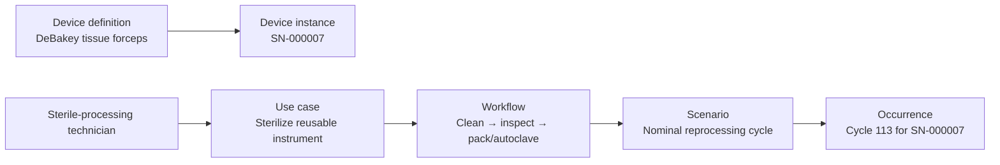

# Reusable instrument: reprocessing architecture description

This is an architecture description of a reusable DeBakey tissue forceps and
one reprocessing cycle. It uses the ISO/IEC/IEEE 42010 idea of documenting the
system of interest, stakeholders and concerns, then the views that address
those concerns. It is an illustrative model, not a validated reprocessing
instruction.

## System of interest, stakeholders, and concerns

| Item | In this example |
| --- | --- |
| System of interest | A reusable DeBakey tissue forceps definition and serial-numbered instance |
| Stakeholder | Sterile-processing technician |
| Main concern | Whether a used instrument is returned to sterile, functional storage with its identity and cycle history intact |
| Operational concern | Cleaning, inspection, sterilization, and release occur in the intended order |
| Lifecycle concern | The definition declares reusability; the instance records the actual instrument and its history |
| Evidence concern | One completed reprocessing cycle is captured as an occurrence, not mistaken for the reusable workflow definition |



## Product and lifecycle view

The device definition holds the reusable lifecycle policy. It is not copied
onto every instrument instance. `forcepsUnit7` is a particular instrument with
its own serial number and reprocessing history.

```sysml
part forcepsDef : MedicalDeviceDefinition {
    attribute :>> name = "TissueForceps_DeBakey";
    attribute :>> technologyDomains = TechnologyDomainKind::mechanical;
    attribute :>> reuse = forcepsReuse;
}
attribute forcepsReuse : ReuseLifecycle {
    attribute :>> reuseMode = ReuseModeKind::reusable;
    attribute :>> maximumReuseCount = 300;
    attribute :>> reprocessingRequired = true;
    attribute :>> sterilizationMethod = SterilizationMethodKind::steamAutoclave;
}
part forcepsUnit7 : MedicalDeviceInstance {
    attribute :>> serialNumber = "SN-000007";
    attribute :>> reprocessingHistorySummary = "112 cycles; jaw alignment inspected 2026-07-01";
    ref :>> definition = forcepsDef;
}
connection : InstanceOf connect instance ::> forcepsUnit7 to definition ::> forcepsDef;
```

## Operational viewpoint: return the instrument to service

The operational viewpoint addresses the technician's concern: what work must
happen before the instrument can return to sterile storage? The use case gives
the goal. The workflow gives the reusable process and its sequence.

```sysml
use case ucSterilize : ClinicalUseCase {
    attribute :>> name = "SterilizeReusableInstrument";
    attribute :>> goalStatement =
        "Return a used instrument to sterile, functional condition for the next case.";
}
connection : Initiates connect initiatingUser ::> sterileProcessingTech
    to initiatedUseCase ::> ucSterilize;
action wfReprocess : OperationalWorkflow {
    attribute :>> name = "InstrumentReprocessingWorkflow";
    attribute :>> entryCondition = "used instrument received in decontamination";
    attribute :>> completionCondition = "sterile pack released to storage";
}
connection : Composes connect parent ::> wfReprocess to child ::> wsClean;
connection : StepPrecedes connect predecessor ::> wsClean to successor ::> wsInspect;
connection : StepPrecedes connect predecessor ::> wsInspect to successor ::> wsSterilize;
```

## Scenario and occurrence view

`scNominalCycle` is a scenario: the selected normal path through the workflow.
`occCycle113` is evidence of one actual execution. Keeping these separate is
the central concept demonstrated by this example: the reusable procedure is
not the same thing as a completed reprocessing record.

```sysml
part scNominalCycle : OperationalScenario {
    attribute :>> name = "NominalReprocessingCycle";
    attribute :>> variantKind = ScenarioVariantKind::nominal;
    ref :>> parentWorkflow = wfReprocess;
}
part occCycle113 : ScenarioOccurrence {
    attribute :>> name = "Cycle113_SN007";
    attribute :>> occurredAt = "2026-07-15T14:02:00Z";
    attribute :>> hypothetical = false;
    attribute :>> outcomeSummary = "cycle 113 of 300 completed; biological indicator passed";
    ref :>> executedScenario = scNominalCycle;
}
```

## Viewpoint correspondence

| Viewpoint | Concern addressed | Model elements to inspect |
| --- | --- | --- |
| Product/lifecycle | What may be reused and under which constraints? | `MedicalDeviceDefinition`, `ReuseLifecycle` |
| Identity | Which physical item underwent the work? | `MedicalDeviceInstance`, `InstanceOf` |
| Operational workflow | What work returns the item to service? | `ClinicalUseCase`, `OperationalWorkflow`, activities and steps |
| Operational occurrence | What happened in a particular cycle? | `OperationalScenario`, `ScenarioOccurrence` |

There is intentionally no software, logical, or physical architecture view:
this example's concern is controlled reuse and evidence of a cycle, not how a
device is implemented.

Open the [source model](https://github.com/memoarchitect/memo/tree/main/examples/reusable-instrument)
to inspect the complete catalog and its overview viewpoint.
