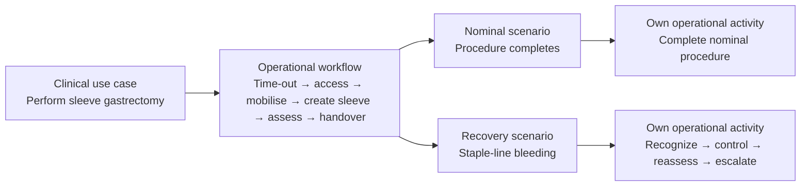

# Surgical workflow modelling: sleeve gastrectomy

This tutorial models one illustrative operation end to end: a laparoscopic
sleeve gastrectomy. It is a modelling example, not a clinical protocol. The
point is to make the clinical work explicit before a device, software item, or
architecture is selected.



## The clinical goal and setting

The use case records the operation's goal, people, and operating-room context.
It is one `ClinicalUseCase`, supported by a reusable workflow—not a duplicate
goal for every scenario.

```sysml
use case ucPerformSleeveGastrectomy : ClinicalUseCase {
    attribute :>> name = "PerformLaparoscopicSleeveGastrectomy";
    attribute :>> goalStatement =
        "Complete the planned laparoscopic sleeve gastrectomy and transfer the patient with the staple line assessed.";
    ref :>> primaryUser = bariatricSurgeon;
    ref :>> supportingActors = (scrubNurse, anesthetist);
    ref :>> useContext = bariatricOr;
}
```

## The reusable workflow

The workflow names the normal work of the operation: confirm time-out and
position, establish access, mobilise the stomach, create the sleeve, assess the
staple line, close, and hand over. `WorkflowStep`s refer to operational
activities, so the order is inspectable without embedding it in prose.

```sysml
action wfSleeveGastrectomy : OperationalWorkflow {
    attribute :>> name = "LaparoscopicSleeveGastrectomyWorkflow";
    attribute :>> entryCondition = "patient prepared; time-out ready";
    attribute :>> completionCondition = "staple line assessed; postoperative handover complete";
}
connection : Composes connect parent ::> wfSleeveGastrectomy to child ::> wsMobilize;
connection : Composes connect parent ::> wfSleeveGastrectomy to child ::> wsSleeve;
connection : StepPrecedes connect predecessor ::> wsMobilize to successor ::> wsSleeve;
connection : SupportsUseCase connect workflow ::> wfSleeveGastrectomy
    to useCase ::> ucPerformSleeveGastrectomy;
```

## A critical task inside the operation

`CreateAndInspectStapleLine` is a critical task, not merely a workflow step.
Its task steps state the work that needs focused review: confirm anatomy,
create the staple line, inspect for bleeding, and assess integrity.

```sysml
action taskCreateStapleLine : CriticalTask {
    attribute :>> name = "CreateAndInspectStapleLine";
    attribute :>> taskGoal =
        "create the planned sleeve and identify bleeding or integrity concerns before completion";
    attribute :>> potentialHarm =
        "bleeding or staple-line complication not recognized before handover";
}
connection : Composes connect parent ::> actSizeAndCreateSleeve
    to child ::> taskCreateStapleLine;
connection : Composes connect parent ::> taskCreateStapleLine to child ::> stInspectBleeding;
```

## Scenarios own their operational activity

The model has a nominal procedure path and a recovery path for observed
staple-line bleeding. Each scenario references its own operational activity.
The recovery activity is an action flow: recognize, control, reassess, then
escalate if needed. It is not a copy of the full surgical workflow.

```sysml
action oaControlStapleLineBleeding : OperationalActivity {
    attribute :>> name = "ControlStapleLineBleeding";
    action recognizeBleeding; action controlBleeding;
    action reassessStapleLine; action escalateIfNeeded;
    first start then recognizeBleeding;
    first recognizeBleeding then controlBleeding;
    first controlBleeding then reassessStapleLine;
}

part scStapleLineBleeding : OperationalScenario {
    attribute :>> name = "StapleLineBleedingRecovery";
    attribute :>> variantKind = ScenarioVariantKind::recovery;
    attribute :>> variationPoint = "bleeding observed during staple-line assessment";
    ref :>> baseScenario = scNominalSleeveProcedure;
    ref :>> parentWorkflow = wfSleeveGastrectomy;
    ref :>> activities = oaControlStapleLineBleeding;
}
connection : Composes connect parent ::> scStapleLineBleeding
    to child ::> oaControlStapleLineBleeding;
```

## What this example deliberately does not model

This is an operational surgical-workflow model. It stops at clinical work,
tasks, workflow steps, scenarios, and action flows. A later model may trace a
selected scenario to functions, devices, requirements, hazards, or evidence;
those elements should be added only when there is a real review question.

Open the [source model](https://github.com/memoarchitect/memo/tree/main/examples/surgical-closure-workflow)
to inspect the full workflow and both scenario paths.

<!-- memo:reinforce -->

## Where this sits in MEMO

Every tutorial is one slice of the same structure. This example populates these layers:

| Layer | Element types it uses | Reference |
| --- | --- | --- |
| Operational | `ClinicalTaskStep`, `OperationalActivity`, `OperationalWorkflow`, `UseCase`, `UseContext`, `User`, `UserTask`, `WorkflowStep` | [Operational](../reference/elements/operational.md) |
| Clinical and products | `ClinicalProcedure`, `ClinicalTechnique` | [Clinical and products](../reference/elements/clinical.md) |
| Assurance | `Need` | [Assurance](../reference/elements/assurance.md) |
| Views and methodology | `MemoDiagramView` | [Views and methodology](../reference/elements/views.md) |

**Typed links it uses:** `Composes`, `Initiates`, `Motivates`, `Realizes`, `StepPrecedes`, `Supports`, `UsesTechnique` — see [Relationships](../reference/relationships.md) for what each one claims and which ends are legal.

**Layers it does not populate:** functional, logical, implementation and realization. That is deliberate rather than incomplete — `layersOptionalRule` says a model fills only the layers its device needs. For a device modelled all the way through, see the [GPCA Pump case study](../case-studies/gpca/index.md).

**Narrative treatment:** [Context and Use](../layers/context.md) · [Medical Products and Identity](../layers/medical-products.md) · [Risk, Cybersecurity, and Assurance](../layers/risk-assurance.md).

**Source model:** [`examples/surgical-closure-workflow`](https://github.com/memoarchitect/memo/tree/main/examples/surgical-closure-workflow)
