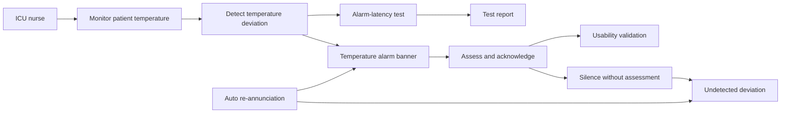

# Temperature Alarm: a small, complete model

This page explains the Temperature Alarm SysML model. It is not a list of
things to model. Follow the code and the relationships to see the whole safety
argument: a nurse monitors a patient, the device detects a deviation, the
alarm supports a critical task, a foreseeable use error creates a hazard, and
a design control is checked with evidence.

| File | Role |
| --- | --- |
| `model/temperature_alarm.sysml` | public parent package |
| `model/catalog/temperature_alarm.sysml` | model elements and relationships |
| `model/viewpoints/temperature_alarm_overview.sysml` | view of the catalog |



## Clinical purpose and human work

The use case states the clinical goal once. The `Initiates` connection says
who starts that use. The acknowledgement activity contains a critical task, so
the human work can be traced to its possible harm and validation.

```sysml
part icuNurse : User {
    attribute :>> id = "TA-USR-001";
    attribute :>> name = "ICUNurse";
    attribute :>> actorKind = ActorKind::clinician;
}
use case ucMonitorTemp : UseCase {
    attribute :>> id = "TA-UC-001";
    attribute :>> name = "MonitorPatientTemperature";
    attribute :>> useCaseKind = UseCaseKind::clinical;
    attribute :>> goalStatement =
        "Continuously monitor core temperature and be alerted when it leaves the safe range.";
}
connection : Initiates connect initiatingUser ::> icuNurse
    to initiatedUseCase ::> ucMonitorTemp;

action taskAckAlarm : CriticalTask {
    attribute :>> name = "AcknowledgeTemperatureAlarm";
    attribute :>> taskGoal = "recognize, assess, and acknowledge the alarm";
    attribute :>> potentialHarm = "delayed intervention for hypo-/hyperthermia";
}
connection : Composes connect parent ::> actAcknowledgeAlarm
    to child ::> taskAckAlarm;
```

## System responsibility and logical channel

`fnDetectDeviation` is the technology-independent responsibility. It is
allocated to `chMonitor`, a logical channel. The model can later allocate that
channel to software or hardware without changing the functional claim.

```sysml
part fnDetectDeviation : SystemFunction {
    attribute :>> id = "TA-FN-001";
    attribute :>> name = "DetectTemperatureDeviation";
    attribute :>> perspective = ArchitecturePerspectiveKind::functional;
    attribute :>> disciplines =
        (EngineeringDisciplineKind::safety, EngineeringDisciplineKind::'verification');
}
part chMonitor : LogicalComponent {
    attribute :>> name = "TemperatureMonitorChannel";
    attribute :>> componentRole = ComponentRoleKind::channel;
    attribute :>> channelRole = ChannelRoleKind::monitor;
}
connection : AllocatedTo connect function ::> fnDetectDeviation
    to allocatedElement ::> chMonitor;
```

## Alarm interaction and safety control

The alarm banner is an element in the model. It triggers an acknowledgement
action and supports the critical task. The connections below form a readable
safety argument: task → use error → hazard; risk control → mitigated hazard;
risk control → the element that implements it.

```sysml
part elAlarmBanner : UIElement {
    attribute :>> name = "TempAlarmBanner";
    attribute :>> alarmPriority = NotificationPriorityKind::high;
    attribute :>> annunciationModality = "flashing banner + tone";
    attribute :>> silenceable = true;
}
connection : ElementTriggersAction connect element ::> elAlarmBanner
    to triggeredAction ::> uiaAcknowledge;
connection : Supports { attribute :>> supportKind = SupportKind::task;
    connect supporter ::> uiBedside to supported ::> taskAckAlarm; }

connection : CommitsUseError connect task ::> taskAckAlarm
    to useError ::> ueSilenceAndForget;
connection : Causes { attribute :>> causeKind = CauseKind::useErrorLeadsToHazard;
    connect cause ::> ueSilenceAndForget to effect ::> hzUndetectedDeviation; }
connection : Mitigates { attribute :>> mitigationKind = MitigationKind::hazard;
    connect control ::> rcReAnnunciate to mitigatedElement ::> hzUndetectedDeviation; }
connection : ControlImplementedBy connect riskControl ::> rcReAnnunciate
    to implementingElement ::> elAlarmBanner;
```

## Evidence is separate from the design

The latency test checks the detection function. The usability validation checks
the nurse's acknowledgement task. These are different claims and therefore
different model elements. The verification case produces a test report.

```sysml
part vcAlarmLatency : VerificationCase {
    attribute :>> name = "VerifyAlarmLatency";
    attribute :>> methodKind = VerificationMethodKind::test;
    attribute :>> acceptanceCriteria = "annunciation within 2 s of sustained deviation";
}
part uvAckTask : UsabilityValidation {
    attribute :>> name = "SummativeAlarmAcknowledgement";
    attribute :>> acceptanceCriteria =
        "no critical-task failures; all alarms assessed before silencing";
}
connection : VerifiedBy connect verificationCase ::> vcAlarmLatency
    to verificationTarget ::> fnDetectDeviation;
connection : Validates connect validationCase ::> uvAckTask
    to validationTarget ::> taskAckAlarm;
connection : ProducesEvidence connect producer ::> vcAlarmLatency
    to producedEvidence ::> evLatencyReport;
```

## The viewpoint does not duplicate the model

The overview view exposes the catalog. It selects and presents existing
elements; it does not introduce a second temperature-alarm architecture.

```sysml
view temperatureAlarmOverview : MemoDiagramView {
    expose memo_examples_temperature_alarm::*;
    attribute depth = 2;
    attribute :>> title = "Temperature Alarm Overview";
    attribute :>> viewKind = DiagramViewKind::general;
    attribute :>> diagramType = "bdd";
}
```

The [full catalog source](https://github.com/memoarchitect/memo/tree/main/examples/temperature-alarm/model/catalog)
contains the remaining attributes and elements used by these excerpts.

<!-- memo:reinforce -->

## Where this sits in MEMO

Every tutorial is one slice of the same structure. This example populates these layers:

| Layer | Element types it uses | Reference |
| --- | --- | --- |
| Operational | `OperationalActivity`, `UseCase`, `User`, `UserTask` | [Operational](../reference/elements/operational.md) |
| Functional | `SystemFunction` | [Functional](../reference/elements/functional.md) |
| Logical | `LogicalComponent` | [Logical](../reference/elements/logical.md) |
| Implementation and realization | `UIAction`, `UIElement`, `UserInterface` | [Implementation and realization](../reference/elements/implementation.md) |
| Assurance | `Evidence`, `Hazard`, `RiskControlMeasure`, `UsabilityValidation`, `UseError`, `VerificationCase`, `VerificationScenario` | [Assurance](../reference/elements/assurance.md) |
| Views and methodology | `MemoDiagramView` | [Views and methodology](../reference/elements/views.md) |

**Typed links it uses:** `ActionInvokesFunction`, `AllocatedTo`, `Causes`, `CommitsUseError`, `Composes`, `ControlImplementedBy`, `ElementTriggersAction`, `ExecutesScenario`, `IndependentOf`, `Initiates`, `Mitigates`, `ProducesEvidence` … +3 — see [Relationships](../reference/relationships.md) for what each one claims and which ends are legal.

**Narrative treatment:** [Context and Use](../layers/context.md) · [Functional Analysis](../layers/operations-system.md) · [Requirements and Architecture](../layers/requirements-architecture.md) · [Risk, Cybersecurity, and Assurance](../layers/risk-assurance.md).

**Source model:** [`examples/temperature-alarm`](https://github.com/memoarchitect/memo/tree/main/examples/temperature-alarm)
