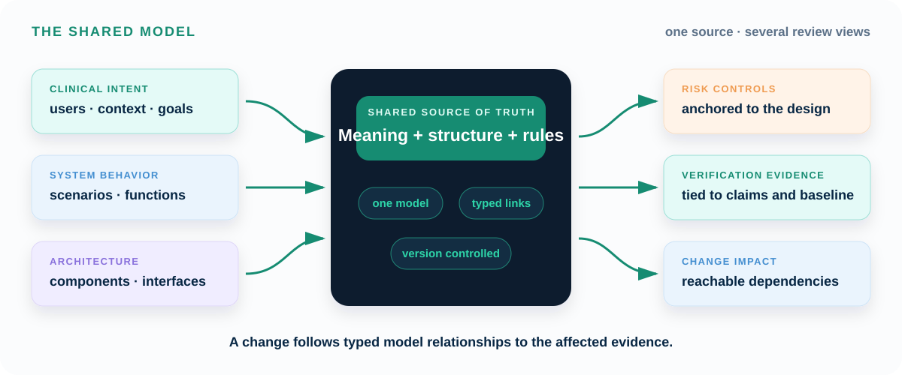

# Explanation

MEMO starts from one problem: a medical-device design changes faster than the
documents used to justify it. Requirements, architecture, risk, verification,
and evidence may remain linked while the engineering meaning of those links
has gone stale.

MEMO's response is to put those facts and claims in one shared model.

{ .memo-presentation-graphic }

The pages in this section explain why that model is needed, what MEMO adds to
SysML v2, and how the model is organized.

## Why MEMO

[Why MEMO](../why/index.md) follows the problem from evidence drift to the
missing shared model:

1. Device complexity makes safety depend on system behavior.
2. Identifier-only traceability cannot state or check an engineering claim.
3. Medical-device standards produce strong discipline-specific records; MEMO
   adds an architecture model that connects them.
4. MEMO addresses the gap with a versionable, architecture-backed semantic
   model.

[Start with Why MEMO →](../why/index.md)

## What MEMO is

[What MEMO is](../what/index.md) explains the implementation of that shared
model. A project imports a SysML v2 library that provides medical-device
concepts, architecture layers, meaningful relationships, and completeness
rules. The project then uses those definitions to model its own device.

The [mental model](../what/mental-model.md) and
[layers](../layers/index.md) explain where each fact belongs and how intent,
design, risk, and evidence remain connected.

[Continue to What MEMO is →](../what/index.md)

## How to use these pages

If MEMO is new to you, read these pages in order:

1. **[Why MEMO](../why/index.md)** — understand the engineering problem the
   ontology addresses.
2. **[What is MEMO](../what/index.md)** — understand what MEMO adds to SysML v2.
3. **[The mental model](../what/mental-model.md)** — learn how intent, design,
   assurance, and evidence form one connected model.
4. **[The layers](../layers/index.md)** — learn where each kind of engineering
   information belongs.
5. **[One closed thread](../what/closed-thread.md)** — follow one concern from
   clinical intent to verification evidence.

After these pages:

- use [How-to Guides](../how-to/index.md) to perform a modeling task;
- use [Tutorials](../examples/index.md) to build a model step by step; and
- use [Reference](../reference/index.md) to look up exact definitions and
  legal relationships.
