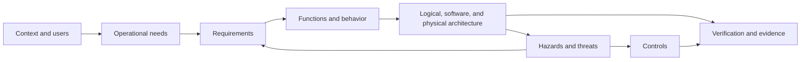

# Model the device as a connected engineering argument

MEMO is a SysML v2 vocabulary for medical-device engineering. It gives teams
shared names for needs, requirements, functions, components, hazards, controls,
tests, evidence, and the relationships between them.

The important idea is simple:

> A model is useful when a reviewer can follow why the device is needed, what it
> must do, how the design responds, what could go wrong, and what evidence shows
> the response is adequate.

## Choose where to begin

| If you are… | Begin with… | You will learn… |
|---|---|---|
| New to MEMO | [The MEMO Mental Model](start/mental-model.md) | How layers, elements, and relationships work together |
| Starting a model | [Your First Model](start/first-model.md) | A small but complete trace from need to evidence |
| Mapping existing artifacts | [Layer Map](layers/index.md) | Where requirements, risks, architecture, and tests belong |
| Looking for a type | [Elements](modeling/elements.md) | Which MEMO element expresses a given engineering idea |
| Connecting records | [Relationships](modeling/relationships.md) | Which direction and semantic link to use |
| Learning from a real model | [GPCA Pump Walkthrough](examples/gpca-walkthrough.md) | How the included example grows across layers |

!!! note "MEMO complements engineering judgment"
    The ontology helps structure claims and expose gaps. It does not decide
    clinical acceptability, regulatory strategy, or risk acceptability for you.
