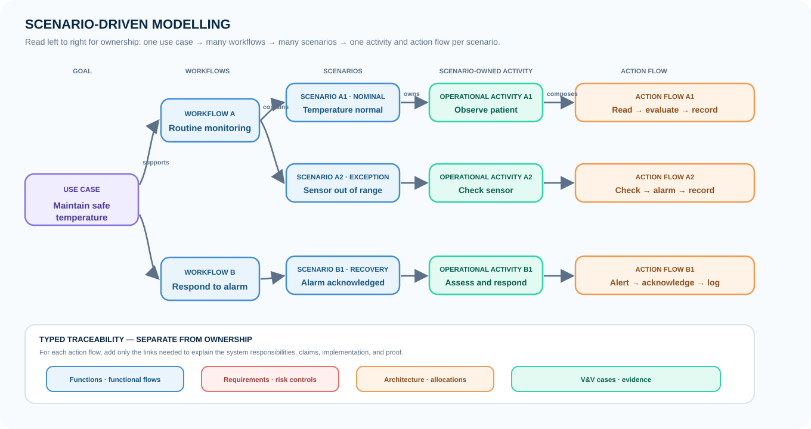

Medical Engineering Modeling Ontology

# Make the engineering argument visible

MEMO is a portable SysML v2 library for medical-device engineering. It gives a
team one shared vocabulary for the clinical work, the device, its risks, and
the evidence used to review it — from a reusable forceps to a surgical robot,
without forcing either through the other's layers.

Use case<i>→</i>Workflow<i>→</i>Scenarios<i>→</i>Functions<i>→</i>Architecture<i>→</i>Evidence

## Why use a shared model

One device is usually described in several places: intended use, requirements,
architecture, risk analysis, and test records. The same alarm may appear in
all of them. If each record is separate, a change can leave one of them out of
date.

MEMO keeps one record for each thing and gives each link a clear meaning. For
example:

- a need motivates a use case;
- a requirement is satisfied by a design element;
- a risk control mitigates a hazard;
- a test checks a claim and produces evidence.

This gives a reviewer a direct way to check the model:

- Why does this requirement or function exist?
- Which part is responsible for it?
- Which hazard or control does it affect?
- Which test and evidence support it?

When something changes, follow these links to find what must be reviewed. The
model supports that check; the engineering team still makes the clinical,
risk-acceptance, and approval decisions.

{ .memo-zoomable aria-label="Open the architecture and assurance V-model" }

## What MEMO provides

### Behavior

- Stakeholders, users, and use contexts
- Use cases and clinical procedures
- Workflows split into nominal, alternate, and exception scenarios
- Activities, tasks, states, and functional flows

### Architecture

- Functions and typed functional exchanges
- Logical components, channels, and interfaces
- Software structure, runtime, and deployment
- Hardware assemblies, physical parts, and ports

### Assurance

- Requirements and design constraints
- Safety risk, controls, and FMEA
- Cybersecurity assets, threats, and mitigations
- Human factors, V&V cases, evidence, and records

## Scenario-driven modelling

Start with one story about use of the device. One use case can be supported by
several workflows. Each workflow can have several nominal, alternate,
exception, or recovery scenarios. Each scenario owns its own operational
activity. That activity contains the action flow for the selected path; the
action flow calls the functions the device must support. Read the model from
left to right:

`use case → workflow → scenario → activities and functions → architecture → evidence`

| Step | What it means | What to model next |
| --- | --- | --- |
| **Use case** | A user goal, such as “receive a safe bolus.” It says what success looks like. | Identify the user, need, and use context. |
| **Workflow** | A reusable way people and the device work toward the use case. One use case may have more than one workflow. | Break each workflow into steps. |
| **Scenario** | One operational path through one workflow. Each workflow can have nominal, alternate, exception, and recovery scenarios. | State the conditions and selected steps. |
| **Scenario activity and action flow** | Each scenario has its own operational activity. The activity composes the action flow for that path, which calls the functions the system must perform. | Model the activity's actions and connect them to the functions they call. |
| **Architecture** | The parts that take responsibility for functions and exchanges. | Allocate each important function to a responsible part. |
| **Evidence** | Tests, validation, and records showing a claim or control was met. | Link each claim to its case and result. |

The arrows describe traceability, not a mandatory lifecycle. Requirements and
risk controls can introduce or change functions at any point. A manual
instrument can go from activity straight to physical parts; a software-only
device has no hardware layer. Choose only what is needed, but keep every claim
connected to its reason, responsible design, and evidence.

The distinction is deliberate: a **use case** says what success looks like; it
can have several **workflows**; each workflow can have several **scenarios**;
and each scenario owns an operational activity that composes its action flow.
The action flow calls the functions needed on that path. Functions then connect to requirements, risk controls,
architecture, verification, and evidence. Do not jump from a use case straight
to architecture: use scenarios to make the operational reason for each
function visible.

**Read next:** [Start with a small connected model](start/mental-model.md),
then continue through the guide in the order shown in the navigation.

!!! note "MEMO complements engineering judgment"
    The ontology helps structure claims and expose gaps. It does not decide
    clinical acceptability, regulatory strategy, or risk acceptability for you.

## Choose where to begin

<a class="memo-start-card" href="start/mental-model/">
<strong>01 · Understand the model</strong>
Layers, labels, elements, and relationships in one page.
</a>

<a class="memo-start-card" href="tutorials/first-model/">
<strong>02 · Model one complete slice</strong>
Build a small thread from need to evidence in SysML v2.
</a>

<a class="memo-start-card" href="examples/">
<strong>03 · Learn from the examples</strong>
Focused models, each answering one modeling question.
</a>

<a class="memo-start-card" href="examples/gpca-walkthrough/">
<strong>04 · Study GPCA end to end</strong>
A complete infusion-pump model built from public research artifacts.
</a>

