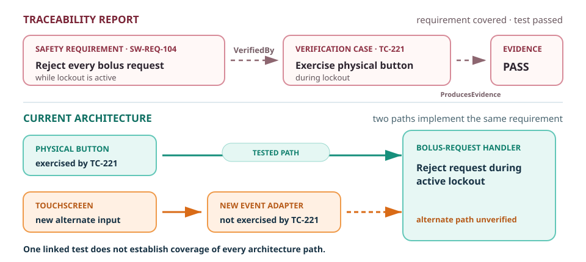
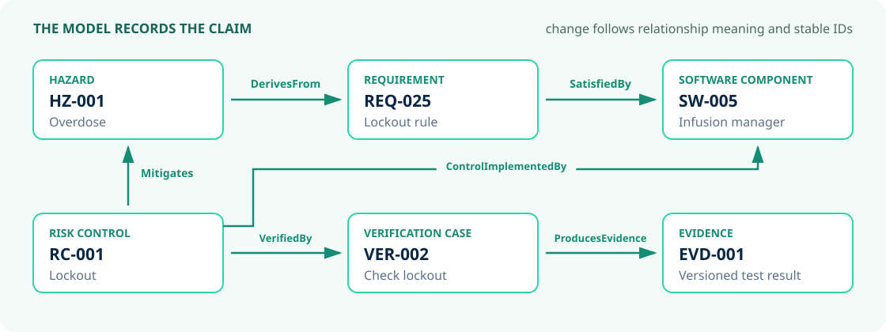

Medical Engineering Modeling Ontology

# MEMO

A SysML v2-native ontology for keeping medical-device architecture, risk,
verification, and evidence connected as the design changes.

## What is MEMO

MEMO is a domain model for medical-device engineering. It specializes SysML v2
with the concepts and rules needed to describe a device and its assurance case
in the same model.

It covers the clinical context, behavior, architecture, requirements, risk,
cybersecurity, verification, and evidence. These are not separate document
models. They are different views of one connected engineering model.

MEMO is distributed as importable SysML v2 source. It defines the model; it is
not an editor, command-line tool, or modeling application.

## Problem statement

Medical devices are software-intensive, connected, and configurable. Safety
depends on the behavior of the whole system—not on any single requirement or
component.

The assurance case, however, is split across teams and artifacts:

- Requirements are traced to tests, but not always to the behavior being tested.
- Hazards and controls are recorded, but controls may not be anchored to the design.
- Threats are listed, but may not be tied to the interfaces they threaten.
- Architecture is documented, but can drift from the implementation.

The artifacts are linked, but the links often stop at IDs. They do not capture
the engineering meaning of the claim. When the design changes, the links still
resolve even when the evidence behind them has become stale.

## Solution

The missing piece is a shared, architecture-backed model that every assurance
activity can use.

### Shared source of truth

Clinical intent, behavior, architecture, requirements, risk, verification, and
evidence are modeled together.

### Meaningful connections

Relationships state the claim being made—not merely that two identifiers are
associated.

### Architecture backbone

Risk controls, interfaces, behavior, implementation, and evidence remain tied
to the design they describe.

### Computable review

Completeness checks, change-impact analysis, and assurance views can be derived
from the model.

The goal is not another document. It is one versionable engineering model whose
meaning can be reviewed and checked as the design evolves.

## Introducing MEMO

SysML v2 provides the language substrate: packages, parts, requirements,
actions, interfaces, relationships, and typed model structure. MEMO adds the
medical-device semantic layer:

- **Typed elements** for clinical use, medical products, architecture,
  requirements, hazards, controls, verification, and evidence.
- **Typed relationships** with direction, meaning, and legal ends.
- **Closure rules** that express completeness and consistency questions as
  model constraints.

In this model, the requirement exists because of a known hazard, the component
satisfies that requirement, the control mitigates the hazard, and verification
produces evidence. A change can therefore follow the meaning of the model
instead of stopping at a list of IDs.

---

`memo::` · open source · SysML v2 · ISO 14971 · IEC 62304 · ISO/IEC/IEEE 42010
