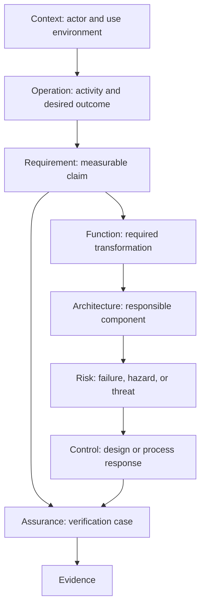

# Layer Map

MEMO layers organize meaning, not folders or organizational ownership. A layer
should tell a reader which question an element answers.

| Layer | Primary question | Typical elements | Useful output |
|---|---|---|---|
| Context | Who and what surrounds the device? | `Actor`, `IntendedUse`, `UseContext`, `UseError` | System-context view |
| Operational | What work and outcomes matter? | `OperationalActivity`, `OperationalCapability`, `OperationalScenario` | Operational thread |
| System analysis | What must the system accomplish? | `SystemCapability`, `FunctionalChain`, `SystemScenario` | Capability and functional-chain views |
| Requirements | What must be true? | `StakeholderNeed`, `SystemRequirement`, `SoftwareRequirement`, `HardwareRequirement` | Requirement trace |
| Functions and behavior | What transformations and states are needed? | `LogicalFunction`, `BehaviorMachine`, `ModeState`, `ActivityAction` | Functional flow, state, and action views |
| Logical architecture | Which solution-independent responsibilities exist? | `LogicalComponent`, `Interface`, `ComponentExchange` | Logical architecture and interconnect |
| Software and hardware | What implements the logical design? | `SoftwareItem`, `FirmwareItem`, `HardwareAssembly`, `ProcessingNode` | Software and physical architecture |
| Risk and cybersecurity | What can lead to harm or compromise? | `Hazard`, `HazardousSituation`, `Threat`, `Vulnerability`, `RiskControl` | Risk chain, FMEA, threat model |
| Assurance | What evidence supports the claims? | `VerificationCase`, `ValidationCase`, `TestArtifact`, `Evidence` | Coverage and evidence views |

## A practical modeling order

For each important use scenario:

This order is a guide, not a gate. Start where the strongest information exists,
then trace outward until the slice is reviewable.
