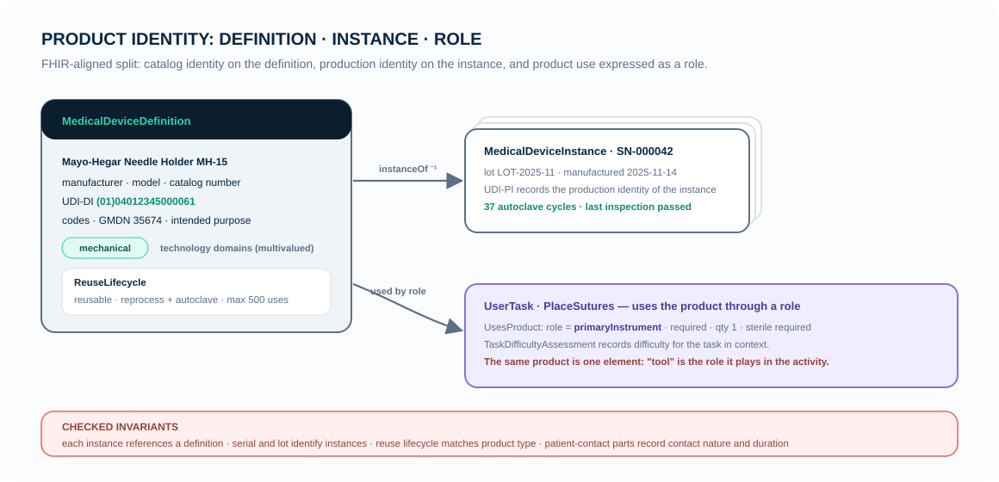

# Medical Products and Identity

Architecture describes what you design; a product is what the world receives.
MEMO separates the two because they change on different clocks and answer
different questions: a design review asks about components and channels, a
field-safety action asks *which serial numbers*. The split follows HL7 FHIR's
`DeviceDefinition`/`Device` pair, so regulatory exports stay lossless.



## Definition vs. instance

A **MedicalDeviceDefinition** is catalog identity: manufacturer, model,
catalog number, intended purpose, UDI-DI, terminology codes (GMDN, EMDN,
SNOMED via `TerminologyCode` — never one ambiguous `code` string), the
multivalued technology domains, and the reuse lifecycle. A
**MedicalDeviceInstance** is production identity: serial number, lot, UDI-PI,
manufacture and expiry dates, software version, calibration and reprocessing
history. Conformance rules enforce the boundary: every instance references
exactly one definition, and instance identifiers on a definition are an error.

## Technology domains, not type explosions

An infusion pump is mechanical *and* electrical *and* electronic *and*
software. Encoding every combination as a subclass would explode the type
system, so technology participation is a multivalued classification
(`technologyDomains`), and derived notions like "electromechanical" or
"cyber-physical" are computed from the set. The product kinds that *do* carry
distinct semantics are few: `MedicalInstrument`, `MedicalEquipment`,
`MedicalDeviceAccessory`, `MedicalConsumable`, `MedicalSupply`, `Implant`.

## Reuse is a property cluster, not a class hierarchy

Whether a product is single-use or reprocessable does not change what kind of
thing it is — a syringe and a forceps are both instruments. So reuse is a
`ReuseLifecycle` value on the definition: reuse mode, maximum reuse count,
cleaning/disinfection/reprocessing requirements, supplied-sterile,
sterilization method, shelf life, lot traceability, UDI applicability. The
rules then check coherence: a single-use product must not carry a reusable
reprocessing lifecycle; a reusable sterile instrument must state its
reprocessing requirements; a patient-contact part must declare contact nature
and duration (ISO 10993-1).

## Products in use: roles

Activities and tasks reference products through `UsesProduct` /
`UsesProduct`, which carries the role (primary, assisting, cutting,
measurement, consumable, …), quantity, sterile and calibration requirements,
and permitted alternatives. The same needle holder that is a "primary
instrument" in suturing is one model element with one physical decomposition —
the role lives on the relationship, so nothing is duplicated between the
operational and physical worlds.

## Minimal usage

A reusable instrument's identity, stated after the reasoning above:

```sysml
part needleHolderDef : MedicalDeviceDefinition {
    attribute :>> name = "MayoHegarNeedleHolder_15cm";
    attribute :>> manufacturer = "Example Surgical GmbH";
    attribute :>> technologyDomains = TechnologyDomainKind::mechanical;
    attribute :>> udiDeviceIdentifier = "(01)04012345000061";
    attribute :>> reuse = reuseProfile;
}
part needleHolderUnit42 : MedicalDeviceInstance {
    attribute :>> serialNumber = "SN-000042";
    attribute :>> lotNumber = "LOT-2025-11";
    ref :>> definition = needleHolderDef;
}
connection : InstanceOf connect instance ::> needleHolderUnit42 to definition ::> needleHolderDef;
```

Study [Manual Surgical Instrument](../examples/manual-surgical-instrument.md),
[Single-Use Device](../examples/single-use-device.md), and
[Reusable Instrument](../examples/reusable-instrument.md)
for the complete patterns.
