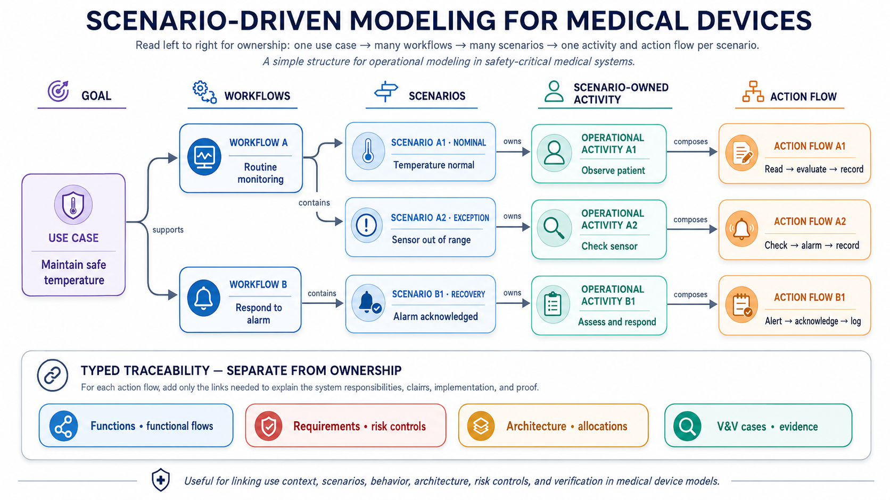

# The Operational World

The operational layer describes work **as it is performed** — clinical care,
field service, manufacturing, or product development — often before any
particular device exists. This ordering is deliberate: a device is an
intervention in someone's workflow, and you cannot argue that an intervention
helps unless the workflow itself is in the model. Clinical work is one
specialization, not the boundary of the layer. It is also what
ISO/IEC/IEEE 42010, IEC 62366-1, and use-related risk analysis assume you
have: identified users, real tasks, and the context of use.

## Who: stakeholders, actors, users

MEMO keeps three roles distinct because they answer different review
questions. A **Stakeholder** has concerns about the system but need not touch
it (a hospital procurement lead). An **Actor** interacts with the system and
may not be human (a pharmacy information system). A **User** is a human actor
who interacts with the medical device — the population human-factors
engineering is accountable for. One real-world entity may play several roles;
MEMO links them (`ActsAsActor`) instead of merging the types.

| Element | Use it for |
|---|---|
| `Stakeholder`, `Concern` | Interests the architecture must answer (ISO 42010) |
| `Actor` → `User` / `NonHumanActor` | Anything that interacts with the system |
| `User` → `ClinicalUser`, `PatientUser`, `CaregiverUser`, `TechnicianUser` | The intended human users |
| `IntendedUse`, `UseContext`, `UseEnvironment` | The governed purpose and the setting of use |

## What for: needs and use cases

A **Need** is a problem-space expectation in stakeholder language; the needs
hierarchy separates user, business, service, regulatory, and operational
needs. A **UseCase** is the goal a person or organization wants to achieve
with system support. `ClinicalUseCase` covers patient care; `ServiceUseCase`,
`ManufacturingUseCase`, and `DevelopmentUseCase` cover the same pattern beyond
clinical operation. There is no separate "Goal" class: the use case *is* the
goal, with its trigger, preconditions, success and failure outcomes.

## How: procedures, workflows, scenarios, tasks

This is the heart of the layer, and the reasoning matters more than the
element names. A **ClinicalProcedure** is the medically defined intervention
(SNOMED-codeable). An **OperationalWorkflow** is how the work of carrying it
out is organized — a reusable definition with steps, decisions, parallel
branches, handoffs, roles, and resources, which can describe the *as-is* world
before your device and the *to-be* world after it, linked by typed
transformation relations (preserves / automates / augments / eliminates a
step). A **scenario** is a selected path through a workflow. An **occurrence**
is one actual execution:

[](../assets/scenario-driven-modeling.png){ .memo-zoomable aria-label="Open the scenario-driven modeling diagram" }

The diagram shows the ownership structure used by MEMO: a use case can be
supported by several workflows; a workflow can contain several scenarios; and
each scenario owns the operational activity and action flow that describe its
selected path. Requirements, risk controls, allocations, and verification
evidence remain typed traceability links rather than additional ownership.

Scenarios are classified along three independent dimensions — variant
(nominal, alternate, exception, recovery), operational condition (normal,
degraded, emergency, foreseeable misuse, …), and purpose (analysis, design,
verification, validation, risk, cybersecurity) — so the same workflow serves
every discipline without being copied. An alternate scenario must name its
base scenario or variation point; duplicating the workflow per scenario is a
rule violation, not a style choice.

Below the workflow sit **OperationalActivity** (work performed),
**UserTask** and **CriticalTask** (units of user work; critical tasks must
trace to usability validation), and **ClinicalTaskStep** (grasp needle, drive
needle, tie knot — the granularity of task analysis). Task difficulty is a
`TaskDifficultyAssessment` attached to a task *in a context* — suturing a
high-BMI patient is hard; the needle holder is not "a difficult instrument."

## With what: products by role

Activities use instruments, consumables, and devices through the role-typed
`UsesProduct` relationship (primary instrument, cutting instrument,
consumable, …). The product remains one element — "tool" is a role it plays in
an activity, never a second copy of the product. See
[Medical Products and Identity](medical-products.md).

## Worked examples

- [Surgical Workflow Modelling](../examples/surgical-closure-workflow.md) — the full operational world with no system layers at all.
- [Reusable Instrument](../examples/reusable-instrument.md) — a reprocessing workflow with a recorded occurrence.

## Minimal usage

The reasoning above first; then the smallest useful slice reads like this —
a user, a goal, and the link that says why the goal exists:

```sysml
part surgeon : ClinicalUser {
    attribute :>> name = "Surgeon";
}
requirement needSecureClosure : Need {
    attribute :>> needKind = NeedKind::clinicalUser;
    attribute :>> statement =
        "The surgeon needs to close the incision so that tissue heals with minimal scarring.";
}
use case ucCloseIncision : ClinicalUseCase {
    attribute :>> name = "CloseSurgicalIncision";
    attribute :>> goalStatement = "Close the surgical incision with secure tissue approximation.";
}
connection : Motivates connect motivatingNeed ::> needSecureClosure to motivatedUseCase ::> ucCloseIncision;
connection : Initiates connect initiatingUser ::> surgeon to initiatedUseCase ::> ucCloseIncision;
```

## Continue the story

Next, read [Functional Analysis](operations-system.md). It explains
how one selected operational scenario identifies the functions the system must
perform, without yet deciding whether those functions are software, hardware,
or mechanical.
