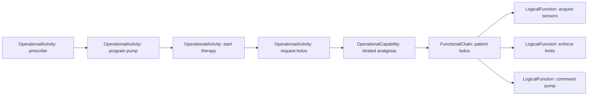

# Operations and System Analysis

These layers bridge the problem space and the solution space.

- **Operational modeling** describes work as stakeholders understand it.
- **System analysis** describes capabilities, scenarios, and functional chains
  the system must realize.

## Operational elements

| Element | Meaning |
|---|---|
| `OperationalEntity` | A participant in the operational world |
| `OperationalActivity` | Work performed to reach an outcome |
| `OperationalCapability` | An outcome the operation must be able to achieve |
| `OperationalScenario` | A particular sequence or situation |
| `OperationalInteraction` | An exchange between operational participants |

Useful links include `Performs`, `ContributesToCapability`, `SequencesStep`, and
`DerivesSystemNeed`.

## System-analysis elements

| Element | Meaning |
|---|---|
| `SystemCapability` | Ability the system must provide |
| `FunctionalChain` | Ordered cooperation of functions |
| `FunctionalChainStep` | One step in a chain |
| `SystemScenario` | System response in a particular situation |
| `Mission` | Higher-level objective supported by capabilities |

Useful links include `RealizesCapability`, `IncludesStep`, `InvolvesFunction`,
and `RealizesScenario`.

## Example thread

Use operational names that stakeholders recognize. Introduce implementation
terms only after you cross into system functions and architecture.
