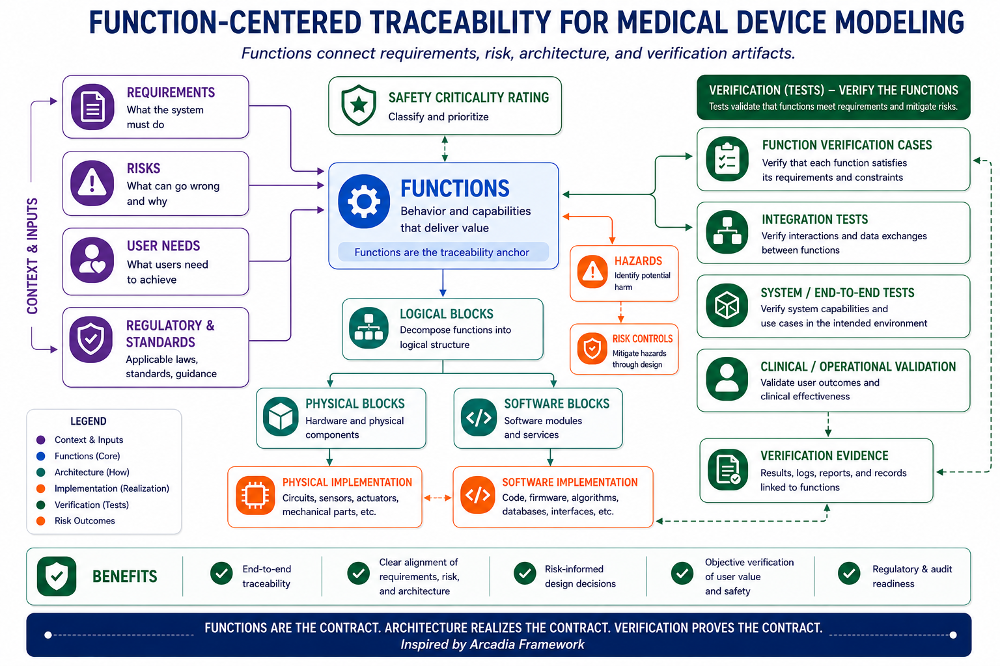
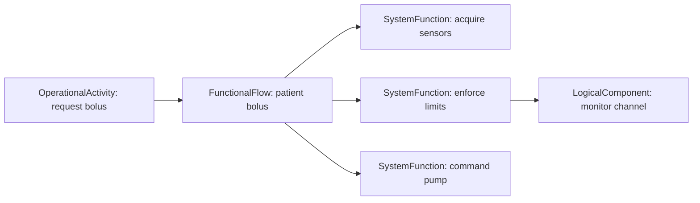

# Functional Analysis

The functional layer answers *what the system must do* without saying how.
This separation is what lets one functional architecture survive a technology
change — and what stops every function from silently becoming software. A
`SystemFunction` may be realized by human action, mechanics, electronics,
software, or a combination; the allocation decision is explicit and comes
later.

## Keep five meanings distinct

The vocabulary here earns its size by preventing one recurring confusion —
work, responsibility, behavior, organization, and path are different claims:

| Element | Meaning |
|---|---|
| `OperationalActivity` | Work performed in the operational world (by people) |
| `SystemFunction` | Technology-independent responsibility of the system |
| `FunctionalFlow` / `FunctionalFlowStep` | Reusable organization of functions with typed steps |
| `FunctionalScenario` | A selected path through a functional flow |

`FunctionalExchange` is a typed transfer (measurement, command, alarm, …)
between functions. An action flow may call a function, but it is diagram
behaviour rather than another functional-architecture element.

## Core relationships

| Relationship | Reads as |
|---|---|
| `EnablesActivity` | This function enables that operational work — it does not perform it |
| `InvolvesFunction` / `IncludesStep` | This flow organizes these functions and steps |
| `SelectsFlow` / `FunctionalRealizesOperational` | This functional scenario selects a flow and realizes an operational scenario |
| `AllocatedTo` | This function is the responsibility of that logical component |

{ .memo-zoomable aria-label="Open the function-centered traceability diagram" }

Functions provide a useful traceability anchor: requirements and risk controls
constrain them, architecture elements take responsibility for them, and
verification cases produce evidence about them. The source model remains the
authority for the exact relationship types and their endpoints.

## Example thread

```mermaid
flowchart LR
    Bolus[OperationalActivity: request bolus] --> Chain[FunctionalFlow: patient bolus]
    Chain --> Sense[SystemFunction: acquire sensors]
    Chain --> Limit[SystemFunction: enforce limits]
    Chain --> Command[SystemFunction: command pump]
    Limit --> Logical[LogicalComponent: monitor channel]
```

In the GPCA example, `gpca_behavior_subsystems.sysml` defines the functions
and exchanges, and `gpca_system.sysml` organizes them into flows whose steps
carry typed references to functions and exchanged items — follow `FCS-001`
through `FCS-005` for the complete bolus path.

## Continue the story

Next, read [Requirements and Architecture](requirements-architecture.md). It
connects the claims that constrain a function to the logical and implemented
parts responsible for it.
