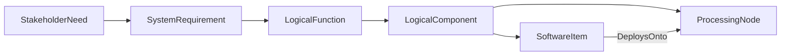

# Requirements and Architecture

Requirements state what must be true. Architecture assigns responsibility for
making it true.

## Requirements

Choose the kind that matches the level of the claim:

| Kind | Appropriate claim |
|---|---|
| `StakeholderNeed` | Desired outcome in stakeholder language |
| `SystemRequirement` | Externally observable system behavior or constraint |
| `SoftwareRequirement` | Behavior or constraint allocated to software |
| `HardwareRequirement` | Behavior or constraint allocated to hardware |
| `DesignControlNeed` | Controlled design input |
| `DesignControlSpecification` | Controlled implementation specification |

A strong requirement has a stable identifier, one principal obligation,
observable acceptance criteria, and a source or rationale.

## Functions and behavior

Use `LogicalFunction` for solution-independent transformations. Use behavior
elements such as `BehaviorMachine`, `ModeState`, `Transition`, `ActivityAction`,
and `InteractionScenario` when order, state, or interaction matters.

## Architecture

| Concern | Element examples |
|---|---|
| Logical responsibility | `LogicalComponent` |
| Software structure | `SoftwareSystem`, `SoftwareComponent`, `SoftwareItem`, `FirmwareItem`, `SOUPComponent` |
| Hardware structure | `HardwareAssembly`, `ProcessingNode` |
| Interfaces | `Interface`, `HardwareInterface`, `SoftwareInterface`, `DataPort`, `ComponentExchange` |
| Physical realization | `PhysicalPort` and physical architecture specializations |

Keep the logical architecture implementation-neutral long enough to compare
alternatives. Then use allocation, deployment, hosting, and interface
realization relationships to connect it to concrete design.

