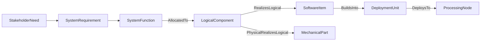

# Requirements and Architecture

Requirements state what must be true. Architecture assigns responsibility for
making it true — first without technology commitments (logical), then with
them (implementation). Keeping those two commitments apart is what lets you
compare alternatives, argue independence of safety channels, and change a
processor without rewriting the safety case.

## Requirements

Choose the kind that matches the level of the claim:

| Kind | Appropriate claim |
|---|---|
| `StakeholderNeed` and the needs hierarchy | Desired outcome in stakeholder language (see [The Operational World](operational-world.md)) |
| `SystemRequirement` | Externally observable system behavior or constraint |
| `SoftwareRequirement` / `HardwareRequirement` | Behavior or constraint allocated to one realization |
| `DesignControlNeed` / `DesignControlSpecification` | Controlled design inputs and outputs |

A strong requirement has a stable identifier, one principal obligation,
observable acceptance criteria, and a source or rationale. MEMO's EARS and
obligation attributes let tools lint the pattern.

## Logical architecture: organization without technology

The logical layer holds responsibility structure: `LogicalSystem`,
`LogicalSubsystem`, `LogicalComponent`, plus the safety-architecture
vocabulary — `LogicalChannel` with a typed role (primary, secondary,
redundant, diverse, monitor, watchdog, interlock, independent protection),
`LogicalControlElement`, `LogicalDataStore`, `LogicalUserInterface`,
`IsolationBoundary`, and `FaultContainmentRegion`. Two design rules follow
from the reasoning, and both are checked:

- **Redundancy is roles plus independence.** Two channels claiming
  independence are linked by `IndependentOf` with the basis stated (separate
  sensing, power, processing) — never modeled as two identically named copies.
- **Flows are typed.** A logical connection carries a `FlowContentKind`:
  information, command, measurement, alarm — but also energy, material,
  fluid, and mechanical force, because medical devices move more than data.

## Implementation: software in three views, physics in one taxonomy

Software structure answers three different questions, so MEMO gives it three
views (the SEI viewtypes): the **module view** (`SoftwareSystem`,
`SoftwareItem`, `SoftwareUnit`, `SOUPComponent` — the IEC 62304
decomposition), the **runtime view** (`RuntimeComponent`, `Process`,
`Thread`, `Service`, `RuntimePartition` — concurrency, scheduling, WCET,
restart policy), and the **deployment view** (`DeploymentUnit` builds from
modules and deploys to a `ProcessingNode`; runtime components are hosted
there). Physical realization spans the full taxonomy — mechanical,
electrical, electronic, fluidic, pneumatic, optical, acoustic, thermal —
because "physical" means more than a circuit board.

| Concern | Element examples |
|---|---|
| Logical responsibility | `LogicalComponent`, `LogicalChannel`, `IsolationBoundary` |
| Software module view | `SoftwareSystem`, `SoftwareItem`, `SoftwareUnit`, `SOUPComponent` |
| Software runtime view | `RuntimeComponent`, `Process`, `Thread`, `Service`, `RuntimePartition` |
| Deployment | `DeploymentUnit`, `ProcessingNode`, `RuntimeEnvironment` |
| Physical realization | `PhysicalAssembly`, `Sensor`, `Actuator`, `FluidicComponent`, `OpticalComponent`, … |
| Interfaces | `Interface` taxonomy, `LogicalPort`/`LogicalInterface`, `ComponentExchange` with typed endpoints |

```mermaid
flowchart LR
    Need[StakeholderNeed] --> Req[SystemRequirement]
    Req --> Function[SystemFunction]
    Function -->|AllocatedTo| Logical[LogicalComponent]
    Logical -->|RealizesLogical| Module[SoftwareItem]
    Module -->|BuildsInto| Unit[DeploymentUnit]
    Unit -->|DeploysTo| Node[ProcessingNode]
    Logical -->|PhysicalRealizesLogical| Mech[MechanicalPart]
```

The `embedded-infusion-pump` example shows the three software views on one
device; `functional-logical-physical` shows one logical element realized by
software *and* mechanics at once — the reason the layers must not collapse.

## Behavior

Use `BehaviorMachine`, `ModeState`, `Transition`, and `TimingConstraint` when
order, state, or timing matters, and keep device modes distinct from UI states
(`memo_interaction`) — a confirmation screen is not a therapy mode.

## Continue the story

Next, read [Risk, Cybersecurity, and Assurance](risk-assurance.md). It shows
how hazards, threats, controls, verification, validation, and evidence attach
to the same behavior and architecture.
