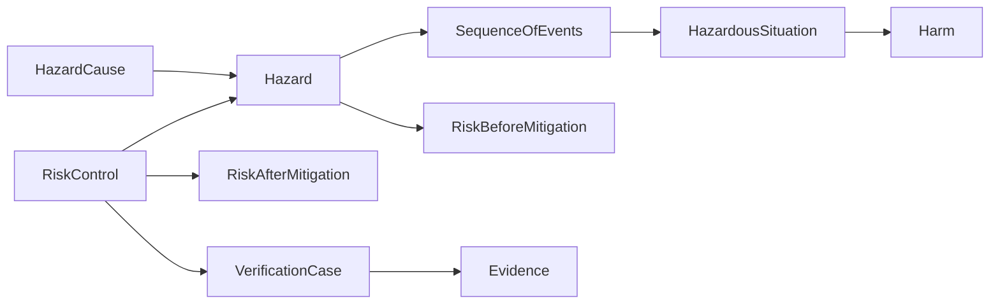

# Risk, Cybersecurity, and Assurance

Risk and assurance are cross-cutting arguments. They should connect to context,
requirements, design, and evidence rather than sit in isolated registers.

## Safety-risk chain

| Element | Question |
|---|---|
| `Hazard` | What is the potential source of harm? |
| `SequenceOfEvents` | How could the situation develop? |
| `HazardousSituation` | When is someone exposed to the hazard? |
| `Harm` | What injury or damage may result? |
| `RiskBeforeMitigation` | What is the initial risk estimate? |
| `RiskControl` | What reduces probability or severity? |
| `RiskAfterMitigation` | What residual risk remains? |

## Cybersecurity chain

Use `CybersecurityAsset`, `AttackSurface`, `Threat`, `Vulnerability`,
`ThreatScenario`, `CyberRisk`, `CyberMitigation`, `SecurityRequirement`,
`TrustBoundary`, and `SecurityClaim`.

Safety and security are connected. Use `ImpactsSafety` when a cyber condition
can affect a safety claim; do not duplicate the same risk independently in two
registers.

## Assurance

| Element | Role |
|---|---|
| `VerificationCase` | Shows the design output meets a specified input |
| `ValidationCase` | Shows the resulting device meets user needs and intended use |
| `TestArtifact` | Procedure, protocol, setup, or result artifact |
| `Evidence` | Reviewable support for a claim |

Connect evidence to the claim it supports. A file path alone is not a complete
assurance argument; record the verification case, acceptance basis, result, and
the evidence artifact.
