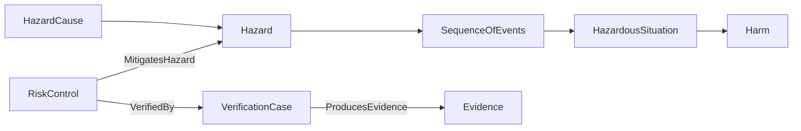

# Risk, Cybersecurity, and Assurance

Risk and assurance are cross-cutting arguments. They connect to context,
requirements, design, and evidence rather than sitting in isolated registers —
and in MEMO they claim existing elements through typed relationships instead
of copying them into a "safety model."

## Safety-risk chain (ISO 14971)

| Element | Question |
|---|---|
| `Hazard` | What is the potential source of harm? |
| `SequenceOfEvents` | How could the situation develop? |
| `HazardousSituation` | When is someone exposed to the hazard? |
| `Harm` | What injury or damage may result? |
| `RiskBeforeMitigation` / `RiskAfterMitigation` | Initial and residual risk estimates |
| `RiskControl` | What reduces probability or severity? |

```mermaid
flowchart LR
    Cause[HazardCause] --> Hazard[Hazard]
    Hazard --> Events[SequenceOfEvents]
    Events --> Situation[HazardousSituation]
    Situation --> Harm[Harm]
    Control[RiskControl] -->|MitigatesHazard| Hazard
    Control -->|VerifiedBy| Test[VerificationCase]
    Test -->|ProducesEvidence| Evidence[Evidence]
```

## Human factors (IEC 62366-1, FDA HF guidance)

The usability chain runs from the operational world into risk: a `UserTask`
can commit a `UseError`; a safety-relevant use error must trace to a `Hazard`;
a `CriticalTask` — one whose failure could cause serious harm — must trace to
a `UsabilityValidation`. `HazardRelatedUseScenario` selects the scenarios for
summative evaluation, and `FormativeEvaluation` records what design iteration
learned. A risk control implemented in the UI (a confirmation dialog, a
guarded control, alarm re-annunciation) is linked to the implementing
`UIElement` with `ControlImplementedBy` — the `temperature-alarm` example
walks the entire chain.

## Cybersecurity chain

Use `CybersecurityAsset`, `AttackSurface`, `Threat`, `Vulnerability`,
`ThreatScenario` (a scenario specialization — it shares the workflow/scenario
semantics), `CyberRisk`, `CyberMitigation`, `SecurityRequirement`,
`TrustBoundary`, and `SecurityClaim`. Interfaces that cross a trust boundary
say so (`CrossesTrustBoundary`); see `connected-patient-monitor`.

Safety and security are connected. Use `ImpactsSafety` when a cyber condition
can affect a safety claim; do not duplicate the same risk independently in two
registers.

## V&V and evidence

| Element | Role |
|---|---|
| `VerificationCase` / `VerificationScenario` | Shows a design output meets a specified input, and the path exercised |
| `ValidationCase` | Shows the device meets user needs and intended use — `Validates` closes the loop to the operational world |
| `UsabilityValidation` | Summative evaluation of critical tasks |
| `Evidence` / `TestArtifact` | Reviewable support for a claim |

The V-model is a **view over these relationships**, not an ontology hierarchy:
each definition-side layer is validated or verified by the matching
integration-side activity (see the [Layer Map](index.md)). Coverage rules keep
the graph honest: safety-critical functions must trace to verification, and
critical tasks to usability validation.

Connect evidence to the claim it supports. A file path alone is not a complete
assurance argument; record the verification case, acceptance basis, result,
and the evidence artifact.

## Continue the story

Next, read [Elements](../modeling/elements.md) and
[Relationships](../modeling/relationships.md) for the practical choices used
to write this connected model.
