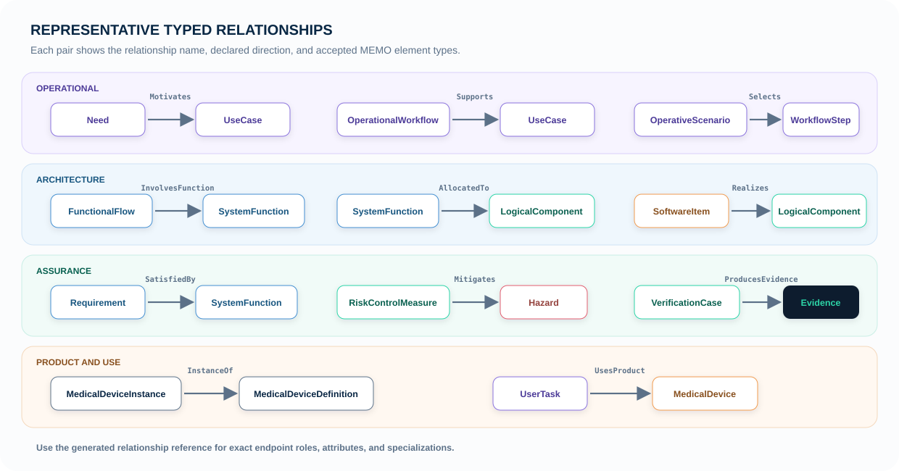

# Relationships

Relationships make the model navigable and testable. The reasoning: a model
element on its own is a note; a typed relationship is a claim a reviewer can
challenge. Select the narrowest relationship whose meaning and endpoint
direction match what you are asserting.


## The backbone

Across the whole ontology, the relationships form one traceability backbone
from clinical intent to postmarket evidence. It is a many-to-many graph — any
element can join several paths, and simple products skip hops entirely:



## High-value traceability links

| Relationship | From | To | Use it to say… |
|---|---|---|---|
| `Motivates` | Need | UseCase | This need is why the goal exists |
| `Initiates` | User | UseCase | This user pursues the goal |
| `SupportsUseCase` | OperationalWorkflow | UseCase | This organized work achieves the goal |
| `SelectsStep` | Scenario | WorkflowStep | This scenario takes this path |
| `UsesProduct` / `TaskUsesProduct` | Activity / task | MedicalDevice | This work uses this product in this role |
| `EnablesActivity` | SystemFunction | OperationalActivity | The system enables this work |
| `AllocatedTo` | Function | Component | This component is responsible for this behavior |
| `RealizesLogical` / `PhysicalRealizesLogical` | Software / physical element | LogicalComponent | This implementation realizes this responsibility |
| `BuildsInto` / `DeploysTo` / `HostsRuntime` | Module / unit / node | Unit / node / runtime | The deployment chain |
| `InstanceOf` | MedicalDeviceInstance | MedicalDeviceDefinition | This unit is of this catalog product |
| `DerivesFrom` | Need, risk, or source driver | Requirement | This requirement exists because of this driver |
| `SatisfiedBy` | Requirement | Design element | This design element satisfies the obligation |
| `MitigatesHazard` | Risk control | Hazard | This control reduces this hazard |
| `CommitsUseError` / `UseErrorLeadsToHazard` | Task / use error | Use error / hazard | The use-related risk path |
| `VerifiedBy` / `ValidatesUseCase` / `ValidatesCriticalTask` | Claim / use case / task | V&V case | This case checks the claim |
| `ProducesEvidence` | V&V case | Evidence | This activity produced this evidence |

The ontology includes more specialized links for cybersecurity, FMEA, fault
trees, lifecycle change, interaction, and document views — every one is a
`connection def` specializing `MemoRelationship` with typed ends, so the full
inventory is discoverable in `src/core/relationships` and each domain package.

## Direction matters

Write the relationship so its endpoint roles read as a sentence:

```sysml
connection : VerifiedBy
    connect verificationTarget ::> reqFlowAccuracy
    to verificationCase ::> testFlowAccuracy;
```

This reads: “`reqFlowAccuracy` is verified by `testFlowAccuracy`.”

## Typed references, not name strings

Where an element holds a reference — a flow's start function, an exchange's
endpoints, an instance's definition — MEMO uses typed `ref`s, never name
strings. A string can silently dangle; a typed reference is resolved by the
tool and checkable by the conformance rules (`rules/ontology`). Path-like
labels (`sourcePortPath`) exist only as descriptive annotations for external
tool round-trips.

## Prefer semantic links over generic traces

A generic trace only says two records are related. A semantic relationship
says how they are related and enables stronger validation. Use a generic trace
only when no stable, more precise relationship exists, and record the
rationale.
