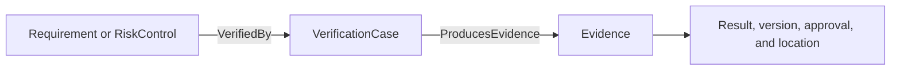

# Views and Evidence

The model is the source; a view is a purposeful selection of it. Build each
view for a review question, not simply to display every element.

| Review question | Useful view |
|---|---|
| Who and what interact with the device? | System context |
| How does a clinical scenario unfold? | Operational sequence |
| Which functions cooperate for an outcome? | Functional chain |
| Which component owns each responsibility? | Function allocation |
| How are components connected? | Logical or physical interconnect |
| How does a hazard lead to harm and where is it controlled? | Risk chain |
| Which requirements lack tests? | Verification coverage |
| Which software depends on which third-party packages? | Software architecture or SBOM view |

## A view is not a second model

Do not copy elements into diagram-specific packages merely to make a picture.
Reference canonical elements and relationships. Layout metadata may change
without changing engineering meaning.

## Evidence closes the loop

A useful assurance path is:

Record enough metadata to reproduce and review the result:

- procedure and version;
- tested configuration;
- acceptance criteria;
- actual result;
- anomalies or deviations;
- evidence location and approval status.

Use views to expose missing links, then use the underlying model to correct
them.
