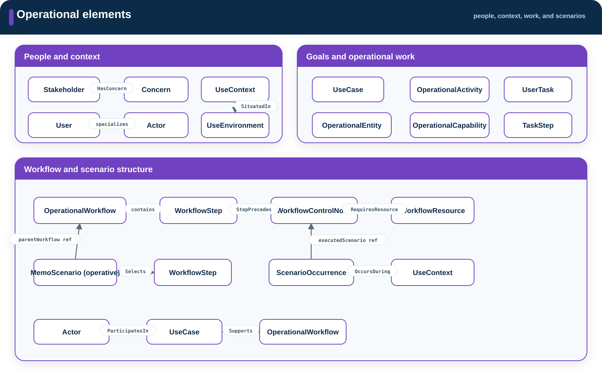
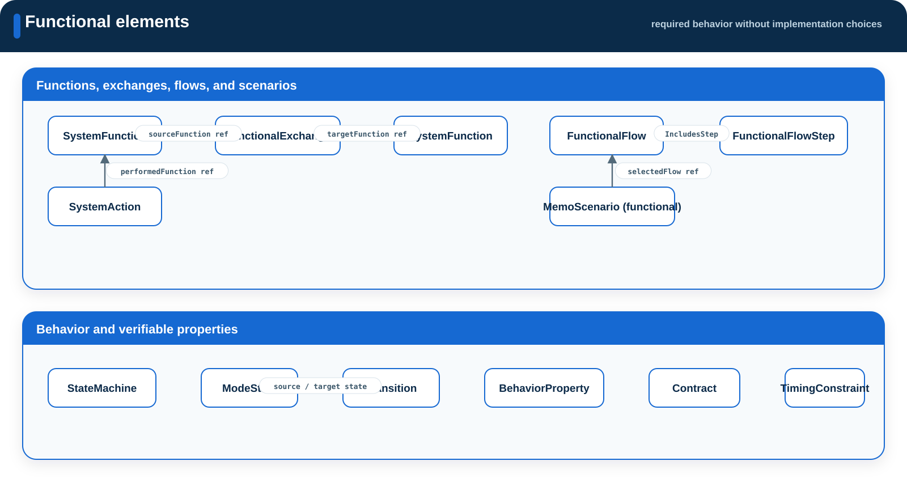
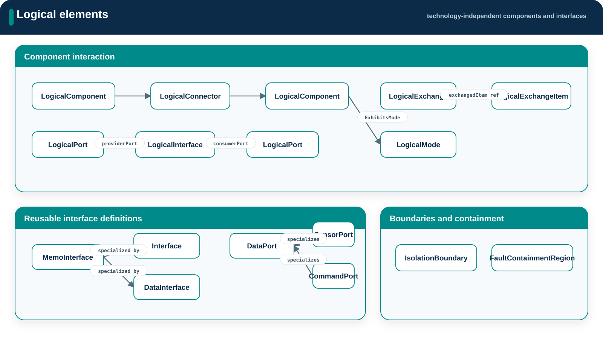
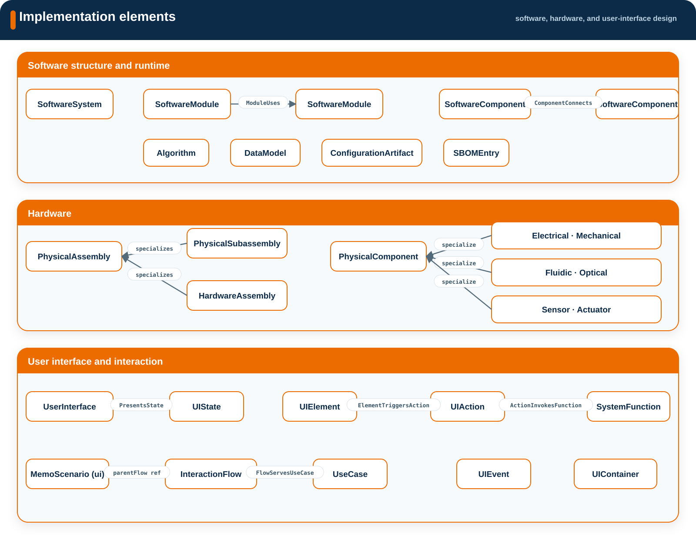
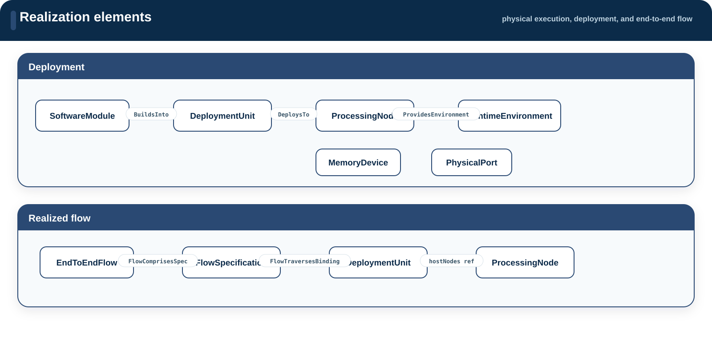

# Architecture

**Source:** `src/architecture/`  
**Namespace:** `memo::architecture`

Architecture describes the system from operating context through deployed
realization.

[Source layout](../index.md)

## Operational

**Namespace:** `memo::architecture::operational`

{ .memo-presentation-graphic }

| Element group | Definitions |
| --- | --- |
| Operational structure | `OperationalEntity`, `OperationalCapability`, `OperationalInteraction` |
| Context | `Actor`, `User`, `NonHumanActor`, `Stakeholder`, `Concern`, `UseContext`, `UseEnvironment` |
| Work | `UseCase`, `OperationalActivity`, `UserTask`, `TaskStep`, `OperationalWorkflow`, `WorkflowStep`, `WorkflowControlNode`, `WorkflowResource` |
| Scenarios | `MemoScenario` (selected by `scenarioKind`), `ScenarioOccurrence` |

## Functional

**Namespace:** `memo::architecture::functional`

{ .memo-presentation-graphic }

| Element group | Definitions |
| --- | --- |
| Functions and flows | `SystemFunction`, `SystemAction`, `FunctionalExchange`, `FunctionalFlow`, `FunctionalFlowStep`, `MemoScenario[scenarioKind=functional]` |
| Behavior | `StateMachine`, `ModeState`, `Transition`, `ActivityAction`, `ActivityFlow`, `InteractionMessage` |
| Verifiable behavior | `BehaviorProperty`, `Contract`, `TimingConstraint` and functional constraints |

## Logical

**Namespace:** `memo::architecture::logical`

{ .memo-presentation-graphic }

| Element group | Definitions |
| --- | --- |
| Structure | `LogicalComponent`, `LogicalState`, `LogicalMode`, `LogicalBehavior`, `IsolationBoundary`, `FaultContainmentRegion` |
| Logical interaction | `LogicalPort`, `LogicalInterface`, `LogicalConnector`, `LogicalExchange`, `LogicalExchangeItem` |
| Reusable interfaces | `Interface`, `InterfaceItem`, `DataInterface`, `DataPort`, `SensorPort`, `CommandPort`, `SoftwarePort`, `ComponentExchange` |

## Implementation

**Namespace:** `memo::architecture::implementation`

{ .memo-presentation-graphic }

| Element group | Definitions |
| --- | --- |
| Software structure | `SoftwareSystem`, `SoftwareModule`, `Algorithm`, `DataModel`, `ConfigurationArtifact`, `SBOMEntry` |
| Software runtime | `SoftwareComponent` |
| Hardware roots | `PhysicalAssembly`, `PhysicalSubassembly`, `HardwareAssembly`, `PhysicalComponent`, `HardwareComponent` |
| Hardware specializations | electrical, mechanical, fluidic, optical, acoustic, thermal, sensing, and actuation definitions |
| User interface | `UserInterface`, `UIContainer`, `UIElement`, `UIState`, `UIEvent`, `UIAction`, `InteractionFlow`, `MemoScenario[scenarioKind=ui]` |

## Realization

**Namespace:** `memo::architecture::realization`

{ .memo-presentation-graphic }

| Element group | Definitions |
| --- | --- |
| Physical execution | `ProcessingNode`, `MemoryDevice`, `PhysicalPort` |
| Deployment | `DeploymentUnit`, `RuntimeEnvironment` |
| Realized flow | `FlowSpecification`, `EndToEndFlow` |

`DesignDecision` records a decision that affects elements in these layers.

## Building blocks

- [Elements](../building-blocks.md#elements)
- [Typed relationships](../building-blocks.md#relationships)
- [Enumerations](../building-blocks.md#enumerations)
- [Generated architecture API](../../sysml-api/index.md#architecture)
