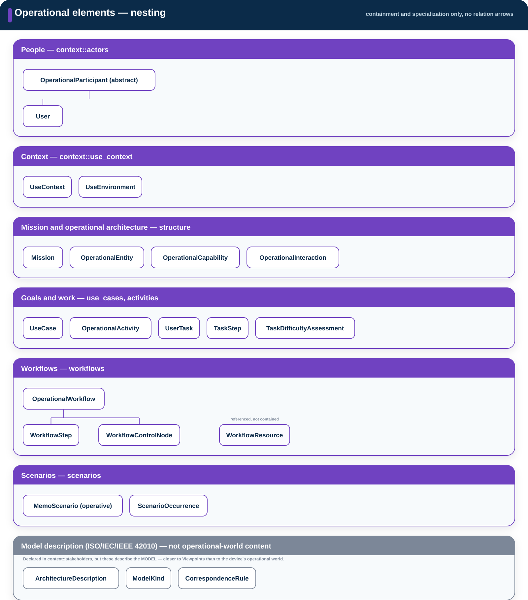
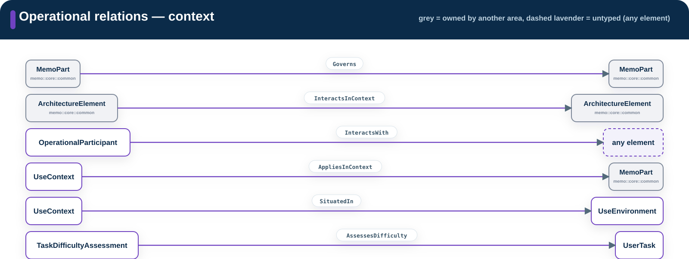
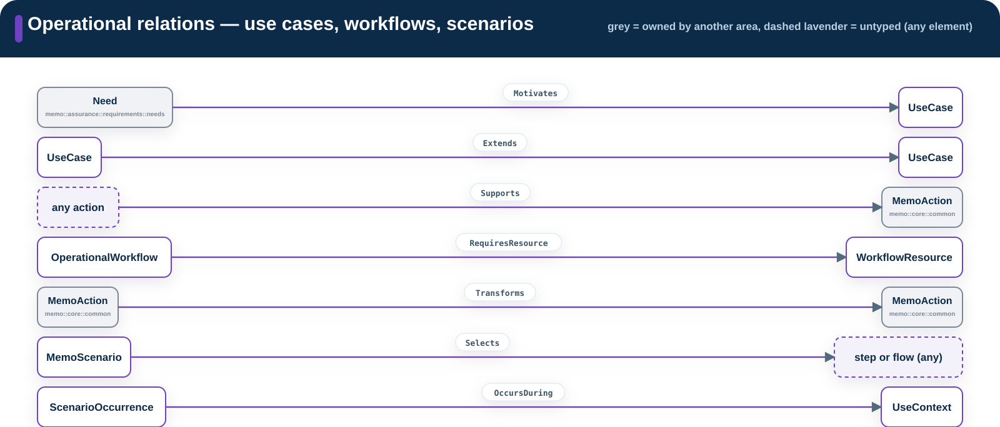

# Architecture

**Source:** `src/architecture/`  
**Namespace:** `memo::architecture`

Architecture describes the system from operating context through deployed
realization.

[Source layout](../index.md)

## Operational

**Namespace:** `memo::architecture::operational`

Elements first, with no relation arrows — grouped by what they mean, not by
which source file they happen to live in. Real containment or specialization
(`OperationalParticipant` → `User`; `OperationalWorkflow` → its steps and
control nodes) is drawn as a parent/child tree, the same elbow-connector
convention [ARCADIA breakdown diagrams](https://github.com/rpuskas0/Arcadia_MBSE_MethodSum)
use — not a box nested inside a box.

{ .memo-presentation-graphic }

| Element group | Definitions |
| --- | --- |
| People | `OperationalParticipant` (abstract), `User` |
| Context | `UseContext`, `UseEnvironment` |
| Mission and operational architecture | `IntendedUse` (the root — a `memo::core::common::MemoMission`), `OperationalEntity`, `OperationalCapability`, `OperationalInteraction` |
| Goals and work | `UseCase`, `OperationalActivity`, `UserTask`, `TaskStep`, `TaskDifficultyAssessment` |
| Workflows | `OperationalWorkflow` (composed of `WorkflowStep`, `WorkflowControlNode`), `WorkflowResource` (referenced, not contained) |
| Scenarios | `MemoScenario` (`scenarioKind = operative`), `ScenarioOccurrence` |
| Model description — *not operational-world content* | `ArchitectureDescription`, `ModelKind`, `CorrespondenceRule` |

The last row is deliberately set apart. `ArchitectureDescription`, `ModelKind`,
and `CorrespondenceRule` are declared in this area's `context::stakeholders`
sub-package, but they describe the *model itself* (ISO/IEC/IEEE 42010's
architecture-description apparatus) rather than the device's operational
world — they read more like Viewpoints content that never moved. That
package name is also a fossil: **`Stakeholder` and `Concern`, 42010's other
two cornerstone classes, no longer exist anywhere in the ontology.** Only a
flat `ConcernKind` enum survives (tagging any `DocumentedElement` or
`Viewpoint`) — there is currently no way to model *which stakeholder* holds a
concern, or which stakeholders a viewpoint is meant to serve. This looks like
an unintentional loss rather than a deliberate simplification and has been
flagged separately for the ontology; this page describes the model as it
exists today, gap included, rather than papering over it.

Relations, split by sub-area instead of one diagram. Every relation below is
itself declared inside `memo::architecture::operational` (its sub-package is
in the **Declared in** column), but several of them type an end against a
element that a *different* area owns — that end is never drawn or named as
if it were an operational type. The diagrams mark it with a grey box and its
real package underneath the name; the table gives the full package path. A
dashed, tinted box (diagrams) or *italic* target (table) means that end is
**untyped**: the ontology deliberately accepts any element there rather than
naming one type.

{ .memo-presentation-graphic }

{ .memo-presentation-graphic }

| Relation | Declared in | Source → Target | Purpose |
| --- | --- | --- | --- |
| `Governs` | `context::stakeholders` | [`memo::core::common::MemoPart`](../../sysml-api/core/common/memo_common.md#memopart) → [`memo::core::common::MemoPart`](../../sysml-api/core/common/memo_common.md#memopart) | 42010 governance: one element governs another by correspondence or use. |
| `InteractsInContext` | `context::use_context` | [`memo::core::common::ArchitectureElement`](../../sysml-api/core/common/memo_common.md#architectureelement) → [`memo::core::common::ArchitectureElement`](../../sysml-api/core/common/memo_common.md#architectureelement) | The one relation a context diagram draws; the boundary side is fixed by `contextSide`, the verb is free text. |
| `InteractsWith` | `context::use_context` | `OperationalParticipant` → *any element* | A participant interacts with something in the operational world — target is untyped so operational activities qualify too. |
| `AppliesInContext` | `context::use_context` | `UseContext` → [`memo::core::common::MemoPart`](../../sysml-api/core/common/memo_common.md#memopart) | A use context applies to a subject element. |
| `SituatedIn` | `context::use_context` | `UseContext` → `UseEnvironment` | A use context is situated in a physical/organizational environment. |
| `AssessesDifficulty` | `activities` | `TaskDifficultyAssessment` → `UserTask` | Records demand/difficulty for a task performed in a context. |
| `Motivates` | `use_cases` | [`memo::assurance::requirements::needs::Need`](../../sysml-api/assurance/requirements/needs/memo_needs.md#need) → `UseCase` | A need motivates a use case — Assurance owns `Need`, not Operational. |
| `Extends` | `use_cases` | `UseCase` → `UseCase` | One use case extends another. |
| `Supports` | `workflows` | *any action* → [`memo::core::common::MemoAction`](../../sysml-api/core/common/memo_common.md#memoaction) | A workflow or activity supports a use case, task, or capability (`supportKind`); the corpus uses all three (`examples/gpca-pump/model/catalog/gpca_operational.sysml`, `gpca_trace.sysml`). |
| `RequiresResource` | `workflows` | `OperationalWorkflow` → `WorkflowResource` | A workflow requires an information, material, or equipment resource. |
| `Transforms` | `workflows` | [`memo::core::common::MemoAction`](../../sysml-api/core/common/memo_common.md#memoaction) → [`memo::core::common::MemoAction`](../../sysml-api/core/common/memo_common.md#memoaction) | Tailoring of workflow structure, as-is → to-be (`transformKind`). |
| `Selects` | `scenarios` | `MemoScenario` → *step or flow* | A scenario selects one path element — target is untyped because steps and flow elements share no common metaclass. |
| `OccursDuring` | `scenarios` | `ScenarioOccurrence` → `UseContext` | An occurrence happens during a use context. |

Unqualified names in the table (`UseContext`, `UserTask`, `OperationalWorkflow`, …)
are all `memo::architecture::operational::*` — this page's own namespace, so
they are not re-qualified on every row.

**Cross-cutting relations** apply to every layer, not just Operational, so
they are not drawn per area — putting them in every diagram is exactly the
clutter this page is trying to avoid:

| Relation | Source → Target | Why it's separate |
| --- | --- | --- |
| [`MemoLink`](../../sysml-api/core/relationships/memo_relationships.md#memolink) | *any element* → *any element* | The deliberate escape hatch: fully untyped both ends, usable when no specific relation carries the meaning. Requires a stated `rationale` — an unexplained `MemoLink` is an audit gap. |
| [`Composes`](../../sysml-api/core/relationships/memo_relationships.md#composes) | *any element* → *any element* | Untyped at the type level; valid pairs are constrained by `ComposesParentKindRule`/`ComposesChildKindRule` instead. |
| [`BindsToInterface`](../../sysml-api/core/relationships/memo_relationships.md#bindstointerface) | *any element* → *any element* | Untyped at the type level; constrained by `BindsToInterfaceEndKindRule`. |
| [`CrossesTrustBoundary`](../../sysml-api/core/relationships/memo_relationships.md#crossestrustboundary) | *any element* → *any element* | Untyped at the type level; constrained by `CrossesTrustBoundaryEndKindRule`. |

## Functional

**Namespace:** `memo::architecture::functional`

{ .memo-presentation-graphic }

| Element group | Definitions |
| --- | --- |
| Functions and flows | `SystemFunction`, `SystemAction`, `FunctionalExchange`, `FunctionalFlow`, `FunctionalFlowStep`, `MemoScenario[scenarioKind=functional]` |
| Behavior | `StateMachine`, `ModeState`, `Transition`, `ActivityAction`, `ActivityFlow`, `InteractionMessage` |
| Verifiable behavior | `BehaviorProperty`, `Contract`, `TimingConstraint` and functional constraints |

## Logical

**Namespace:** `memo::architecture::logical`

{ .memo-presentation-graphic }

| Element group | Definitions |
| --- | --- |
| Structure | `LogicalComponent`, `LogicalState`, `LogicalMode`, `LogicalBehavior`, `IsolationBoundary`, `FaultContainmentRegion` |
| Logical interaction | `LogicalPort`, `LogicalInterface`, `LogicalConnector`, `LogicalExchange`, `LogicalExchangeItem` |
| Reusable interfaces | `Interface`, `InterfaceItem`, `DataInterface`, `DataPort`, `SensorPort`, `CommandPort`, `SoftwarePort`, `ComponentExchange` |

## Implementation

**Namespace:** `memo::architecture::implementation`

{ .memo-presentation-graphic }

| Element group | Definitions |
| --- | --- |
| Software structure | `SoftwareSystem`, `SoftwareModule`, `Algorithm`, `DataModel`, `ConfigurationArtifact`, `SBOMEntry` |
| Software runtime | `SoftwareComponent` |
| Hardware roots | `PhysicalAssembly`, `PhysicalSubassembly`, `HardwareAssembly`, `PhysicalComponent`, `HardwareComponent` |
| Hardware specializations | electrical, mechanical, fluidic, optical, acoustic, thermal, sensing, and actuation definitions |
| User interface | `UserInterface`, `UIContainer`, `UIElement`, `UIState`, `UIEvent`, `UIAction`, `InteractionFlow`, `MemoScenario[scenarioKind=ui]` |

## Realization

**Namespace:** `memo::architecture::realization`

{ .memo-presentation-graphic }

| Element group | Definitions |
| --- | --- |
| Physical execution | `ProcessingNode`, `MemoryDevice`, `PhysicalPort` |
| Deployment | `DeploymentUnit`, `RuntimeEnvironment` |
| Realized flow | `FlowSpecification`, `EndToEndFlow` |

`DesignDecision` records a decision that affects elements in these layers.

## Building blocks

- [Elements](../building-blocks.md#elements)
- [Typed relationships](../building-blocks.md#relationships)
- [Enumerations](../building-blocks.md#enumerations)
- [Generated architecture API](../../sysml-api/index.md#architecture)
