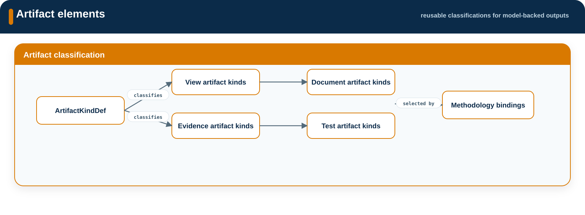

# Artifacts

**Source:** `src/artifacts/`  
**Namespace:** `memo::artifacts`

[Source layout](../index.md#source-layout)

Artifacts classifies model-backed outputs. It defines what kind of artifact an
output is, and the controlled records and their lifecycle.

{ .memo-presentation-graphic }

## Namespace structure

```text
artifacts/
└── definitions/
```

## Elements

`ArtifactKindDef` is the reusable artifact classification type. The package
also declares the standard artifact-kind instances used by viewpoints,
document views, and methodology bindings.

## Relationships

Artifacts are connected to model content and views using shared relationships
from `memo::core::relationships`. This source area does not declare a parallel
relationship vocabulary.

## Enumerations

`ArtifactKind` is the controlled value used by controlled artifact and test
artifact definitions. The artifact definitions package provides the richer
model-backed classifications.

## SysML source

[Open the generated artifact definitions page](../../sysml-api/artifacts/definitions/memo_artifact_definitions.md).
