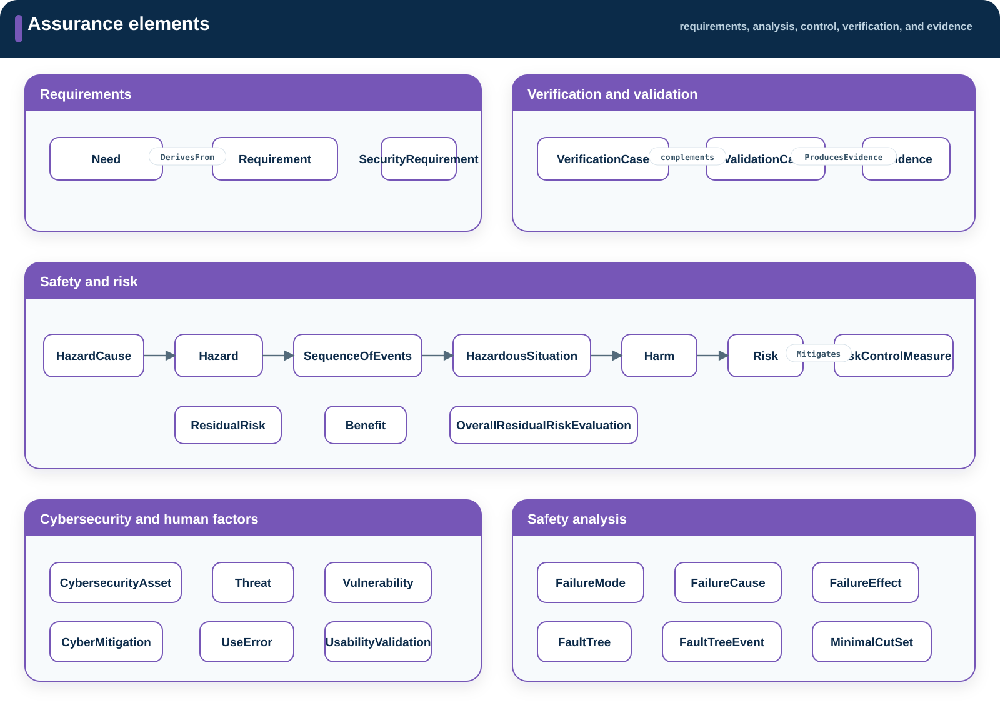

# Assurance

**Source:** `src/assurance/`  
**Namespace:** `memo::assurance`

[Source layout](../index.md#source-layout) ·
[Architecture](architecture.md)

Assurance defines requirements and the disciplines used to evaluate the
architecture.

## Namespace structure

{ .memo-presentation-graphic }

```text
assurance/
├── requirements/
│   └── needs/
├── safety_risk/
│   └── analysis/
├── cybersecurity/
├── human_factors/
└── verification_validation/
```

## Elements

| Namespace | Element families | Purpose |
| --- | --- | --- |
| `requirements` and `requirements::needs` | `Need`, `Requirement`, `SecurityRequirement` | Record stakeholder intent and system obligations |
| `safety_risk` | hazards, causes, sequences of events, hazardous situations, harms, risks, controls, and residual risk | Represent the ISO 14971 risk chain |
| `safety_risk::analysis` | failure modes, effects, fault trees, and HAZOP analysis | Analyze failure and deviation mechanisms |
| `cybersecurity` | assets, attack surfaces, threats, vulnerabilities, cyber risk, and mitigations | Represent the cybersecurity argument |
| `human_factors` | critical tasks, use errors, hazard-related use scenarios, formative evaluation, and usability validation | Represent usability engineering work |
| `verification_validation` | verification cases, validation cases, reviews, results, and evidence | Record objective evaluation of requirements and realized use |

## Relationships

Assurance relationships form trace paths through intent, design, controls, and
evidence. Common examples are `DerivesFrom`, `SatisfiedBy`, `IdentifiesHazard`,
`Mitigates`, `ThreatenedBy`, `ImpactsSafety`, `ControlImplementedBy`,
`VerifiedBy`, `Validates`, and `ProducesEvidence`.

Use [Relationships](../building-blocks.md#relationships) for typed ends.

## Enumerations

Assurance enumerations control requirement source and status, severity and
probability, risk acceptability, control kind, threat category, use-error
category, verification method, and validation method. Examples include
`RequirementKind`, `SeverityKind`, `ProbabilityKind`, `RiskControlKind`,
`ThreatCategoryKind`, `UseErrorCategoryKind`, `VerificationMethodKind`, and
`ValidationMethodKind`.

Use [Enumerations](../building-blocks.md#enumerations) for permitted values.

## SysML source

[Browse the generated assurance API](../../sysml-api/index.md#assurance).
