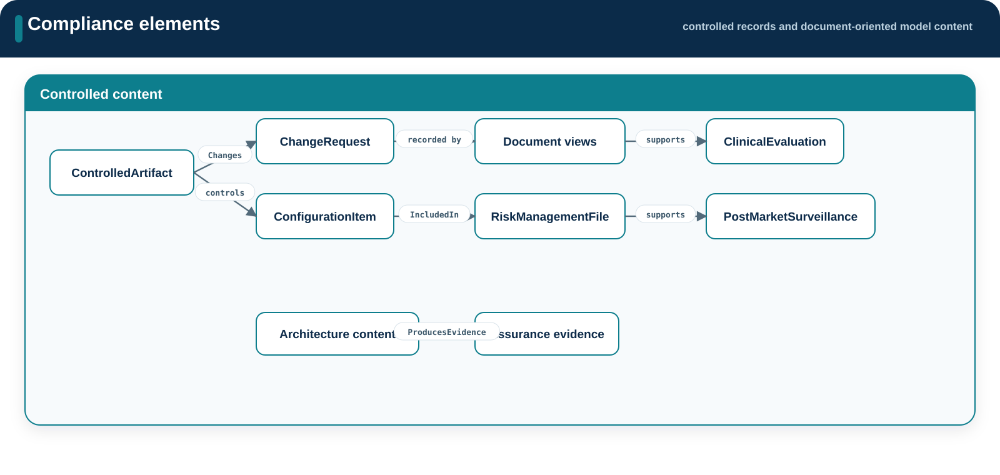

# Compliance

**Source:** `src/compliance/`  
**Namespace:** `memo::compliance`

[Source layout](../index.md#source-layout)

Compliance defines controlled records and document-oriented model content. It
does not encode a complete regulatory process and does not generate files.

{ .memo-presentation-graphic }

## Namespace structure

```text
compliance/
├── artifacts/
├── change/
├── document_views/
├── iso14971/
└── postmarket/
```

## Elements

| Namespace | Element families | Purpose |
| --- | --- | --- |
| `artifacts` | `ControlledArtifact` and controlled-output types | Record identity, state, and evidence status of controlled outputs |
| `change` | `ChangeRequest`, `ConfigurationItem` | Represent controlled change and configuration records |
| `document_views` | document-oriented view definitions | Select model content for controlled documents |
| `iso14971` | `RiskManagementFile` | Organize risk-management records |
| `postmarket` | `ClinicalEvaluation`, `PostMarketSurveillance` | Record post-market and clinical-evaluation content |

## Relationships

Compliance records refer to requirements, risks, evidence, architecture, and
views using shared relationships such as `IncludedIn`, `Changes`, and
`ProducesEvidence`. The referenced content remains owned by its original
source area.

## Enumerations

Compliance elements use shared artifact, lifecycle, workflow-stage, and status
enumerations. This area does not duplicate those value sets.

## SysML source

[Browse the generated compliance API](../../sysml-api/index.md#compliance).
