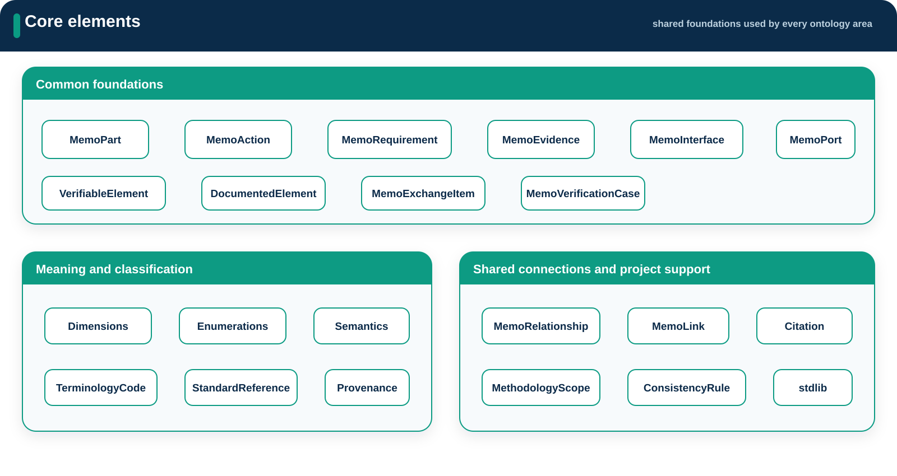

# Core

**Source:** `src/core/`  
**Namespace:** `memo::core`

[Source layout](../index.md#source-layout)

Core contains definitions shared by the rest of the ontology.

## Namespace structure

{ .memo-presentation-graphic }

```text
core/
├── common/
├── dimensions/
├── enumerations/
├── relationships/
├── semantics/
├── terminology/
├── methodology_scope/
├── consistency_rules/
└── stdlib/{collections,functions,scalars,time}/
```

## Elements

| Namespace | Element families | Purpose |
| --- | --- | --- |
| `common` | `MemoPart`, `MemoAction`, `MemoRequirement`, `MemoRelationship`, `MemoEvidence`, and other construct-specific bases | Provide shared identity, documentation, lifecycle, and traceability semantics |
| `dimensions` | classification metadata | Classify perspective, realization stage, discipline, and cross-cutting concerns |
| `semantics` | shared semantic metadata | Record meaning used across ontology areas |
| `terminology` | terminology codes, identifiers, and standard references | Connect model vocabulary to controlled external terminology |
| `methodology_scope` | scope and element-kind aliases | Let methodology refer to ontology content without redefining it |
| `consistency_rules` | reusable rule-description types | Describe rule category, severity, strength, and predicate shape |
| `stdlib` | scalar, collection, function, and time wrappers | Provide small portable support packages used by MEMO definitions |

## Relationships

`MemoRelationship` is the common base for MEMO semantic connections. The
`relationships` namespace owns reusable cross-area verbs such as
`AllocatedTo`, `Realizes`, `DerivesFrom`, `SatisfiedBy`, `Mitigates`,
`VerifiedBy`, `Validates`, and `ProducesEvidence`.

Use [Relationships](../building-blocks.md#relationships) for organization by semantic purpose.

## Enumerations

The `enumerations` namespace owns controlled value sets shared across
architecture, assurance, viewpoints, methodology, artifacts, and compliance.
Use [Enumerations](../building-blocks.md#enumerations) to find a value set by its consumer.

## SysML source

[Browse the generated core API](../../sysml-api/index.md#core).
