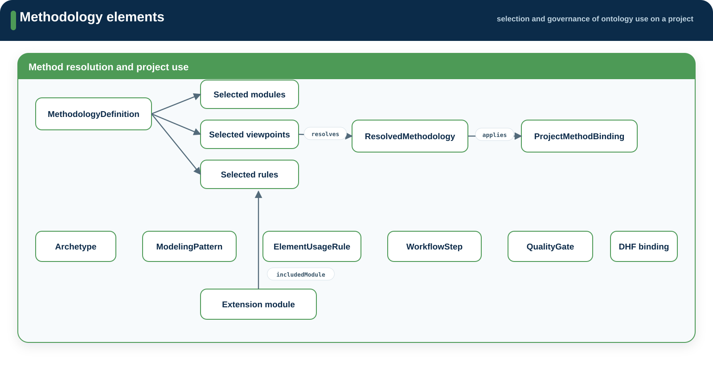

# Methodology

**Source:** `src/methodology/`  
**Namespace:** `memo::methodology`

[Source layout](../index.md#source-layout)

Methodology defines how a project selects and governs ontology use. It refers
to model, viewpoint, artifact, and rule definitions without redefining them.

{ .memo-presentation-graphic }

## Namespace structure

```text
methodology/
├── core/
├── archetypes/
├── profiles/
├── patterns/
├── viewpoints/
├── rules/
├── workflow/
└── gates/
```

## Elements

| Namespace | Element families | Purpose |
| --- | --- | --- |
| `core` | `MethodologyLibrary`, `MethodologyDefinition`, `ResolvedMethodology`, `ProjectMethodBinding`, `DhfDocumentBinding` | Define and resolve a project method |
| `archetypes` | `Archetype` definitions | Describe reusable project shapes |
| `profiles` | named methodology profiles | Select predefined ontology scope |
| `patterns` | `ModelingPattern` | Describe repeatable modeling expectations |
| `viewpoints` | methodology viewpoint selection | Select views by scope or lifecycle stage |
| `rules` | `ElementUsageRule`, `RelationUsageRule` | State permitted and required vocabulary use |
| `workflow` | `WorkflowStep` | Define ordered methodology work |
| `gates` | `QualityGate` | Define review boundaries and required checks |

## Relationships

Methodology uses references and scope bindings rather than creating a separate
set of domain relationships. `includedModule` selects ordinary SysML packages,
including optional extension packages outside `src/`.

## Enumerations

Methodology uses shared values for workflow stage, rule strength, lifecycle
scope, included layers, and artifact requirements.

## Extensions

An extension is an ordinary SysML package outside `src/`. A methodology selects
it through `includedModule`.

| Location | Purpose |
| --- | --- |
| `extensions/template/` | Extension package skeleton |
| `extensions/clinical/` | Clinical-procedure vocabulary |
| `extensions/aadl/` | AADL (SAE AS5506) correspondence profile and runtime families |
| `extensions/cloud/` | Networked services and managed data stores |
| `extensions/container/` | OCI container images and runtimes |
| `extensions/messaging/` | Message items, directional ports, topic interfaces, brokers, and delivery semantics |
| `extensions/ros/` | ROS 2 nodes, messages, topic/service/action interfaces, QoS, and containerized deployment |

The rules an extension follows — relations specialize base relations, and every
definition carries the extension's prefix — are in `extensions/README.md`.

## SysML source

[Browse the generated methodology API](../../sysml-api/index.md#methodology).
