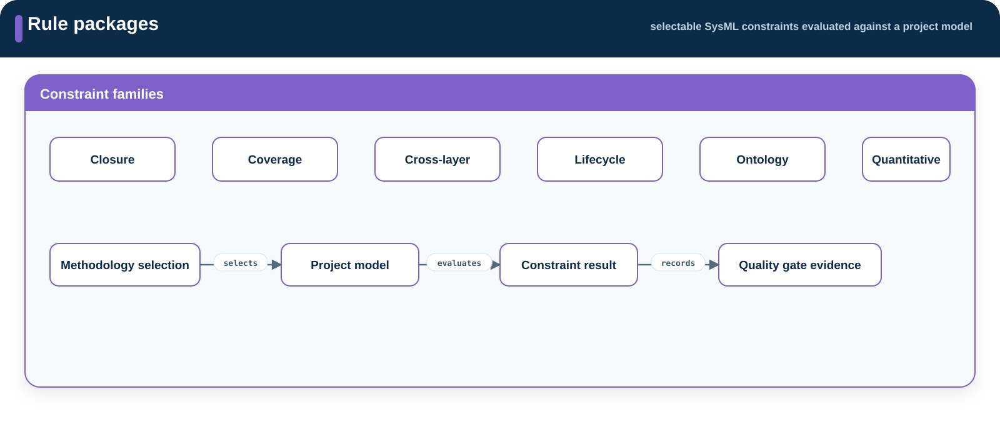

# Rules

**Source:** `src/rules/`  
**Namespace:** `memo::rules`

[Source layout](../index.md#source-layout)

Rules contains selectable SysML `constraint def` declarations. Importing
`memo::*` does not automatically apply every rule; a methodology selects the
packages appropriate to its scope and gates.

{ .memo-presentation-graphic }

## Namespace structure

```text
rules/
├── closure/
├── coverage/
├── crosslayer/
├── lifecycle/
├── ontology/
└── quantitative/
```

## Rule definitions

| Namespace | Checks |
| --- | --- |
| `closure` | Required trace paths and argument closure |
| `coverage` | Presence of model content required by a selected standard or method |
| `crosslayer` | Connections across architecture and assurance |
| `lifecycle` | Permitted lifecycle state and ordering |
| `ontology` | MEMO ownership and semantic invariants |
| `quantitative` | Configured structural bounds |

## Relationships

Rules inspect the typed relationships declared by Core and the source areas.
They do not define a replacement relationship vocabulary.

## Enumerations

Rule metadata uses `RuleCategoryKind`, `RulePredicateKind`,
`RuleSeverityKind`, and `RuleStrengthKind` from Core.

## SysML source

[Browse the generated rules API](../../sysml-api/index.md#rules).
