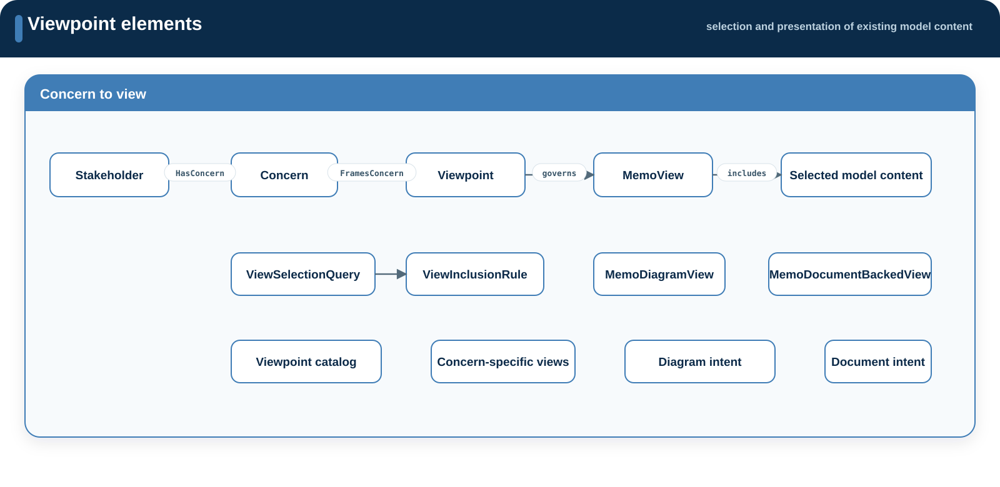

# Viewpoints

**Source:** `src/viewpoints/`  
**Namespace:** `memo::viewpoints`

[Source layout](../index.md#source-layout)

A viewpoint defines how model content is selected and presented for a stated
concern. A view applies that contract to a particular model. Neither owns a
second copy of the selected content.

{ .memo-presentation-graphic }

## Namespace structure

```text
viewpoints/
├── definitions/
├── catalog/
├── context/
├── operational/
├── functional/
├── logical/
├── software/
├── physical/
├── requirements/
├── risk/
├── cybersecurity/
├── usability/
├── verification/
└── clinical/
```

## Elements

| Element family | Purpose |
| --- | --- |
| `Viewpoint` | State concern, audience, scope, selection, and presentation contract |
| `ViewSelectionQuery`, `ViewInclusionRule` | Select elements and relationships from an existing model |
| `MemoView` | Common model-specific view definition |
| `MemoDiagramView` | Describe diagram-oriented presentation |
| `MemoDocumentBackedView`, `MemoDocumentView` | Describe controlled document-oriented presentation |
| Catalog and concern-specific viewpoints | Provide reusable contracts for context, architecture, assurance, and evidence concerns |

## Relationships

Viewpoints frame concerns and include existing model content through typed
relationships such as `FramesConcern` and `IncludedIn`. Selection does not
change ownership of the selected element.

## Enumerations

Viewpoint definitions use controlled values for audience, concern,
presentation, output, diagram kind, document kind, and workflow stage. Examples
include `AudienceKind`, `ConcernKind`, `PresentationKind`, `ViewOutputKind`,
`DiagramViewKind`, and `DocumentViewKind`.

| Concern area | View definitions |
| --- | --- |
| Context | system context |
| Operational | use cases and participants |
| Functional | function structure and allocation |
| Logical | components, interfaces, and allocations |
| Software | software structure |
| Physical | composition and network deployment |
| Requirements | traceability |
| Risk | hazard, risk, control, and evidence chain |
| Cybersecurity | threats and assessment |
| Usability | tasks, use errors, and evaluation evidence |
| Verification | verification coverage |
| Clinical | clinical evidence selected from base or extension content |

## SysML source

[Browse the generated viewpoints API](../../sysml-api/index.md#viewpoints).
