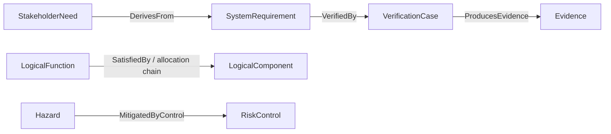

# The MEMO Mental Model

Think of MEMO as a map with three kinds of structure:

1. **Layers** answer different engineering questions.
2. **Elements** are the nouns recorded in each layer.
3. **Relationships** are the typed claims that make the nouns traceable.

## Layers answer questions

| Question | Layer |
|---|---|
| Who uses the device, where, and for what purpose? | Context |
| What work must people and the system accomplish? | Operational and system analysis |
| What outcomes and constraints are required? | Requirements |
| What transformations and behavior produce those outcomes? | Functions and behavior |
| Which responsibilities exist independent of implementation? | Logical architecture |
| Which software, hardware, and physical items implement them? | Software, hardware, and physical architecture |
| What can cause harm or compromise the device? | Risk and cybersecurity |
| What test or evidence supports the engineering claim? | Assurance |

Layers are not project phases. You will move between them as understanding
improves. A newly discovered hazard may create a requirement; a design decision
may expose a new interface; a failed test may change the design.

## Elements are typed engineering records

An element is a durable model record with identity, meaning, and properties.
Choose the most specific kind that matches the statement:

- “Nurse” is an `Actor`.
- “Deliver prescribed medication” is an `OperationalActivity`.
- “The pump shall stop on occlusion” is a `SystemRequirement`.
- “Occlusion detection” is a `LogicalFunction`.
- “Flow-control firmware” is a `SoftwareItem`.
- “Over-infusion” is a `Hazard`.
- “Independent flow monitor” is a `RiskControl`.
- “Flow accuracy test” is a `VerificationCase`.

Do not use a relationship name as an element and do not use a vague generic
element when the ontology provides a meaningful kind.

## Relationships are reviewable claims

A relationship says something that a reviewer can challenge:

Read the connection endpoints, not only the label. For example,
`VerifiedBy` runs from the claim being verified to the verification case.
The endpoint roles make direction explicit.

## A useful model grows in vertical slices

Avoid filling one entire layer before touching the next. Build a thin,
end-to-end slice:

1. one user and one intended use;
2. one operational activity;
3. one need and one requirement;
4. one function and responsible component;
5. one relevant hazard and control;
6. one verification case and evidence record.

Validate that slice, review it, and then add the next scenario. This produces
feedback earlier and keeps traceability meaningful.
