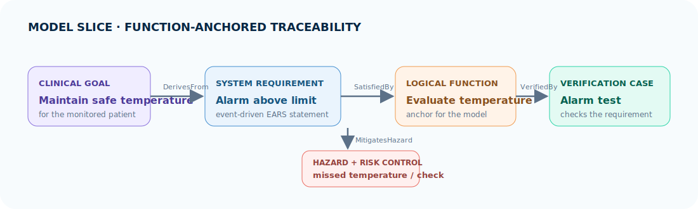
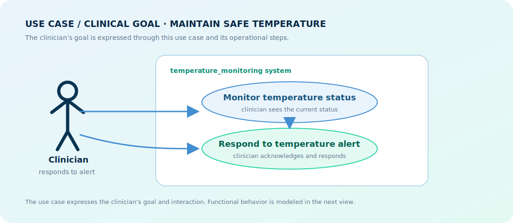
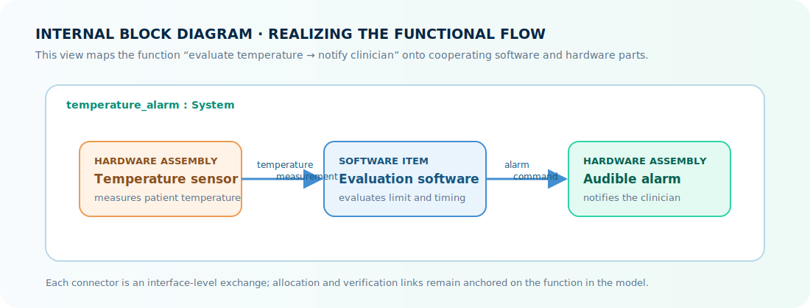

# Tutorial: model a temperature alarm

This tutorial assumes MEMO is already available in your SysML project. If the
import below does not resolve, complete [Set up MEMO in your model](setup.md)
first.

You will create one file: `temperature_alarm.sysml`. Start with the small file
below, then add each following snippet immediately above the final `}` of
`package temperature_alarm`. The final section shows the whole completed file.

## What you will build

You will build one connected engineering slice for a temperature alarm. The
slice starts with the clinician’s use-case goal, follows the clinical workflow
into an operational scenario, and identifies the functional flow that the
system must perform. From that function, you will create an EARS requirement,
allocate software and hardware, identify a risk control, and define a
verification case.



The diagram is the destination for this tutorial. Read it from left to right to
understand the rationale and response; use the central logical function as the
anchor when you review requirements, architecture, risk, and tests.

<div class="memo-tutorial-overview" markdown>
  <div class="memo-tutorial-copy">
    <p class="memo-kicker">First model · about 20 minutes</p>
    <h2>One small device, one connected argument</h2>
    <p>A bedside temperature alarm warns a clinician when a measured temperature is too high. You will make its clinical reason, system obligation, design response, safety control, and test explicit.</p>
  </div>
  <div class="memo-device-card" aria-label="Temperature alarm concept">
    <span class="memo-device-label">Simple device</span>
    <strong>Temperature<br>alarm</strong>
    <span class="memo-device-display">38.7 °C</span>
    <span class="memo-device-alert">ALARM</span>
  </div>
</div>

<div class="memo-tutorial-flow" aria-label="Tutorial model flow">
  <div><span>01</span><strong>Need</strong><small>Who needs what?</small></div>
  <i>→</i>
  <div><span>02</span><strong>Requirement</strong><small>What must it do?</small></div>
  <i>→</i>
  <div><span>03</span><strong>Response + control</strong><small>How is it handled safely?</small></div>
  <i>→</i>
  <div><span>04</span><strong>Verification</strong><small>How will we check?</small></div>
</div>

## The use case you are modeling

Before writing elements, make the interaction clear: a clinician relies on the
device to observe a temperature and raise an audible alert. This small use-case
view sets the scope for the first model.



The use case is the clinician’s goal in context: maintaining patient
temperature within a safe range. “Evaluate temperature” and “notify clinician”
are functions that later support the goal.

## Modeling route

Use the clinical story to discover the system behavior, then use the functions
as the anchor for the technical model. Read this path from left to right.

<div class="memo-model-stages" aria-label="Function-anchored modeling path">
  <div class="memo-stage-goal"><span>1</span><strong>Use case / goal</strong><small>Maintain safe patient temperature</small></div>
  <i>→</i>
  <div class="memo-stage-operational"><span>2</span><strong>Workflow + scenario</strong><small>Observe status, respond to alert</small></div>
  <i>→</i>
  <div class="memo-stage-function"><span>3</span><strong>Functional flow</strong><small>Evaluate temperature → notify clinician</small></div>
  <i>→</i>
  <div class="memo-stage-evidence"><span>4</span><strong>Connected engineering</strong><small>Requirements, architecture, risk, verification</small></div>
</div>

For a real device, revisit this route for each important scenario. A functional
flow can reveal a new requirement, hazard, control, test, or allocation as the
model becomes more detailed.

## 1. Clinical need

Create `temperature_alarm.sysml` with this initial content. The `Actor` names
the person in the scenario; the `StakeholderNeed` records that person’s desired
clinical outcome.

```sysml
// temperature_alarm.sysml
package temperature_alarm {
    // Import the public MEMO library surface once for this package.
    private import memo_medical_device_library::*;

    // The person who relies on the device in this scenario.
    part clinician : Actor {
        attribute :>> id = "ACT-001";
        attribute :>> name = "Clinician";
    }

    // The clinician's clinical goal for the monitored patient.
    requirement maintainSafePatientTemperature : StakeholderNeed {
        attribute :>> id = "NEED-001";
        attribute :>> name = "MaintainSafePatientTemperature";
        attribute :>> statement =
            "The clinician needs to maintain the patient's temperature within a safe range.";
    }
}
```

The need provides the rationale for the model. It uses clinical language that
people can review together before translating it into a measurable system claim.

## 2. Workflow and operational scenario

Add this snippet above the closing `}`. The activities form a simple operational
workflow; the scenario records the event that makes the workflow relevant.

```sysml
    // The clinician observes the patient's current temperature.
    part monitorTemperatureStatus : OperationalActivity {
        attribute :>> id = "OA-001";
        attribute :>> name = "MonitorTemperatureStatus";
    }

    // The clinician responds when an alert is raised.
    part respondToTemperatureAlert : OperationalActivity {
        attribute :>> id = "OA-002";
        attribute :>> name = "RespondToTemperatureAlert";
    }

    // The operational event that frames this slice of work.
    part highTemperatureScenario : OperationalScenario {
        attribute :>> id = "OS-001";
        attribute :>> name = "HighTemperatureScenario";
        attribute :>> sequenceDescription =
            "The clinician observes status and responds to a high-temperature alert.";
    }

    // The workflow direction: observe status, then respond to the alert.
    connection : SequencesStep
        connect activity ::> monitorTemperatureStatus
        to nextActivity ::> respondToTemperatureAlert;
```

This workflow describes people and clinical work. It gives the next layer a
clear source for the system behavior that must support the scenario.

## 3. Functional flow

Add this snippet above the closing `}`. These functions are the anchor for the
rest of the model: requirements specify them, architecture realizes them, risk
analysis challenges them, and verification checks them.

```sysml
    // Determines whether the measured temperature is inside the safe range.
    part evaluateTemperature : LogicalFunction {
        attribute :>> id = "LF-001";
        attribute :>> name = "EvaluateTemperature";
    }

    // Produces the system alert that supports the clinician's response.
    part notifyClinician : LogicalFunction {
        attribute :>> id = "LF-002";
        attribute :>> name = "NotifyClinician";
    }
```

The functional flow is **evaluate temperature → notify clinician**. It is
independent of whether the final implementation uses a microcontroller, mobile
application, display, buzzer, or network service.

## 4. Requirement

The clinical goal explains why the model matters, and the functional flow says
what behavior the system must provide. Now turn that behavior into a precise,
testable system claim. This requirement is derived from the goal and satisfied
by `evaluateTemperature`, which keeps the requirement connected to both its
rationale and its functional response.

Add this snippet above the closing `}`. It uses the **event-driven EARS** form:
**When** a trigger occurs, **the system shall** provide a defined response.

```sysml
    // A testable EARS requirement extracted from the evaluation function.
    requirement alarmAboveLimit : SystemRequirement {
        attribute :>> id = "REQ-001";
        attribute :>> name = "AlarmAboveLimit";
        attribute :>> statement =
            "When the measured temperature exceeds 38.0 °C, the temperature alarm shall issue an audible alert within 2 seconds.";
        attribute :>> notation = RequirementNotationKind::ears;
        attribute :>> earsPattern = EarsPatternKind::eventDriven;
        attribute :>> obligation = ObligationKind::shall;
        attribute :>> conditionClause = "When the measured temperature exceeds 38.0 °C";
        attribute :>> systemResponse = "issue an audible alert within 2 seconds";
        attribute :>> acceptanceCriteria =
            "At 38.1 °C, an audible alert begins within 2 seconds.";
    }

    // Preserve the clinical rationale for this requirement.
    connection : DerivesFrom
        connect sourceDriver ::> maintainSafePatientTemperature
        to targetRequirement ::> alarmAboveLimit;

    // The functional response that satisfies the system requirement.
    connection : SatisfiedBy
        connect requiredElement ::> alarmAboveLimit
        to satisfyingElement ::> evaluateTemperature;
```

EARS creates a consistent sentence pattern. SOPHIST adds a quality check:
state the condition, the system subject, the `shall` obligation, the response,
and an observable acceptance criterion. This requirement has all five.

<div class="memo-requirement-craft">
  <div><span>EARS statement</span><strong>When the measured temperature exceeds 38.0 °C, the temperature alarm shall issue an audible alert within 2 seconds.</strong></div>
  <div><span>SOPHIST check</span><strong>Condition + subject + shall + response + measurable acceptance criterion</strong></div>
</div>

## 5. Architecture and risk

Add this snippet above the closing `}`. The two implementation elements are
allocated from the functional flow. The hazard and risk control are also linked
to the function that they concern.

```sysml
    // The software item that implements temperature evaluation.
    part temperatureEvaluationSoftware : SoftwareItem {
        attribute :>> id = "SW-001";
        attribute :>> name = "TemperatureEvaluationSoftware";
    }

    // The hardware assembly that provides the temperature measurement.
    part temperatureSensorAssembly : HardwareAssembly {
        attribute :>> id = "HW-001";
        attribute :>> name = "TemperatureSensorAssembly";
    }

    // A potential source of harm that must be considered.
    item missedHighTemperature : Hazard {
        attribute :>> id = "HAZ-001";
        attribute :>> name = "MissedHighTemperature";
    }

    // A distinct measure intended to reduce the missed-alert hazard.
    item independentAlarmCheck : RiskControl {
        attribute :>> id = "RC-001";
        attribute :>> name = "IndependentAlarmCheck";
    }

    // Allocate the evaluation function to its software realization.
    connection : AllocatedTo
        connect function ::> evaluateTemperature
        to allocatedElement ::> temperatureEvaluationSoftware;

    // Allocate the evaluation function to its sensing hardware.
    connection : AllocatedTo
        connect function ::> evaluateTemperature
        to allocatedElement ::> temperatureSensorAssembly;

    // State which control reduces this particular hazard.
    connection : MitigatesHazard
        connect riskControl ::> independentAlarmCheck
        to mitigatedHazard ::> missedHighTemperature;
```

The function, hazard, and control are separate model elements because they
answer separate review questions: what the system does, what can cause harm,
and which measure reduces that concern.

Before completing verification, show how the functional flow is realized in
the internal block diagram. This is a focused design view: parts, exchanges,
and direction are visible without mixing in the requirements or test evidence.



## 6. Verification

Add this snippet above the closing `}`. The verification case states the
planned check and connects it to the requirement it evaluates.

```sysml
    // The planned check and its observable pass condition.
    part highTemperatureAlarmTest : VerificationCase {
        attribute :>> id = "VER-001";
        attribute :>> name = "HighTemperatureAlarmTest";
        attribute :>> acceptanceCriteria =
            "With a simulated temperature of 38.1 °C, an audible alert starts within 2 seconds.";
    }

    // Connect the function to the test that will verify its behavior.
    connection : VerifiedBy
        connect verificationTarget ::> evaluateTemperature
        to verificationCase ::> highTemperatureAlarmTest;
```

Verification turns the requirement into a checkable engineering claim. The
acceptance criterion is shared with the requirement so the expected result is
consistent from specification through test.

## Complete file

Your finished `temperature_alarm.sysml` should contain this connected model:

```sysml
// temperature_alarm.sysml
package temperature_alarm {
    // Import the public MEMO library surface once for this package.
    private import memo_medical_device_library::*;

    // The person who relies on the device in this scenario.
    part clinician : Actor {
        attribute :>> id = "ACT-001";
        attribute :>> name = "Clinician";
    }

    // The clinician's clinical goal for the monitored patient.
    requirement maintainSafePatientTemperature : StakeholderNeed {
        attribute :>> id = "NEED-001";
        attribute :>> name = "MaintainSafePatientTemperature";
        attribute :>> statement =
            "The clinician needs to maintain the patient's temperature within a safe range.";
    }

    // The clinician observes the patient's current temperature.
    part monitorTemperatureStatus : OperationalActivity {
        attribute :>> id = "OA-001";
        attribute :>> name = "MonitorTemperatureStatus";
    }

    // The clinician responds when an alert is raised.
    part respondToTemperatureAlert : OperationalActivity {
        attribute :>> id = "OA-002";
        attribute :>> name = "RespondToTemperatureAlert";
    }

    // The operational event that frames this slice of work.
    part highTemperatureScenario : OperationalScenario {
        attribute :>> id = "OS-001";
        attribute :>> name = "HighTemperatureScenario";
        attribute :>> sequenceDescription =
            "The clinician observes status and responds to a high-temperature alert.";
    }

    // The workflow direction: observe status, then respond to the alert.
    connection : SequencesStep
        connect activity ::> monitorTemperatureStatus
        to nextActivity ::> respondToTemperatureAlert;

    // Determines whether the measured temperature is inside the safe range.
    part evaluateTemperature : LogicalFunction {
        attribute :>> id = "LF-001";
        attribute :>> name = "EvaluateTemperature";
    }

    // Produces the system alert that supports the clinician's response.
    part notifyClinician : LogicalFunction {
        attribute :>> id = "LF-002";
        attribute :>> name = "NotifyClinician";
    }

    // A testable EARS requirement extracted from the evaluation function.
    requirement alarmAboveLimit : SystemRequirement {
        attribute :>> id = "REQ-001";
        attribute :>> name = "AlarmAboveLimit";
        attribute :>> statement =
            "When the measured temperature exceeds 38.0 °C, the temperature alarm shall issue an audible alert within 2 seconds.";
        attribute :>> notation = RequirementNotationKind::ears;
        attribute :>> earsPattern = EarsPatternKind::eventDriven;
        attribute :>> obligation = ObligationKind::shall;
        attribute :>> conditionClause = "When the measured temperature exceeds 38.0 °C";
        attribute :>> systemResponse = "issue an audible alert within 2 seconds";
        attribute :>> acceptanceCriteria =
            "At 38.1 °C, an audible alert begins within 2 seconds.";
    }

    // The software item that implements temperature evaluation.
    part temperatureEvaluationSoftware : SoftwareItem {
        attribute :>> id = "SW-001";
        attribute :>> name = "TemperatureEvaluationSoftware";
    }

    // The hardware assembly that provides the temperature measurement.
    part temperatureSensorAssembly : HardwareAssembly {
        attribute :>> id = "HW-001";
        attribute :>> name = "TemperatureSensorAssembly";
    }

    // A potential source of harm that must be considered.
    item missedHighTemperature : Hazard {
        attribute :>> id = "HAZ-001";
        attribute :>> name = "MissedHighTemperature";
    }

    // A distinct measure intended to reduce the missed-alert hazard.
    item independentAlarmCheck : RiskControl {
        attribute :>> id = "RC-001";
        attribute :>> name = "IndependentAlarmCheck";
    }

    // The planned check and its observable pass condition.
    part highTemperatureAlarmTest : VerificationCase {
        attribute :>> id = "VER-001";
        attribute :>> name = "HighTemperatureAlarmTest";
        attribute :>> acceptanceCriteria =
            "With a simulated temperature of 38.1 °C, an audible alert starts within 2 seconds.";
    }

    // Preserve the clinical rationale for this requirement.
    connection : DerivesFrom
        connect sourceDriver ::> maintainSafePatientTemperature
        to targetRequirement ::> alarmAboveLimit;

    // The functional response that satisfies the system requirement.
    connection : SatisfiedBy
        connect requiredElement ::> alarmAboveLimit
        to satisfyingElement ::> evaluateTemperature;

    // Allocate the evaluation function to its software realization.
    connection : AllocatedTo
        connect function ::> evaluateTemperature
        to allocatedElement ::> temperatureEvaluationSoftware;

    // Allocate the evaluation function to its sensing hardware.
    connection : AllocatedTo
        connect function ::> evaluateTemperature
        to allocatedElement ::> temperatureSensorAssembly;

    // State which control reduces this particular hazard.
    connection : MitigatesHazard
        connect riskControl ::> independentAlarmCheck
        to mitigatedHazard ::> missedHighTemperature;

    // Connect the function to the test that will verify its behavior.
    connection : VerifiedBy
        connect verificationTarget ::> evaluateTemperature
        to verificationCase ::> highTemperatureAlarmTest;
}
```

Use your editor’s reference navigation and check that you can follow the need
to its requirement, the requirement to its design response, and the
requirement to its verification case. Next, use the [Layer Map](../layers/index.md)
to place this slice in the wider product argument.
