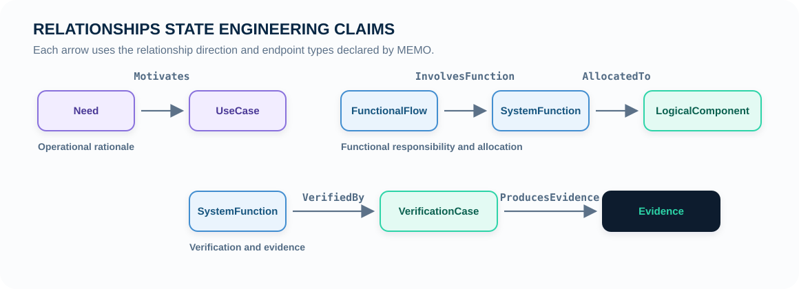
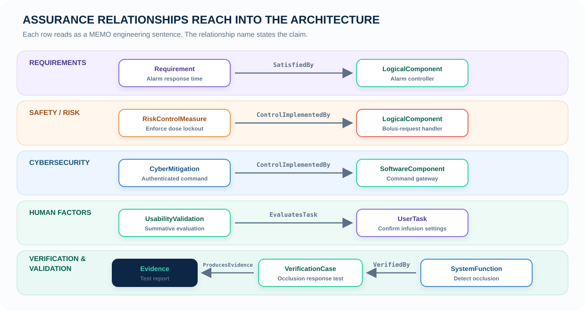
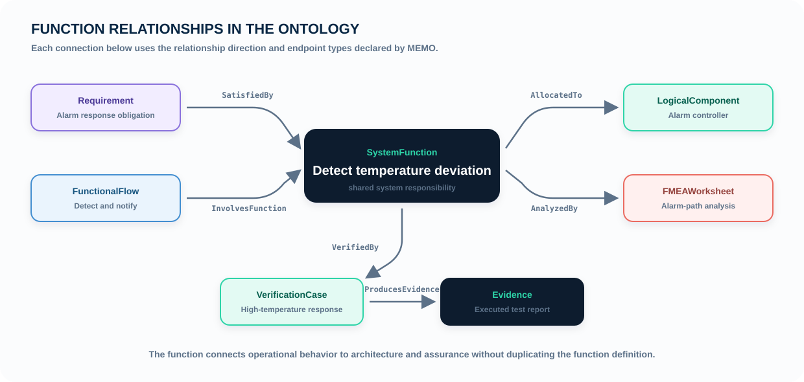
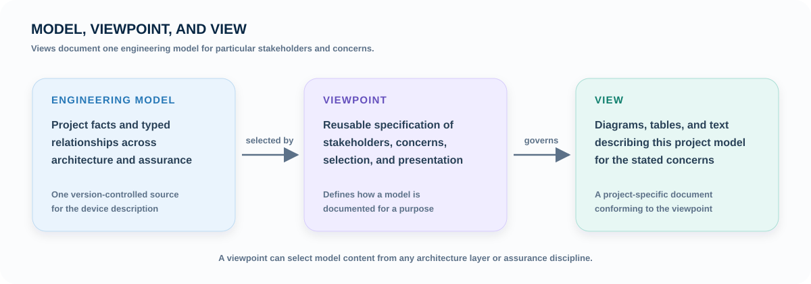
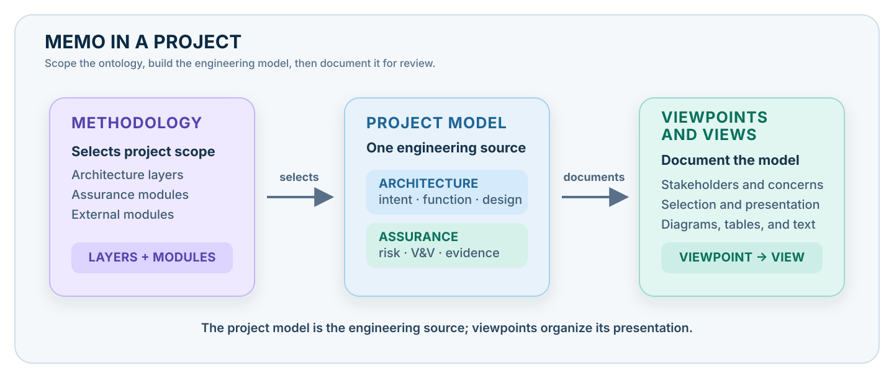

# What is MEMO

MEMO is the **Medical Engineering Modeling Ontology**: an importable SysML v2
model library for describing a medical device and the assurance argument around
it in one connected model.

SysML v2 supplies the general modeling language. MEMO supplies the
medical-device semantics: what the elements mean, which relationships are
legal, how architecture and assurance connect, and which conditions make a
model complete enough to review.

A device project imports MEMO and creates its own users, use cases, scenarios,
functions, components, requirements, hazards, controls, verification cases,
products, and evidence from those definitions. Project specializations retain
their place in the ontology and continue to participate in its shared
relationships, rules, and viewpoints.

MEMO has three related parts: the **ontology** defines the architecture and
assurance model; **viewpoints and views** document that model for particular
stakeholders and concerns; and a **methodology** selects the layers and modules
used by a project.

{ .memo-zoomable aria-label="Open the MEMO architecture and assurance V-model" }

The V-model is the primary map of the ontology. The architecture axis moves
from operational intent to functional responsibility, logical organization,
implementation technology, and realized product. Requirements, safety,
cybersecurity, human factors, and V&V connect across those layers as assurance
disciplines. Traceability and evidence close the engineering argument.

## What MEMO adds to SysML v2

SysML v2 provides general modeling constructs. MEMO specializes those
constructs for medical-device engineering:

| SysML v2 capability | MEMO specialization | Engineering use |
|---|---|---|
| parts, actions, requirements, items, and ports | medical-device domain definitions with required properties | represent users, scenarios, functions, components, hazards, controls, products, verification, and evidence consistently |
| `connection def` | typed relationships such as `AllocatedTo`, `Mitigates`, `ControlImplementedBy`, and `VerifiedBy` | record the engineering claim and constrain the element types at each endpoint |
| constraints | closure, coverage, lifecycle, quantitative, and ontology-consistency rules | evaluate whether required model paths and conditions are complete |
| views and viewpoints | architecture and assurance review viewpoints | select relevant facts from the same model for different engineering roles |
| packages and imports | a versioned public medical-device library | reuse the ontology across device projects and project-specific extensions |

{ .memo-presentation-graphic }

## The mental model

MEMO records a device concern, the design response, and the evidence for it in
one model. Begin with a scenario and add the elements and relationships needed
to answer a specific engineering or review question.

  
Why?<strong>Clinical intent</strong><small>What does a person need?</small>

  <i>→</i>
  
What must be true?<strong>Requirement</strong><small>A testable obligation</small>

  <i>→</i>
  
How?<strong>Design response</strong><small>Function and architecture</small>

  <i>→</i>
  
How do we know?<strong>Evidence</strong><small>Verification and records</small>

Risk participates throughout this argument. A hazard can introduce a new
requirement, a control changes the design response, and a failed verification
returns attention to the requirement, behavior, or architecture. MEMO records
these feedback paths as typed relationships.

## Scenario-driven modeling

Scenarios give a hazard and a system behavior a concrete **situation**: a
particular user performing a particular task, in a particular context, while
the system is in a particular state. This context makes the requirement,
hazard, control, and verification case precise.

MEMO therefore reaches system behavior through the path a real user takes.

{ .memo-presentation-graphic }

### The reading path

Every MEMO device model begins with operational intent and reads in the same
order:

1. **Use case** — the goal of the work being modeled. Why is anyone here?
2. **Workflow** — the sequence of clinical or operational work that supports
   that goal.
3. **Operative scenario** — one concrete nominal, alternate, or exception path
   through the workflow.
4. **Functions** — what the system has to do on that path, reached through its
   activities and functional flows.
5. **Architecture and assurance** — the logical and implemented
   responsibilities, requirements, risks, controls, verification, and evidence
   connected to those functions.

The scenario carries critical context. Splitting a workflow into named paths
makes hazard analysis specific: an exception scenario describes the hazardous
situation as work performed by users and the system, with an explicit device
state and required behavior.

Consider an infusion pump. “Deliver a bolus dose” is a use case. The workflow
has a nominal path and may also have an alternate path where the clinician
changes the prescription during therapy and an exception path where the line
occludes during delivery. The occlusion scenario is where the hazard lives. It
has a user, a context, a device state, and functions that must behave correctly.
A control and a verification case can connect to that same situation.

The scenario-driven foundation applies to every device technology. The
realization may be mechanical, electronic, software-based, or a combination;
the model still begins with operational intent, a concrete scenario, and the
functions required on that path.

| Concept | MEMO definition | Package |
|---|---|---|
| Use case | `UseCase` | `use_cases` |
| Workflow | `OperationalWorkflow`, `WorkflowStep` | `workflows` |
| Scenario | `MemoScenario` (selected by `scenarioKind`), `ScenarioOccurrence` | `scenarios` |
| Activity on a path | `OperationalActivity`, `TaskStep`, `UserTask` | `activities` |

## Architecture layers: from intent to realization

The architecture axis organizes distinct levels of system reasoning. Moving
down the axis increases solution commitment while preserving traceability to
the clinical intent and scenario established above it.

| Layer | Engineering question | Representative MEMO definitions |
|---|---|---|
| **Operational** | Who uses the device, for what goal, in which context and scenario? | `User`, `UseContext`, `Need`, `UseCase`, `OperationalWorkflow`, `MemoScenario[scenarioKind=operative]`, `UserTask` |
| **Functional** | What must the system accomplish on that scenario path? | `SystemFunction`, `FunctionalFlow`, `MemoScenario[scenarioKind=functional]`, `FunctionalExchange` |
| **Logical** | How are responsibilities, interactions, interfaces, and modes organized? | `LogicalComponent`, channels, ports, interfaces, modes |
| **Implementation** | Which technology implements those responsibilities? | `SoftwareComponent`, `SoftwareModule`, `ElectronicComponent`, `MechanicalPart`, `UserInterface` |
| **Realization** | How is the design assembled, hosted, and deployed? | `DeploymentUnit`, `RuntimeEnvironment`, `ProcessingNode`, `HardwareAssembly`, `PhysicalAssembly` |

The layers preserve a chain of decisions: user and clinical intent establish
the scenario; the scenario establishes required functions; functions are
allocated to logical responsibilities; implementation elements implement
those responsibilities; and realization elements describe the assembled and
deployed device.

## Assurance disciplines: across the architecture

Assurance elements remain distinct engineering facts and connect to the
relevant scenario, function, architecture, implementation, and realization
elements through typed relationships.

{ .memo-presentation-graphic }

| Discipline | Engineering question | Representative MEMO definitions |
|---|---|---|
| **Requirements** | Which needs and obligations govern the device and its behavior? | `Need`, `Requirement` |
| **Safety / risk** | Which hazardous situations, risks, and controls require management? | `Hazard`, `Risk`, `RiskControlMeasure`, FMEA and fault-tree elements |
| **Cybersecurity** | Which assets, threats, vulnerabilities, and controls affect the device? | `CybersecurityAsset`, `Threat`, `Vulnerability`, cybersecurity controls |
| **Human factors** | Which users, tasks, use errors, and evaluations shape safe and effective use? | `UserTask` with its `criticality`, `UseError`, `FormativeEvaluation`, `UsabilityValidation` |
| **Verification & validation** | Which cases and evidence establish that engineering claims are met? | `VerificationCase`, `ValidationCase`, `Evidence` |

Architecture definitions and assurance definitions retain their own package
ownership. Typed relationships connect a requirement, hazard, control,
verification case, or item of evidence to the scenario, function, component,
interface, or realized product fact it concerns.

## Functions are the traceability hub

Once a scenario identifies what the system must do, the functions on that path
become the hub of the engineering description. Requirements state the
obligations those functions satisfy, architecture assigns responsibility for
them, safety analysis examines them, and verification cases check them.

{ .memo-presentation-graphic }

### Read each relationship by its meaning

| Relationship | Reads as |
|---|---|
| `Motivates` | a need motivates a use case |
| `Supports` | an operational workflow supports a use case |
| `Selects` | an operative scenario selects a workflow step or flow for its path |
| `InvolvesFunction` | a functional flow involves a system function |
| `SatisfiedBy` | a requirement is satisfied by a design element |
| `AllocatedTo` | a function is allocated to a responsible architecture element |
| `AnalyzedBy` | an architecture element is examined by an analysis artifact |
| `IdentifiesHazard` | an analysis identifies a hazard |
| `Mitigates` | a risk control mitigates a hazard or other risk element |
| `ControlImplementedBy` | a risk control is implemented by a design element |
| `VerifiedBy` | a model element is verified by a verification case |
| `ProducesEvidence` | a verification case produces evidence |

The relationship graph supports traversal in either direction. A reviewer can
ask:

- *Which operational path requires this function?* Follow
  `InvolvesFunction` to its functional flow and scenario, then to the operative
  scenario, workflow, and use case.
- *Which part is responsible for it?* Follow `AllocatedTo` into the logical
  and implementation architecture.
- *What could go wrong with it?* Follow `AnalyzedBy` into safety analysis and
  onward to hazards and controls.
- *How do we know it works?* Follow `VerifiedBy` to the verification case and
  `ProducesEvidence` to the resulting record.

When a function changes, the same graph identifies the affected requirements,
responsible components, analyses, hazards, controls, verification cases, and
evidence. Impact analysis follows the semantics of the model.

## Project elements and relationships

A project develops a scenario-driven vertical slice in three steps:

  <article class="memo-model-step step-scope">
    1
    

      <h3>Model the operational scenario</h3>
      
Define the <code>Need</code> and <code>UseCase</code>, the <code>OperationalWorkflow</code> that supports the use case, and a <code>MemoScenario</code> with <code>scenarioKind=operative</code> that selects the applicable <code>WorkflowStep</code> path.

    

    <a href="../reference/elements/operational/">Operational definitions →</a>
  </article>
  <article class="memo-model-step step-elements">
    2
    

      <h3>Describe system behavior and architecture</h3>
      
Use a <code>MemoScenario</code> with <code>scenarioKind=functional</code> and a <code>FunctionalFlow</code> to identify the required <code>SystemFunction</code> sequence, then allocate those functions to the responsible <code>LogicalComponent</code> elements.

    

    <a href="../reference/elements/functional/">Functional definitions →</a>
  </article>
  <article class="memo-model-step step-relations">
    3
    

      <h3>Connect assurance to the scenario and design</h3>
      
Add the applicable <code>Requirement</code>, <code>Hazard</code>, <code>RiskControlMeasure</code>, <code>VerificationCase</code>, and <code>Evidence</code>. Use typed relationships including <code>SatisfiedBy</code>, <code>Mitigates</code>, and <code>ControlImplementedBy</code> to state how the assurance facts depend on the functions and architecture.

    

    <a href="../reference/elements/assurance/">Assurance definitions →</a>
  </article>

The most productive starting scope is a **vertical slice**: one scenario that
reaches from a real user concern to a checkable result.

  <b>Operational intent</b> Need and use case<i>→</i>
  <b>Scenario</b> Applicable workflow path<i>→</i>
  <b>Behavior and design</b> Functions and responsible components<i>→</i>
  <b>Assurance</b> Requirements, controls, verification, and evidence

That slice is sufficient to expose missing rationale, an unaddressed hazard,
or an untestable requirement. The model expands scenario by scenario while
preserving the connections already established.

## Model, viewpoint, and view

The **model** is the project’s engineering description. Its architecture
records operational intent, scenarios, required behavior, design, and
realization. Its assurance records requirements, hazards, controls,
verification, and evidence. Typed relationships connect the two.

A **viewpoint** is a reusable specification for documenting that model in the
sense used by ISO/IEC/IEEE 42010. It identifies the stakeholders and concerns
being addressed, the model elements and relationships to select, and the forms
of presentation to use.

A **view** is the project-specific documentation produced for a viewpoint. A
view can contain diagrams, tables, and explanatory text. For example, a risk
view can combine hazards, controls, implementing components, verification
cases, and evidence from the same model.

{ .memo-presentation-graphic }

Viewpoints operate over the complete engineering model. Each viewpoint can
select facts from any architecture layer or assurance discipline without
changing where those facts are defined.

## Methodology selects the layers and modules

A MEMO methodology is a named inclusion set. It selects the architecture layers
and ontology modules that a project will use.

| Inclusion | What the methodology names | Example |
|---|---|---|
| **Architecture layer** | a public layer namespace and the modules collected beneath it | `memo::architecture::operational`, `memo::architecture::functional` |
| **MEMO module** | a specific public ontology package | `memo::assurance::safety_risk` |
| **External module** | any qualified package made available to the project alongside MEMO | `acme::infusion_extension` |

The same inclusion mechanism is used for MEMO and external modules. A project
binding selects a methodology and may add project- or supplier-specific module
names. The resolved methodology is therefore the complete set of layer and
module namespaces available to that project.

The ontology represents these selections through the `includedLayer` and
`includedModule` properties of `MethodologyDefinition` and
`ResolvedMethodology`. `includedModule` accepts qualified package names both
inside and outside the `memo::` namespace.

## How the parts work together

{ .memo-presentation-graphic }

A project selects its scope through a methodology, creates one connected
architecture and assurance model, and documents that model through views that
conform to defined viewpoints. The model remains the engineering source; the
views provide the diagrams, tables, and text needed for review.

## Continue from here

- Use the [first-model tutorial](../tutorials/first-model.md) to build a
  scenario-driven model step by step.
- Use [How-to Guides](../how-to/index.md) for installation, imports, project
  specialization, and specific modeling tasks.
- Use [Reference](../reference/index.md) for exact definitions, properties,
  and legal relationship endpoints.
