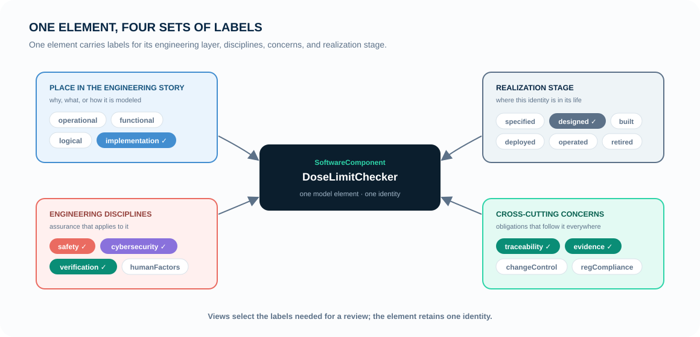

# The mental model

MEMO records a device concern, the design response, and the evidence for it in
one model. You do not need to use every layer. Start with one scenario, then
add only the elements and relationships needed to answer the review question.

  
Why?<strong>Clinical intent</strong><small>What does a person need?</small>

  <i>→</i>
  
What must be true?<strong>Requirement</strong><small>A testable obligation</small>

  <i>→</i>
  
How?<strong>Design response</strong><small>Function and architecture</small>

  <i>→</i>
  
How do we know?<strong>Evidence</strong><small>Verification and records</small>

Risk is not a late-stage column in this story. A hazard can introduce a new
requirement at any time, and a failed verification can send you back to the
design. The model is a connected argument, not a waterfall checklist — see
[function-centered traceability](function-centered.md) for how the links
actually run.

## Three rules for building the model

  <article class="memo-card memo-card-purple"><h3>1. Ask one question</h3><ul><li>Who uses the device and where?</li><li>What must the system do?</li><li>Which part is responsible?</li><li>How will the team check it?</li></ul>
<a href="../layers/index.md">Find the right layer →</a>
</article>
  <article class="memo-card memo-card-blue"><h3>2. Record the facts</h3><ul><li>People, needs, and use cases</li><li>Requirements and functions</li><li>Components, interfaces, and parts</li><li>Hazards, controls, tests, and evidence</li></ul>
<a href="../reference/elements/index.md">Choose what to record →</a>
</article>
  <article class="memo-card memo-card-teal"><h3>3. Link the facts</h3><ul><li>A need explains a use case.</li><li>A function is assigned to a component.</li><li>A requirement or control is checked by a test.</li><li>A test produces evidence.</li></ul>
<a href="../reference/relationships.md">Choose the link →</a>
</article>

Keep one record for each real thing. Do not copy the same component into
separate safety, cybersecurity, and verification models; add those concerns to
the same component and use views to show it to different reviewers.

## Keep one element; add labels

Do not create a separate copy of the same component for software, safety, and
cybersecurity. Those copies drift apart when the component changes.

Instead, keep one component and give it the labels that describe it: where it
fits in the engineering story, its life stage, the assurance disciplines that
apply, and the concerns that follow it. A view simply chooses which labeled
elements to show.

This is the rule the ontology enforces as **single-axis ownership**: an element
is owned by exactly one axis — a horizontal architecture layer or a vertical
assurance discipline — and reaches the other only through typed relationships.
[Layer Map](../layers/index.md) explains the two axes.

## Start with a small argument, not a complete layer

The most productive first model is a **vertical slice**: one narrow scenario
that reaches from a real user concern to a checkable result. For example:

  <b>Need</b> Clinician needs warning<i>→</i>
  <b>Requirement</b> Alarm above limit<i>→</i>
  <b>Function</b> Detect and alert<i>→</i>
  <b>Verification</b> High-temperature test

That slice is enough to expose missing rationale, an unaddressed hazard, or an
untestable requirement. Expand the model one scenario at a time — which is
exactly what [scenario-driven modelling](scenario-driven.md) describes.

## Continue

| Next step | Page |
| --- | --- |
| See the two axes and every layer | [Layer Map](../layers/index.md) |
| Install MEMO | [Installation](../how-to/install/index.md) |
| Build the vertical slice above | [Temperature Alarm tutorial](../tutorials/first-model.md) |
