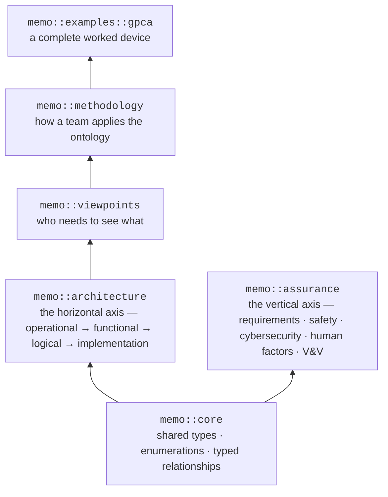

# How `memo::` is organised

The library is small enough to hold in your head. Five ideas, built bottom-up:
shared core semantics first, then the two axes of the model, then the ways of
looking at it, and finally how a team applies it.



## The five things to remember

| Package | Holds | Read it when |
| --- | --- | --- |
| `memo::core` | The shared foundation every other package builds on: base types, enumerations, and the typed relationship definitions | You want to know what a link means |
| `memo::architecture` | The horizontal axis — the engineering story from operational context to implementation | You are describing the device |
| `memo::assurance` | The vertical axis — the disciplines that must be satisfied about the device | You are describing risk, requirements, or evidence |
| `memo::viewpoints` | Stakeholder concerns and the views that frame them | A reviewer needs a specific picture |
| `memo::methodology` | Profiles, patterns, workflow steps, quality gates, and project binding | You are setting a project up |

Two more exist and are mostly consumed rather than read:
`memo::rules` (the closure and coverage checks) and `memo::compliance`
(regulated artifacts and change concepts).

## One import

A product model imports **one library** and uses focused packages beneath it:

```sysml
private import memo_medical_device_library::*;
```

`memo_medical_device_library` re-exports core, every architecture layer, and
the standard viewpoints and views. Prefer it over deep imports into source
packages: deep imports couple your project to MEMO's internal organisation and
make upgrades harder.

## Two axes, one element

The single most important structural rule: **an element is owned by exactly one
axis**. A `Hazard` lives in assurance. A `LogicalComponent` lives in
architecture. Neither is copied into the other; they are connected by a typed
relationship.

This is what stops the model from growing parallel copies of the same component
in safety, cybersecurity, and verification. [The layers](../layers/index.md)
explain the axes in full.

---

The complete package table, the public import surface, and the design decisions
behind the naming are in
[Reference → The `memo::` namespace](../architecture/namespace.md).
