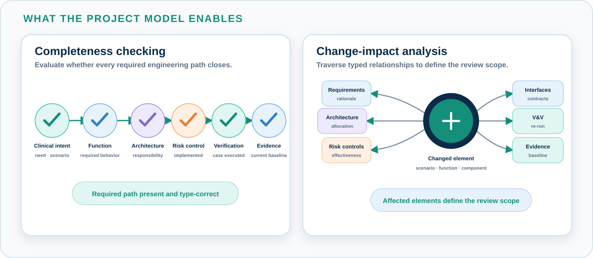

# Why MEMO

Medical-device development must establish that the device performs the
functions required by its users and that those functions are implemented and
verified safely. This requires a connected model of clinical intent, system
behavior, architecture, risk controls, verification, and evidence.

The engineering chain begins with a clinical need and a use scenario. The
scenario establishes the system functions required from the device;
architecture assigns responsibility for those functions; risk analysis links
hazards and controls to the design; and verification produces evidence for the
reviewed product baseline.

{ .memo-presentation-graphic }

Each part of the chain answers a different question. Together they explain why
the device exists, what it must do, which design elements are responsible, what
can go wrong, how risk is controlled, and which evidence supports the result.

## The engineering problem

The information needed for this chain is usually distributed across several
engineering artifacts and tools:

| Engineering information | Typical location |
|---|---|
| Intended use, users, and clinical workflow | user needs, use specifications, and clinical documents |
| Required behavior | system requirements, software requirements, and behavior models |
| Design responsibility | architecture descriptions, interface specifications, hardware design, and software design |
| Hazards and controls | risk-management files, safety analyses, and cybersecurity analyses |
| Verification and evidence | test protocols, test results, analysis reports, and review records |

Traceability matrices connect many of these artifacts, but an identifier link
establishes only that two records are associated. For example,
`SW-REQ-104 → TC-221` can answer **“Is this requirement linked to a test?”** It
cannot answer the more important assurance question: **“Does this test result
demonstrate the required behavior for the current design?”**

Answering that question requires three kinds of context:

| Context | What must be known |
|---|---|
| **Rationale and behavior** | the use scenario that requires the behavior and the system function that expresses the responsibility |
| **Design and risk** | the architecture element responsible for the function and the hazards or risk controls that depend on it |
| **Evidence applicability** | the operating conditions exercised by the test and the design and product baseline to which the result applies |

**The specific problem is that traceability coverage and evidence validity are
treated as the same thing.** A matrix can report that every requirement has a
linked test while the current product baseline has no applicable passing
evidence for some of those requirements.

Consider a patient-controlled analgesia pump. `SW-REQ-104` requires the pump to
reject **every** patient bolus request while the lockout is active. `TC-221`
exercises the physical bolus button and confirms that no dose is delivered. The
test passes.

The next baseline adds a touchscreen as an alternate way to request a bolus.
The button and its passing test remain valid, while the touchscreen introduces
a second input path through a new event adapter. `SW-REQ-104` is still linked to
`TC-221`, so the traceability matrix reports the requirement as covered even
though the touchscreen path has never been tested during lockout.

This is the gap: **the requirement applies to every request path, while the
linked test exercises only one path.** The model must connect the requirement
and verification evidence to the architecture path they cover, so the new path
is identified as requiring verification.

{ .memo-presentation-graphic }

## Design change affects the complete chain

A change to one part of the device can affect information maintained by several
disciplines. Examples include:

| Change | Information that may require review |
|---|---|
| A clinical workflow changes | use cases, operative scenarios, user tasks, functions, hazards, and validation |
| A function changes | requirements, allocations, interfaces, failure analyses, controls, and verification cases |
| Responsibility moves between components | architecture allocations, interfaces, implementation, risk controls, and tests |
| A software or hardware baseline changes | realized configuration, verification procedures, results, and evidence applicability |
| An operating condition changes | scenario assumptions, hazards, control effectiveness, and test conditions |
| An AI or automation model changes | data assumptions, operating scenarios, performance limits, hazards, and verification evidence |

Existing document links can continue to resolve after the claim represented by
the link has changed. A test report remains available even when it applies to
an earlier behavior or product baseline. A risk control remains listed even
when its implementation has moved to another component.

A passing test therefore supports a claim only when the tested scenario,
behavior, configuration, conditions, and baseline match the claim under review.
Change-impact analysis must be able to follow all of those dependencies.

## Architecture provides the connection

System architecture connects operational intent to the implemented and
realized device:

{ .memo-presentation-graphic }

1. Operational concepts define the users, context, goals, workflows, and
   scenarios.
2. Functions define what the system must accomplish in those scenarios.
3. Logical architecture assigns responsibilities and defines interactions.
4. Implementation architecture identifies the software, electronics,
   mechanical elements, and user interfaces that implement the design.
5. Realization identifies deployment, processing nodes, assemblies, and the
   product configuration.

Requirements, safety, cybersecurity, human factors, and verification connect
to the relevant elements across these architecture layers. This allows each
discipline to work with the same description of system behavior and design.

When each discipline reproduces part of the design in its own artifact, those
representations can change at different times. A shared model provides one
identity for each scenario, function, component, interface, hazard, control,
verification case, and item of evidence.

### Why architecture is difficult to maintain

The presentation identifies four structural causes. They affect established
organizations as well as code-first product teams:

| Cause | Effect on the engineering model |
|---|---|
| **Team boundaries** | systems, software, risk, cybersecurity, V&V, and quality maintain different working artifacts |
| **Document-centered delivery** | specifications, risk files, protocols, and reports receive more maintenance than the architecture model |
| **Code-first development** | design intent, architecture boundaries, and interface assumptions remain implicit in source code, tests, and developer knowledge |
| **Acquired and legacy products** | inherited artifacts use different tools, terminology, and engineering structures; architecture and original design rationale may be incomplete or unavailable |
| **Adoption effort** | a modeling tool provides notation, while the team still has to define the ontology, model structure, viewpoints, and workflow |

The implementation remains the executable description of product behavior.
The architecture records intent, responsibility, interfaces, allocation, and
safety assumptions. Keeping both connected allows implementation changes to be
reviewed against the complete system design.

Aerospace uses architecture and allocation chains to connect functions, safety
analysis, and verification evidence. Automotive uses platform architectures
and interface contracts to support safety mechanisms and reuse. Medical-device
standards define rigorous lifecycle, risk, usability, electrical-safety, and
cybersecurity activities; the manufacturer supplies the architecture model
that connects them. MEMO provides reusable semantics for that connective
model.

## Relationships need defined semantics

The relationship between two model elements must state the engineering claim
being made. MEMO defines relationships with specific meanings and legal
endpoint types:

| Relationship | Engineering meaning |
|---|---|
| `Motivates` | a `Need` provides the rationale for a `UseCase` |
| `SatisfiedBy` | a requirement or other verifiable element is satisfied by an architecture element |
| `AllocatedTo` | a function is allocated to the architecture element responsible for it |
| `AnalyzedBy` | an architecture element is examined by an analysis artifact |
| `Mitigates` | a control mitigates a hazard or another risk element |
| `ControlImplementedBy` | a risk control is implemented by a design element |
| `VerifiedBy` | a model element is checked by a `VerificationCase` |
| `ProducesEvidence` | a `VerificationCase` produces an evidence record |

{ .memo-presentation-graphic }

The distinction between these relationships allows tools to evaluate specific
questions. For example:

- Which functions have no architecture allocation?
- Which hazards have no mitigating control?
- Which controls have no implementing design element?
- Which requirements and controls have no verification case?
- Which verification cases have no evidence for the reviewed baseline?

These are model queries because the elements and relationships have defined
semantics.

## Requirements for a shared engineering model

A shared medical-device model needs the following capabilities:

| Capability | Purpose |
|---|---|
| **Medical-device domain definitions** | provide common meanings for users, scenarios, functions, components, hazards, controls, verification, evidence, and products |
| **Scenario-based behavior** | preserve the users, system state, operating conditions, and nominal or exception path associated with a claim |
| **Architecture allocation** | connect required functions to logical responsibility, implementation, and realization |
| **Typed relationships** | record the engineering meaning of each connection and constrain its endpoints |
| **Baseline and lifecycle information** | identify which design and product configuration a claim or evidence item applies to |
| **Executable rules** | check closure, coverage, cross-layer consistency, lifecycle conditions, and ontology consistency |
| **Views and viewpoints** | present focused information for architecture, risk, cybersecurity, usability, V&V, and regulated reviews |
| **Versionable source** | review model changes with the corresponding engineering baseline |
| **Methodology support** | provide reusable profiles, modeling patterns, workflows, and quality gates for applying the ontology |

## MEMO's purpose

MEMO supplies these capabilities as a SysML v2 ontology for medical-device
engineering. A project uses MEMO definitions to create its device-specific
model. The project model connects clinical intent, scenarios, functions,
architecture, assurance, realization, and evidence using shared relationship
semantics and rules.

The resulting model supports two activities that are difficult to perform from
document identifiers alone:

{ .memo-presentation-graphic }

1. **Completeness checking** — determine whether the required architecture and
   assurance connections are present.
2. **Change-impact analysis** — follow a changed scenario, function,
   component, interface, requirement, hazard, control, or baseline to the
   dependent elements that require review.

[Continue to What is MEMO →](../what/index.md)
